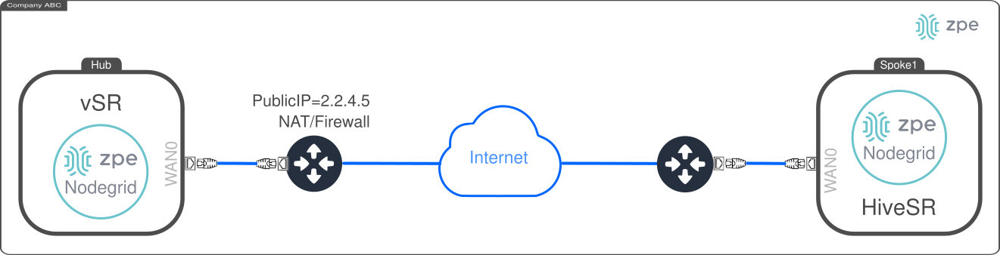
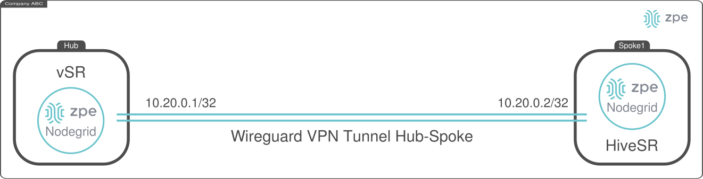

# ZPE Wireguard Hub-Spoke automated peering service: Hub

This document describes the deployment of the *ZPE Wireguard Hub-Spoke automated peering service: Hub*. This service consists of having a centralized node, i.e., the **Hub**, and multiple **Spokes** in remote locations which require to configure a Point-to-Point VPN, i.e., a Wireguard tunnel. To this end, each **Spoke** shall request the **Hub** the required information to create a Wireguard peering VPN. Once the peering VPN is established, both the **Spoke** and the **Hub** must have IP connectivity over it. 



This document describes the deployment and configuration of the **Hub**. The following diagram depicts the overall objective:




## Requirements

For all the devices (i.e., the Hub and all the Spokes), the following requirements must be met:
- Clone the repo [Nodegrid Ansible Library](https://github.com/ZPESystems/Ansible) and execute:

```bash
git clone https://github.com/ZPESystems/Ansible 
cd Ansible
ansible-playbook nodegrid_install.yml
```

### Hub specific requirements

- Public IP address: `{{ PUBLIC_IP }}`
- Capability to open TCP port, e.g., 8080, 22
- Capability to open multiple UDP ports, e.g., 51821, 1110, 2220, 3330


## Deploying and Configuring the **Hub**

### Deploying from the Nodegrid Hub device

The deployment and configuration consist on the execution of an ansible playbook as follows:

- Connect to the Hub using the **ansible** user

- Go to the path `Ansible/examples/playbooks/wireguard-hub-spoke-peering`:

- Modify the file `setup-wireguard-hub.yaml`, specifying:
  - `WIREGUARD_IFACE_PUBLIC_IP`:  `{{ PUBLIC_IP }}`
  - `PORT_KNOCKING: true` to enable port knocking feature

```yaml
- hosts: localhost
  gather_facts: false
  connection: local
  become: true

  tasks:
    - name: setting up wg hub role
      include_role:
        name: setup-wg-hub
      vars:
        # Nodegrid Variables
        NODEGRID_URI: "https://localhost"
        NODEGRID_API_PREFIX: "/api/v1"
        NODEGRID_CREATE_API_USER: true 
        NODEGRID_USER: "zpeapi" # Nodegrid API User
        NODEGRID_KEY: "" # Nodegrid API User key must be defined if NODEGRID_CREATE_API_USER is fale

        # Wireguard Peering Service Variables
        WIREGUARD_IFACE_PUBLIC_IP: "{{ PUBLIC_IP }}" # Hub public IP
        WIREGUARD_SERVICE_PORT: 8080 # Hub TCP port for incoming peering requests
        WIREGUARD_IFACE_PUBLIC_PORT: 51821 # Hub UDP port for wireguard encrypted trafic
        WIREGUARD_IFACE_NAME: 'wg-hub' # Hub's Network :: Wireguard interface name 
        WIREGUARD_LAN: '10.20.0.0/16' # Hub-Spokes LAN. Each node will have an /32 IP address
        WIREGUARD_IFACE_IP: '10.20.0.1/32' # Hub's Network :: Wireguard interface LAN IP Address /32

        # Port Knocking Variables
        PORT_KNOCKING: false # true for enabling port knocking. If true, the following vars are taken in consideration
        PORT1: 1110 # first port to knock
        PORT2: 2220 # second port to knock
        PORT3: 3330 # third port to knock
        TCP_PORTS: # TCP ports to open on the firewall
          - 80
          - 443
          - 22
        UDP_PORTS: # UDP ports to open on the firewall
          - 51821
```

- Execute the playbook:

```bash
ansible-playbook setup-wireguard-hub.yaml
```

The playbook configures a new service on the Nodegrid. To validate it manually, you can interact with the service as follows:

- Check status: `/etc/init.d/wgpeer status`
- Start the service: `/etc/init.d/wgpeer start`
- Restart the service: `/etc/init.d/wgpeer restart`
- Stop the service: `/etc/init.d/wgpeer stop`

The service's logs are at: `/var/log/wgpeerservice.log`

