## The goal of this guide:
This guide provides an overview of how an Isolated Management Infrastructure IMI can be created using ZPE Systems' Nodegrid solution. It utilizes the ZPE Systems Ansible Library to automate the setup and configuration process.

The Guide assumes that one of the Super Coordinators (`ny-sc1`) is used as an Ansible host that will provision all other Nodegrid appliances in the demo setup. The Guide assumes that only a minimal configuration was performed on all appliances and that a working network connection exists between all nodes.

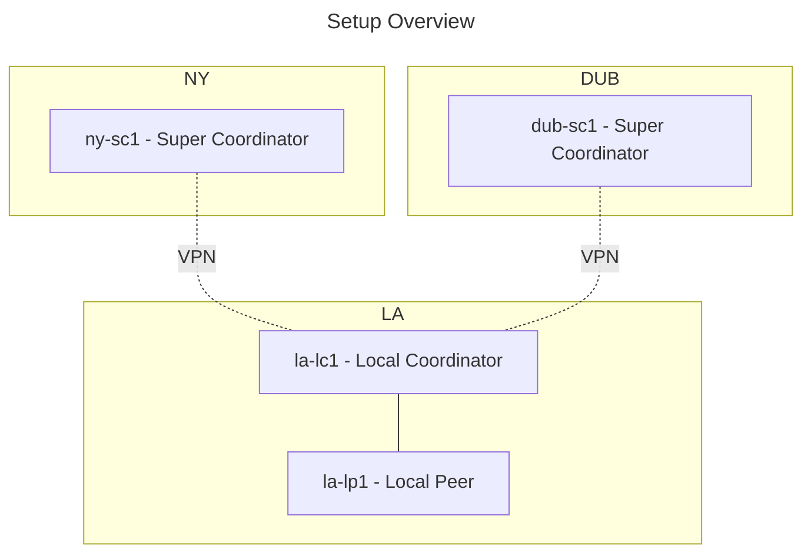

Requirements to replicate this setup:
- 4 Nodegrid appliances, physical or virtual or a mix
- Nodegrid Version 5.8.16 or higher
- Cluster Licenses for 4 Nodes

# Overview
This document will guide users through the installation and configuration of the required tools and configurations on 
each Nodegrid host. The guide will first look at the installation of the Ansible dependencies on one of the SuperCoordinators. 
This system will then be used to maintain the configuration of each Nodegrid node. After this, the guide will complete 
the configuration for each host and setup a VPN overlay network between each Coordinator, 
which allows for an automatic failover in case the primary link fails.

The configuration can be easily expanded to include more location or nodes per site by adding additional hosts to the inventory.

# Configuration of NY-SC1
## Step 1: Download Ansible Library
- Download Ansible Library from https://github.com/ZPESystems/Ansible
	- Click on Code and select "Download ZIP"

	   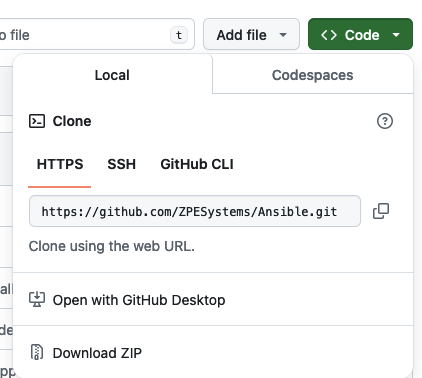

-  Login to the Nodegrid appliance via the WebUI as admin user
- Open  **System > Toolkit > File Manager** and navigate to **admin_group**

  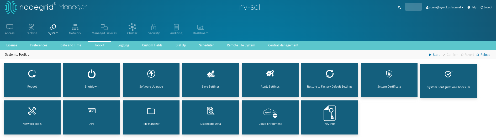

- Navigate to **admin_group**

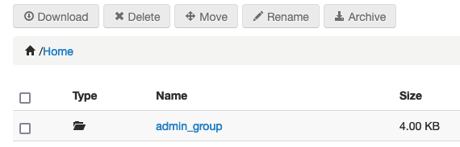

- Upload the downloaded `.zip` file into the folder (default name: `Ansible-main.zip`)

  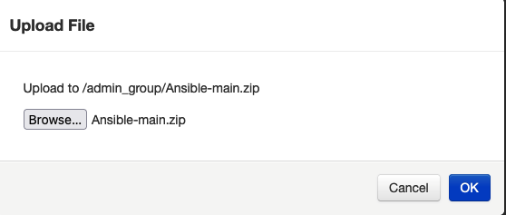

- Close the File Manager window
- Open a **Console connection** to Nodegrid
- Access the shell as an **admin** user using the `shell` command
- Navigate to `/var/local/file_manager/admin_group/`
```shell
cd /var/local/file_manager/admin_group/
```
- Extract the `.zip` file with
```shell
unzip Ansible-main.zip
```
*Example Output*
```shell
[admin@nodegrid /]# shell

WARNING: Improper use of shell commands could lead to data loss,
the deletion of important system files or other unexpected result.
Please double-check your syntax when typing shell commands.

admin@nodegrid:~$ cd /var/local/file_manager/admin_group/
admin@nodegrid:/var/local/file_manager/admin_group$ unzip Ansible-main.zip
Archive:  Ansible-main.zip
   creating: Ansible-wireguard/
  inflating: Ansible-wireguard/.gitignore
  inflating: Ansible-wireguard/LibrarySupport.md
  inflating: Ansible-wireguard/README.md
  inflating: Ansible-wireguard/build.py
   creating: Ansible-wireguard/collections/
```
## Step 2: Install Ansible Library

- In an **admin shell**, navigate to the downloaded library directory 
```bash
cd Ansible-main
```
- Run the installation playbook.
```bash
ansible-playbook nodegrid_install.yml
```
- Example Output:
```bash
admin@nodegrid:/var/local/file_manager/admin_group$ ls 
ansible  Ansible-main.zip  Ansible-main
admin@nodegrid:/var/local/file_manager/admin_group$ cd Ansible-main
admin@nodegrid:/var/local/file_manager/admin_group/Ansible-main$ ansible-playbook nodegrid_install.yaml
[WARNING]: log file at /var/log/ansible/ansible.log is not writeable and we cannot create it, aborting


PLAY [localhost] *******************************************************************************************************************************************************************************************************************************************************************

....... 


......
TASK [ensure proper permissions to ansible.log] ************************************************************************************************************************************************************************************************************************************
changed: [localhost]

PLAY RECAP *************************************************************************************************************************************************************************************************************************************************************************
localhost                  : ok=27   changed=18   unreachable=0    failed=0    skipped=1    rescued=0    ignored=0   

admin@nodegrid:/var/local/file_manager/admin_group/Ansible-main$ 
```

- Become `ansible` user.
```bash
sudo su - ansible
```

- Navigate to the system ansible folder
```bash
cd /etc/ansible/playbooks/
```
- Display example playbooks
```bash
ansible@nodegrid:~$ cd /etc/ansible/playbooks/
ansible@nodegrid:/etc/ansible/playbooks$ ls -l examples/playbooks/
total 7
drwxrwxr-x 2 ansible admin 1024 May 13 10:30 managed_devices
drwxrwxr-x 2 ansible admin 1024 May 13 10:30 network
drwxrwxr-x 2 ansible admin 1024 May 13 10:30 nodegrid
drwxrwxr-x 2 ansible admin 1024 May 13 10:30 security
drwxrwxr-x 2 ansible admin 1024 May 13 10:30 setup
drwxrwxr-x 2 ansible admin 1024 May 13 10:30 system
drwxrwxr-x 3 ansible admin 1024 May 13 10:30 system-roles
```

> [!Note]
> 
> **Example Playbooks**
> 
> The examples are sorted into folders for reference. Users have the option to either directly run the playbooks from the examples folder or to copy the desired playbooks to `/etc/ansible/playbooks/`.
> 
> It is recommended that the examples be copied to the working directory. This allows users to change and adapt them as needed freely.

- To copy the required playbooks for this example to the playbook folder, use the following command.
```shell
cp /etc/ansible/playbooks/examples/playbooks/system-roles/IMI/*.yaml /etc/ansible/playbooks/
```

- *Example*:
```shell
ansible@nodegrid:/etc/ansible/playbooks$ cp /etc/ansible/playbooks/examples/playbooks/system-roles/IMI/*.yaml /etc/ansible/playbooks/
ansible@nodegrid:/etc/ansible/playbooks$ ls -l
total 20
-rwxr-xr-x 1 ansible ansible 1580 May 13 10:42 001_setup_nodegrid_ansible.yaml
-rwxr-xr-x 1 ansible ansible 1812 May 13 10:42 100_role_super_coordinator.yaml
-rwxr-xr-x 1 ansible ansible 1811 May 13 10:42 101_role_local_coordinator.yaml
-rwxr-xr-x 1 ansible ansible 1514 May 13 10:42 102_role_local_peer.yaml
-rwxr-xr-x 1 ansible ansible  466 May 13 10:42 201_setup_wireguard_tunnels.yaml
-rwxr-xr-x 1 ansible ansible 1597 May 13 10:42 202_cluster_super_coordinator.yaml
-rwxr-xr-x 1 ansible ansible  199 May 13 10:42 300_nodegrid_facts.yaml
-rwxr-xr-x 1 ansible ansible 4059 May 13 10:42 301_nodegrid_firmware_update.yaml
-rwxr-xr-x 1 ansible ansible 1112 May 13 10:42 302_nodegrid_backup.yaml
drwxrwxr-x 4 ansible admin   1024 May 13 10:30 examples
-rwxrwxr-x 1 ansible admin    425 Mar  9  2018 import_settings.yaml
```
- Run a test playbook. 
```shell
ansible-playbook 300_nodegrid_facts.yaml
```

---
> [!Tip]
> 
> In case the host's SSH TCP port is different than the default `22`, add the following variable (e.g., for port TCP `2222`):
```shell
ansible-playbook 300_nodegrid_facts.yaml -e "ansible_ssh_port=2222"
```
---

Example Output
```shell
ansible@nodegrid:/etc/ansible/playbooks$ ansible-playbook 300_nodegrid_facts.yaml

PLAY [all] *************************************************************************************************************************************************************************************************************************************************************************

TASK [Get Facts from Nodegrid] *****************************************************************************************************************************************************************************************************************************************************
ok: [localhost]

TASK [output] **********************************************************************************************************************************************************************************************************************************************************************
ok: [localhost] => {
    "output": {
        "ansible_facts": {
            "about": {
                "bogomips": "6787.24",
                "boot_mode": "Legacy",
                "cpu": "QEMU Virtual CPU version 2.5+",
                "cpu_cores": "2",
                "licenses": "5",
                "revision_tag": "r1",
                "secure_boot": "Disabled",
                "serial_number": "821eef8d511b4e568e9c086223a89b97",
                "system": "Nodegrid Manager",
                "uptime_days": "0",
                "uptime_hours": "0",
                "uptime_minutes": "41",
                "version": "5.8.16",
                "version_date": "(Nov 8 2023 - 07:55:28)"
            },
....

....
        "changed": false,
        "failed": false
    }
}

PLAY RECAP *************************************************************************************************************************************************************************************************************************************************************************
localhost                  : ok=2    changed=0    unreachable=0    failed=0    skipped=0    rescued=0    ignored=0 
```
- The Ansible Nodegrid Library has been successfully installed. The next step is to define the `inventory.yaml` file, which is a **strict requirement for the IMI building process**.

## Step 3: Build the Ansible Inventory
### Overview
This step is critical, as the setting will be used as a source of truth for all appliances and will determine which settings get applied to each system. The Inventory should match the designed layout. The following section outlines a few basic concepts. For more information about the Ansible Inventory option, see [How to Build Your Inventory](https://docs.ansible.com/ansible/latest/inventory_guide/intro_inventory.html)

The Example will build out the following network:

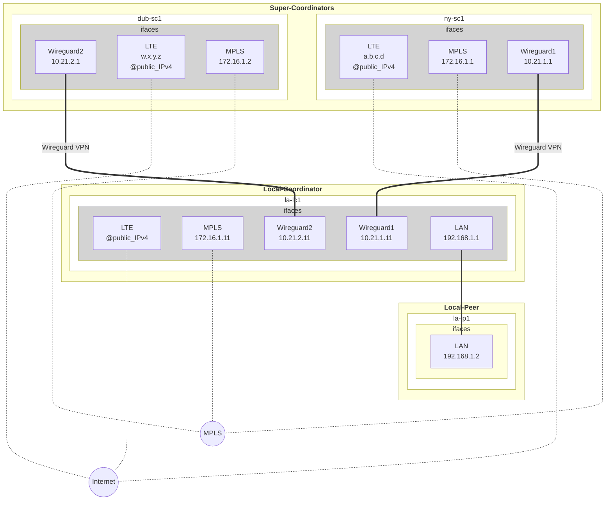

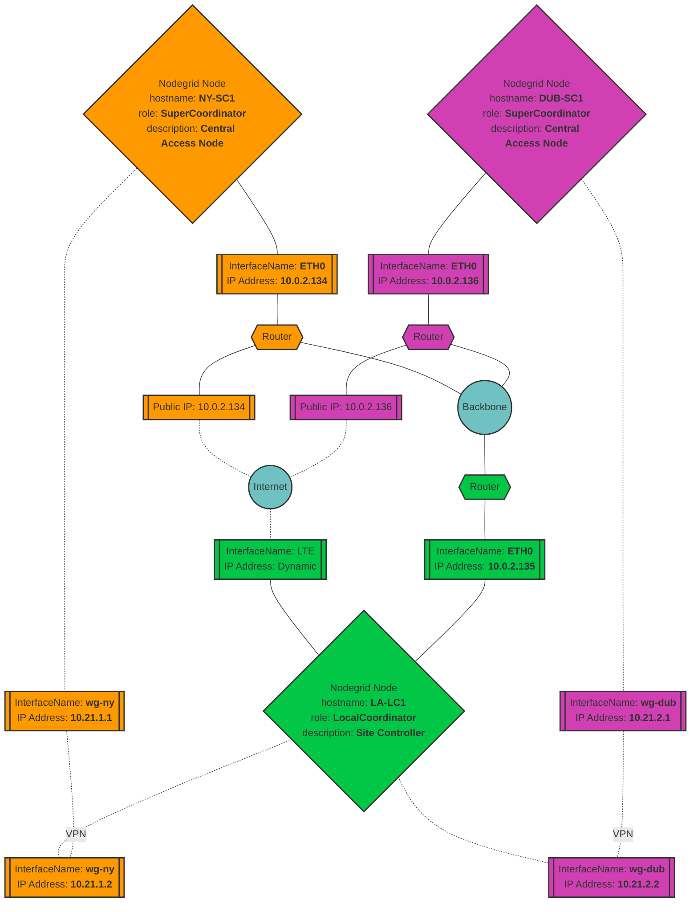

Inventory Overview
1. The inventory is organized hierarchically and utilizes groups that can be nested.
2. Infrastructure devices like Nodegrid appliances are represented as `hosts` which can be part of one or multiple groups
3. Each group and host can have multiple variables assigned to it. These Variables are typically `key-value` pairs but can be in the form of `lists` and `dictionaries`
4. The Ansible inventory files utilize standard `YAML` or `JSON` notation. Both are valid, but ideally should not be mixed to avoid confusion. This document will only use `YAML` notation.
5. The default location for the Ansible inventory on a Nodegrid appliance is `/etc/ansible/inventories/`
6. The Inventory is stored in `YAML` files. The main file is the `hosts.yml` file, which must contain the inventory structure. 


---
> [!Note]
> 
> Dynamic Inventory Plugins
> 
> Ansible supports dynamic inventory sources, like [Netbox](https://galaxy.ansible.com/ui/repo/published/netbox/netbox/) and other systems. This guide does not cover the setup of dynamic Inventory plugins, see [here](https://docs.ansible.com/ansible/latest/plugins/inventory.html) for more details and here to search for additional [modules](https://galaxy.ansible.com) which can be installed.
---

> [!Note]
> 
> ZPE Systems Dynamic Inventory Plugins
> 
> ZPE Systems currently supports three dynamic inventory plugins:
> 1. **Cluster plugin**: This exposes all cluster hosts to a local installation of Ansible on a Nodegrid appliance. This is installed and active by default and only requires a working Cluster configuration
> 2. **Device plugin**: This Exposes all locally configured managed devices on Nodegrid appliance. This plugin is automatically installed with the Nodegrid Ansible library.
> 3. **ZPE Cloud plugin**: This plugin enables the execution of Ansible playbooks via ZPE Cloud as the connector, and the use of the ZPE Cloud inventory and custom fields as inventory on a local Ansible host. [Ansible ZPE Cloud](https://galaxy.ansible.com/ui/repo/published/zpe/zpecloud/) describes in detail this plugin.
---

### Inventory Structure
Configure the Inventory

1. Navigate to the Inventory folder
```bash
cd /etc/ansible/inventories/
```
2. Edit the `hosts.yaml` file and create the inventory
```bash
vim hosts.yaml
```
3.  Example `hosts.yaml` file without variables, based on the provided Example
```hosts.yaml
all:
  children:
    company:
      children:
        USA:
          children:
            NY:
              hosts:
               ny-sc1:
            LA:
              hosts:
                la-lc1:
                la-lp1:
        EMEA:
          children:
            DUB:
              hosts:
               dub-sc1:
```

> [!Tip]
> 
> It is recommended to utilize a group that identifies the organization/company. This serves to clearly differentiate manually configured hosts from hosts provided through an automated inventory plugin, like the Nodegrid Cluster inventory plugin, which exposes all Nodegrid Cluster nodes.

> [!Warning]
> 
> YAML files only accept space characters, are very specific with the indentations, and do not allow tabulators. Should the command fail to display the host's inventory, double-check the hostname and the `hosts.yaml` file for formatting errors.
> 
> To display in `vim` special characters, you can use the command: `:set list`

4. To test the current inventory changes, run the command, which will show and validate the inventory structure
```bash
ansible-inventory --graph
```
Example Output:
```bash
ansible@nodegrid:/etc/ansible/inventories$ ansible-inventory --graph
@all:
  |--@cluster:
  |  |--@local:
  |  |  |--localhost
  |--@managed_devices:
  |  |--@device_console:
  |  |--@device_disabled:
  |  |--@device_enabled:
  |  |--@device_ondemand:
  |--@company:
  |  |--@EMEA:
  |  |  |--@DUB:
  |  |  |  |--dub-sc1
  |  |--@USA:
  |  |  |--@LA:
  |  |  |  |--la-lc1
  |  |  |  |--la-lp1
  |  |  |--@NY:
  |  |  |  |--ny-sc1
  |--@ungrouped:
```

To display host-specific settings use the following command
```bash
ansible-inventory --host ny-sc1
```

Example Output:
```bash
ansible@nodegrid:/etc/ansible/inventories$ ansible-inventory --host ny-sc1
{}
```

> [!Warning]
> 
>  The inventory output for the specific host is currently still empty as no variables have been defined. This will be done during the following steps.

### Group Variables
- Variables can be stored in the `hosts.yaml` file or in dedicated variable files, which are stored in the `group_vars` sub-folders. 

> [!Tip]
> 
> It is recommended to store group variables in dedicated files, for example, variables which apply to all hosts can be stored in the file `group_vars/company.yaml` 
-  Navigate to the Inventory folder  
```bash
cd /etc/ansible/inventories/group_vars  
```

- Create the file `company.yaml`, which will contain variables which apply to all hosts
```bash
vim company.yaml 
```

> [!Warning]
> 
> The file name must match the group name used in the inventory in this case 'company.yaml'

- Add the following content; this is an example list with the minimum requirements for the example. 
  
  The list should be adjusted as needed, each section is marked with:
  "**DO NOT CHANGE**" (Settings should not be changed), 
  "**NO CHANGE REQUIRED**" (Settings use common default values), 
  "**CHANGE**" (Section needs to be adjusted, the provided values only serve as an example), 
  "**REQUIRED**" (Details must be provided in these sections)

```all.yaml
# Section - REQUIRED - THIS SECTION CONTAINS VALUES THAT MUST BE ADJUSTED
# License Keys: (REQUIRED - ADD VALID CLUSTER LICENSE KEY) 
nodegrid_license_keys:  
     - XXXXX-XXXXX-XXXXX-XXXXX
     - XXXXX-XXXXX-XXXXX-XXXXX
    
# Local User Accounts: (REQUIRED - UPDATED PASSWORD)
local_user_accounts:  
  - username: "<myusername>"  
    hash_format_password: "no"  
    password: "<mypassword>"  
    user_group: "admin"  
    
# SECTION - CHANGE - CHANGES ARE RECOMMENDED BUT NOT REQUIRED

# Firmware Settings: (CHANGE - TO DESIRED NODEGRID VERSION)  
nodegrid_iso_location: "/var/local/file_manager/datastore/"  
nodegrid_iso_file: "Nodegrid_Platform_v5.8.16_20231107.iso"  
nodegrid_iso_target_version: "5.8.16"  
  
# Default System Settings: (CHANGE - TO DESIRED VALUES)  
sys_show_hostname_on_webui_header: "yes"  
sys_idle_timeout: 3600  
sys_banner: '''  
WARNING: This private system is provided for authorized use only and it may be monitored for all lawful purposes to ensure its use. All information  
including personal information, placed on or sent over this system may be  
monitored and recorded. Use of this system, authorized or unauthorized,  
constitutes consent to monitoring your session. Unauthorized use may subject you to criminal prosecution. Evidence of any such unauthorized  
use may be used for administrative, criminal and/or legal actions. '''  
  
# Default System Date and Time: (CHANGE - TO DESIRED VALUES)  
sys_date_and_time_date_and_time: "network_time_protocol"  
sys_date_and_time_zone: "utc"  

# Authentication  
# Local User Groups: (CHANGE - TO DESIRED VALUES)
nodegrid_local_user_groups:  
  - name: 'admin'  
    track_system_information: "yes"  
    terminate_sessions: "yes"  
    software_upgrade_and_reboot_system: "yes"  
    configure_system: "yes"  
    configure_user_accounts: "yes"  
    apply_and_save_settings: "yes"  
    shell_access: "yes"  
    manage_devices_permissions: "no"  
  - name: 'user'  
    track_system_information: "no"  
    terminate_sessions: "no"  
    software_upgrade_and_reboot_system: "no"  
    configure_system: "yes"  
    configure_user_accounts: "no"  
    apply_and_save_settings: "no"  
    shell_access: "no"  
    manage_devices_permissions: "no"  

# Default Authentication Server: (CHANGE - TO DESIRED VALUES)
# TACACS server settings have changed from 5.8 to 6.0 Update settings as required
nodegrid_authentication_servers:  
  - number: 1
    method: "tacacs+"
    status: "disabled"
    fallback_if_denied_access: "yes"
    remote_server: "10.1.1.5"
    tacacs_plus_accounting_server: "10.1.1.5"
    authorize_ssh_pkey_users: "yes"
    tacacs_plus_port: "49"
    tacacs_plus_service: "raccess"
    tacacs_plus_secret: "tacacs"
    tacacs_plus_timeout: "2"
    tacacs_plus_retries: "2"
    tacacs_plus_version: "v1"
    tacacs_plus_enable_user-level: "yes"
    tacacs_plus_user_level_12: "user" 
    tacacs_plus_user_level_15: "admin"

# System SNMP Settings: (CHANGE - TO DESIRED VALUES)
syscontact: "noc@zpesystems.internal"
syslocation: "Nodegrid"
snmp_rules:
  - version: "version_v1|v2"
    community: "public"
    source: ""
    snmp_for_ipv6: "no"
    oid: ""
    access_type: "read_only"

# Network Settings (CHANGE - TO DESIRED VALUES)
nodegrid_domain_name: us.internal

# SECTION - NO CHANGE REQUIRED - NO CHANGES ARE REQUIRED

# Default Network Settings: (NO CHANGE REQUIRED)
nodegrid_enable_ipv4_ip_forward: "no"  
nodegrid_enable_ipv6_ip_forward: "no"  
nodegrid_reverse_path_filtering: "strict_mode"  
nodegrid_enable_multiple_routing_tables: "yes"  
failover_enable_network_failover: "no"  
  
# Default Audit Settings: (NO CHANGE REQUIRED)  
auditing_settings:
  event_timestamp_format: local_time  
  datalog_add_timestamp: "no"  
  datalog_timestamp_format: local_time  
  datalog_destination: file
  enable_persistent_logs: "no"

# System Session Logging: (NO CHANGE REQUIRED) 
system_logging_enable_session_logging_alerts: "no"  

# Nodegrid Authentication settings: (NO CHANGE REQUIRED)
authentication_admin_and_root_fallback_to_local_on_console: "yes"  
authentication_default_group_for_remote_users: ""  
authentication_enable_authentication_server_selection_based_on_realms: "yes"  

# System Services: (NO CHANGE REQUIRED)
services_enable_snmp_service: "yes"

# Firewall Settings
ipv4_firewall:
  policy:
    FORWARD: ACCEPT
    INPUT: ACCEPT
    OUTPUT: ACCEPT
  chains:
    INPUT:
        - target: ACCEPT
          rule_number: 0
          input_interface: lo
          output_interface: any
          description: DEFAULT_RULE_DO_NOT_REMOVE
        - target: ACCEPT
          rule_number: 1
          protocol: tcp
          destination_port: 22
          source_net4: ""
          destination_net4: ""
          description: 'NODEGRID_SSH'        
        - target: ACCEPT
          rule_number: 2
          protocol: tcp
          source_net4: ""
          destination_net4: ""
          destination_port: 9300
          description: 'NODEGRID_SEARCH_9300' 
        - target: ACCEPT
          rule_number: 3
          protocol: tcp
          destination_port: 9966
          description: 'NODEGRID_CLUSTER_9966'
          source_net4: ""
          destination_net4: ""
        - target: ACCEPT
          rule_number: 4
          protocol: tcp
          destination_port: 443
          description: 'NODEGRID_HTTPS'
          source_net4: ""
          destination_net4: ""
        - target: ACCEPT
          rule_number: 5
          protocol: udp
          destination_udp_port: 161
          description: 'NODEGRID_SNMP'
          source_net4: ""
          destination_net4: ""
        - target: ACCEPT
          rule_number: 6
          protocol: udp
          destination_udp_port: 51820
          description: 'NODEGRID_WIREGUARD'
          source_net4: ""
          destination_net4: ""
        - target: ACCEPT
          rule_number: 7
          protocol: numeric
          description: 'ACCEPT_WIREGUARD_TRAFFIC'
          source_net4: "10.21.0.0/16"
          destination_net4: "10.21.0.0/16"
          enable_state_match: "no"
        - target: ACCEPT
          rule_number: 8
          protocol: numeric
          description: 'ACCEPT_RELATED_TRAFFIC'
          enable_state_match: "yes"
          new: "no"
          established: "yes"
          related: "yes"
          invalid: "no"
          reverse_state_match: "no"
          source_net4: ""
          destination_net4: ""
        - target: DROP
          rule_number: 9
          protocol: numeric
          description: 'DROP_ALL'
          source_net4: ""

# SECTION - DO NOT CHANGE - THIS SECTION CONTAINS SETTING WHICH SHOULD NOT BE CHANGED
# Generic Ansible Settings: (DO NOT CHANGE)
ansible_user: ansible
ansible_ssh_private_key_file: /home/ansible/.ssh/id_ed25519
ansible_python_interpreter: "/usr/bin/python3" 

# Generic Nodegrid Roles  
nodegrid_roles:  
  - local_peer

cluster_settings_cluster_mode: mesh  
cluster_settings_polling_rate: 120
```

- To display and validate the defined group variables, display the host-specific settings of a group member, using the following command.

```bash
ansible-inventory --host ny-sc1
```
Example Output:
```bash
ansible@nodegrid:/etc/ansible/inventories/group_vars$ ansible-inventory --host ny-sc1
{
    "ansible_python_interpreter": "/usr/bin/python3",
    "ansible_ssh_private_key_file": "/home/ansible/.ssh/id_ed25519",
    "ansible_user": "ansible",
...

...
    "sys_snmp_two_version": "version_v1|v2",
    "system_logging_enable_session_logging_alerts": "no"
}
ansible@nodegrid:/etc/ansible/inventories/group_vars$ 
```
### Host Specific Variables (ny-sc1)
- Host-specific variables can be stored either in the `hosts.yaml` file or similar to group variables in individual files. 
  
> [!Tip]
> 
> It is recommended to store host-specific variables in host-specific files. These files are located in the folder `host_vars` and would typically have the name of the host, for example, `ny-sc1.yaml`

> [!Warning]
> 
> **OVERWRITING OF VARIABLES**
> 
>  Variables with the same name, that are defined on a host level will overwrite group-level variables; this allows us to have generic defaults defined on group levels, which then get overwritten with specific values on a lower level.

- For this example, we will store the variable inside the `host_vars` directory
- Edit the `ny-sc1.yaml` file
```
vim /etc/ansible/inventories/host_vars/ny-sc1.yaml
```
- Add the following values to the local first node. In this example, `ny-sc1` is considered to be the local first node.

> [!Tip]
>
> It is recommended to configure some base settings. Other settings can be added later. The below example defines the required variables for a SuperCoordinator. Adjust the values are required.

> [!Important]
>
> **SSH TCP Port `22`**
> 
> In case your device requires an specific SSH TCP port (e.g., `2222`) for SSH connections, adjust the following line in the inventory file `ny-sc1.yaml`: 
> ```shell
> ansible_ssh_port: 2222
> ```

```ny-sc1.yaml
# Generic Ansible Settings  (REQUIRED)
ansible_host: 127.0.0.1  # IP address, which ansible will use to communicate with the host
ansible_ssh_port: 22
ssh_tcp_port: 22
# Generic Nodegrid Roles (DO NOT CHANGE)  
nodegrid_roles:  
  - super_coordinator  
  - wireguard_hub  

# Nodegrid Network Settings:  (CHANGE)
nodegrid_hostname: ny-sc1  
  
# Nodegrid Network Connections:  (REQUIRED)
network_connections:  
- nodegrid_connection_name: ETH0  
  nodegrid_interface: eth0  
  nodegrid_connect_description: "MGMT"  
  nodegrid_ipv4_mode: static  
  nodegrid_ipv4_address: 10.0.2.134  
  nodegrid_ipv4_bitmask: 24  
  
# Wireguard Settings:  (CHANGE)  
wireguard_interface_name: ny-sc1-hub            # Wireguard interface and VPN name  
wireguard_interface_address: 10.21.1.1/32       # Wireguard interface internal IP address  
wireguard_external_address_main: 10.0.2.134     # Wireguard main external IP address (used on the spoke side)  
wireguard_external_address_backup: 10.0.2.134   # Wireguard backup external IP address (used on the spoke side)  
wireguard_udp_port: 51820                       # Wireguard UDP port  
  
# Cluster Settings:  (NO CHANGE REQUIRED)  
cluster_settings_name: NY  
cluster_settings_psk: NYCluster
cluster_settings_type: coordinator
cluster_settings_mode: star
```
- Now that all required variables for the first super coordinator are defined, we can validate that the inventory is working before continuing:
```bash
ansible-inventory --host ny-sc1
```
- The output will now contain the host-specific variables
- To test the Ansible connection with the host use the following command
```shell
ansible -m ping ny-sc1
```

> [!Warning]
> 
>  This command will only be successful if the target host is the local system. 
>  In the case of a remote target, the user `ssh_keys` must be installed first on the remote system. This is covered in the section [[#Configure a new host]]

Example Output:
```shell
ansible@nodegrid:~$ ansible -m ping ny-sc1
ny-sc1 | SUCCESS => {
    "changed": false,
    "ping": "pong"
}
```

## Step 4: Configure Nodegrid on Local System
At this point, everything is ready to configure the local system as a Super-Coordinator. If we want to change any configurations in future, we only have to adjust the inventory variables, and the changes will be on the next run applied to all of the specific systems.

To push the configuration, use the following commands.
- Navigate to the playbooks folder.
```shell
cd /etc/ansible/playbooks/
```
- Execute the playbook `100_role_super_coordinator.yaml`. In this example, we limit the target node execution to the currently configured system `ny-sc1`
```
ansible-playbook 100_role_super_coordinator.yaml --limit ny-sc1
```

Example Output:
```
ansible@ny-sc1:/etc/ansible/playbooks$ ansible-playbook 100_role_super_coordinator.yaml --limit ny-sc1

PLAY [Configure a nodegrid as Super Coordinator] *****************************************************************************************************************************************************************************************************************************

TASK [Setup Audit Settings] **************************************************************************************************************************************************************************************************************************************************

TASK [zpe.nodegrid.auditing : Setup Auditing Settings] ***********************************************************************************************************************************************************************************************************************
changed: [ny-sc1]

TASK [zpe.nodegrid.auditing : Setup ZPE Cloud Auditing Settings] *************************************************************************************************************************************************************************************************************
changed: [ny-sc1]

TASK [zpe.nodegrid.auditing : Setup E-Mail Auditing Settings] ****************************************************************************************************************************************************************************************************************
changed: [ny-sc1]
....

....
TASK [Setup System SNMP Settings] ********************************************************************************************************************************************************************************************************************************************

TASK [zpe.nodegrid.system_snmp_settings : Update System SNMP Settings] *******************************************************************************************************************************************************************************************************
changed: [ny-sc1]

PLAY RECAP *******************************************************************************************************************************************************************************************************************************************************************
ny-sc1                     : ok=26   changed=18   unreachable=0    failed=0    skipped=4    rescued=0    ignored=0
```

- The first Super Coordinator `ny-sc1` is now configured!.

# Setup of the rest of the Environment
To configure and add additional hosts to the environment, we need to add their configurations to our inventory and then deploy the configuration.

## Add additional host variables to the Inventory.
As outlined before, host-specific variables can be maintained in the `/etc/ansible/inventories/hots.yaml` file or in host-specific files, which are stored in the `/etc/ansible/inventories/hosts_vars` directory. Similarly to the first system, we will add the additional host variables into the `hosts.yaml` file. 

Before we do this, let us cover briefly which settings are required for each system:
### Variables Overview

| Section            | Variable                          | Host Type                   | Description                                                                                                                                                                                                                                                                                                                                                                                                                                                                                                                                                                                                                                                                                                                     | Example/Typical settings                                                                                                                                                                                                 |
| ------------------ | --------------------------------- | --------------------------- |---------------------------------------------------------------------------------------------------------------------------------------------------------------------------------------------------------------------------------------------------------------------------------------------------------------------------------------------------------------------------------------------------------------------------------------------------------------------------------------------------------------------------------------------------------------------------------------------------------------------------------------------------------------------------------------------------------------------------------|--------------------------------------------------------------------------------------------------------------------------------------------------------------------------------------------------------------------------|
| nodegrid_roles     |                                   |                             | Defines Nodegrid system roles which are assigned to the specific host. The support system roles are:<br>**super_coordinator** - identifies a host as a super coordinator<br>**local_coordinator** - identifies a host, as site (local) coordinator<br>**local_peer** - identifies a host as a site node, which only communicates locally with the local_coordinator<br>**wireguard_hub** - identifies a host as a wireguard VPN hub, typically assigned together with the super_coordinator role (Requires Wireguard settings to be configured)<br>**wireguard_spoke** - identifies a host as a wireguard VPN spoke, typically assigned together with the local_coordinator role (Requires Wireguard settings to be configured) |                                                                                                                                                                                                                          |
|                    | nodegrid_roles                    | Super Coordinator           | <br>                                                                                                                                                                                                                                                                                                                                                                                                                                                                                                                                                                                                                                                                                                                            | - Super_coordinator <br>- wireguard_hub                                                                                                                                                                                  |
|                    | nodegrid_roles                    | Local Coordinator           |                                                                                                                                                                                                                                                                                                                                                                                                                                                                                                                                                                                                                                                                                                                                 | - local_coordinator <br>- wireguard_spoke                                                                                                                                                                                |
|                    | nodegrid_roles                    | Local Peer                  |                                                                                                                                                                                                                                                                                                                                                                                                                                                                                                                                                                                                                                                                                                                                 | - local_peer                                                                                                                                                                                                             |
| Cluster            | **Cluster Settings**              | All                         | Settings Required for the Cluster configuration                                                                                                                                                                                                                                                                                                                                                                                                                                                                                                                                                                                                                                                                                 |                                                                                                                                                                                                                          |
|                    | cluster_settings_cluster_name     | All                         | Cluster Name                                                                                                                                                                                                                                                                                                                                                                                                                                                                                                                                                                                                                                                                                                                    | NY11                                                                                                                                                                                                                     |
|                    | cluster_settings_psk              | All                         | The PSK used for the Cluster                                                                                                                                                                                                                                                                                                                                                                                                                                                                                                                                                                                                                                                                                                    | NY11NGCluster                                                                                                                                                                                                            |
|                    | cluster_coordinator_address       | All                         | Address of the Cluster Coordinator                                                                                                                                                                                                                                                                                                                                                                                                                                                                                                                                                                                                                                                                                              | 172.16.11.1                                                                                                                                                                                                              |
|                    | cluster_settings_type             | Super and Local Coordinator | Use to identify, if the system is a cluster **peer** (default) or **coordinator**                                                                                                                                                                                                                                                                                                                                                                                                                                                                                                                                                                                                                                               | coordinator                                                                                                                                                                                                              |
| Network Settings   | **Network Settings**              |                             |                                                                                                                                                                                                                                                                                                                                                                                                                                                                                                                                                                                                                                                                                                                                 |                                                                                                                                                                                                                          |
|                    | nodegrid_hostname                 | All                         | system hostname                                                                                                                                                                                                                                                                                                                                                                                                                                                                                                                                                                                                                                                                                                                 |                                                                                                                                                                                                                          |
|                    | nodegrid_domain_name              | All                         | systems domain name                                                                                                                                                                                                                                                                                                                                                                                                                                                                                                                                                                                                                                                                                                             |                                                                                                                                                                                                                          |
|                    | network_connections               | All                         | Configuration of the Network interfaces                                                                                                                                                                                                                                                                                                                                                                                                                                                                                                                                                                                                                                                                                         | - nodegrid_connection_name: ETH0  <br>  nodegrid_interface: eth0  <br>  nodegrid_connect_description: "MGMT"  <br>  nodegrid_ipv4_mode: static  <br>  nodegrid_ipv4_address: 10.0.2.134  <br>  nodegrid_ipv4_bitmask: 24 |
| Network Failover   | **Network Failover**              |                             |                                                                                                                                                                                                                                                                                                                                                                                                                                                                                                                                                                                                                                                                                                                                 |                                                                                                                                                                                                                          |
|                    | failover_enable_network_failover  | Local Coordinator           | Should Network Failover be configured, "yes" or "no" (Default)                                                                                                                                                                                                                                                                                                                                                                                                                                                                                                                                                                                                                                                                  | "yes"                                                                                                                                                                                                                    |
|                    | failover_primary_connection       | Local Coordinator           | Primary Interface                                                                                                                                                                                                                                                                                                                                                                                                                                                                                                                                                                                                                                                                                                               | ETH0                                                                                                                                                                                                                     |
|                    | failover_secondary_connection     | Local Coordinator           | Secondary Interface                                                                                                                                                                                                                                                                                                                                                                                                                                                                                                                                                                                                                                                                                                             | CELLULAR-A                                                                                                                                                                                                               |
|                    | failover_trigger_ip_address       | Local Coordinator           | Test Endpoint to be used, is the trigger for failover                                                                                                                                                                                                                                                                                                                                                                                                                                                                                                                                                                                                                                                                           | zpecloud.com                                                                                                                                                                                                             |
| Wireguard Settings | **Wireguard Settings**            |                             | Wireguard is used as an overlay network between the Super Coordinators and local Coordinators. The VPN ensures security and resilience in case of Network failover scenarios                                                                                                                                                                                                                                                                                                                                                                                                                                                                                                                                                    |                                                                                                                                                                                                                          |
|                    | wireguard_interface_name          | Super and Local Coordinator | VPN interface Name on the system                                                                                                                                                                                                                                                                                                                                                                                                                                                                                                                                                                                                                                                                                                | ny-sc1-hub                                                                                                                                                                                                               |
|                    | wireguard_interface_address       | Super and Local Coordinator | The internal VPN IP address of the system                                                                                                                                                                                                                                                                                                                                                                                                                                                                                                                                                                                                                                                                                       | 10.21.1.1/32                                                                                                                                                                                                             |
|                    | wireguard_external_address_main   | Super and Local Coordinator | The primary public IP address. This is used to configure VPN failover on the spoke systems                                                                                                                                                                                                                                                                                                                                                                                                                                                                                                                                                                                                                                      | 10.0.2.134                                                                                                                                                                                                               |
|                    | wireguard_external_address_backup | Super and Local Coordinator | The backup public IP address. This so used to configure VPN failover on the spoke systems                                                                                                                                                                                                                                                                                                                                                                                                                                                                                                                                                                                                                                       | 2.2.2.2                                                                                                                                                                                                                  |
|                    | wireguard_udp_port                | Super and Local Coordinator | The UDP port used for the VPN                                                                                                                                                                                                                                                                                                                                                                                                                                                                                                                                                                                                                                                                                                   | 51820                                                                                                                                                                                                                    |
|                    | wireguard_failover_status         | Super and Local Coordinator | "yes" or "no" (default) defines if wireguard failover should be configured, which enables failover between public IP's                                                                                                                                                                                                                                                                                                                                                                                                                                                                                                                                                                                                          | "no"                                                                                                                                                                                                                     |
### Setting up Environment Inventory
Add the variables for the remaining hosts to the `/etc/ansible/inventories/host_vars` directory. 

### Global Settings
> [!Tip]
> 
> To avoid issues with the IMI playbooks, it is recommended that you apply a configuration that excludes all hosts from any of the system roles. This is specifically required in case these playbooks are executed without any filters.

- edit the `all.yaml` file in group_vars
```
vim /etc/ansible/inventories/group_vars/all.yaml
```
add the following values 
```all.yaml
nodegrid_roles:
  - ignore
```

#### Variables for Super Coordinator (`dub-sc1`)
- Edit the `dub-sc1.yaml` file
```
vim /etc/ansible/inventories/host_vars/dub-sc1.yaml
```
- Add the following values 
```dub-sc1.yaml
# Generic Ansible Settings
ansible_host: 10.0.2.136
ansible_ssh_port: 22
# Generic Nodegrid Roles
nodegrid_roles:
    - super_coordinator
    - wireguard_hub
# Nodegrid Network Settings
nodegrid_hostname: dub-sc1
nodegrid_domain_name: emea.internal
# Nodegrid Network Connections  
network_connections:  
    - nodegrid_connection_name: ETH0  
      nodegrid_interface: eth0  
      nodegrid_connect_description: "MGMT"  
      nodegrid_ipv4_mode: static  
      nodegrid_ipv4_address: 10.0.2.136  
      nodegrid_ipv4_bitmask: 24  
# Wireguard Settings  
wireguard_interface_name: dub-sc1-hub           # VPN interface name
wireguard_interface_address: 10.21.2.1/32       # VPN Internal IP address
# The following settings are used to configure the Wireguard Spokes
wireguard_external_address_main: 10.0.2.136     # VPN primary external IP  
wireguard_external_address_backup: 10.0.2.136   # VPN backup external IP  
wireguard_udp_port: 51820     # VPN UDP port  
# Cluster Settings  
cluster_settings_name: DUB  
cluster_settings_psk: DUBCluster
cluster_settings_type: coordinator
cluster_settings_mode: star
```
- To validate the inventory run
```bash
ansible-inventory --host dub-sc1
```

#### Variables for Local Coordinator (`la-lc1`)
- Edit the `la-lc1.yaml` file
```
vim /etc/ansible/inventories/host_vars/la-lc1.yaml
```
- Add the following values 
```la-lc1.yaml  
# Generic Ansible Settings  
ansible_host: 10.0.2.135  
# Generic Nodegrid Roles  
nodegrid_roles:  
    - local_coordinator  
    - wireguard_spoke  
# Nodegrid Network Settings  
nodegrid_hostname: la-lc1
# Nodegrid Network Connections  
network_connections:  
    - nodegrid_connection_name: ETH0  
      nodegrid_interface: eth0  
      nodegrid_connect_description: "MGMT"  
      nodegrid_ipv4_mode: static  
      nodegrid_ipv4_address: 10.0.2.135  
      nodegrid_ipv4_bitmask: 24  
    - nodegrid_connection_name: ETH1  
      nodegrid_interface: eth1  
      nodegrid_set_as_primary_connection: "yes"  
      nodegrid_connect_description: "LTE"  
      nodegrid_ipv4_mode: static  
      nodegrid_ipv4_address: 10.1.11.2  
      nodegrid_ipv4_bitmask: 24  
      nodegrid_ipv4_gateway: 10.1.11.1  
# Network Failover  
failover_enable_network_failover: "yes"  
failover_primary_connection: "ETH0"  
failover_secondary_connection: "ETH1"  
failover_trigger_ip_address: 10.0.2.1 
# Wireguard Settings
wireguard_failover_status: "yes"
wireguard_interfaces:  
    - wireguard_hub: ny-sc1                       # super_coordinator ansible hostname  
      wireguard_interface_name: ny-sc1            # VPN interface name  
      wireguard_interface_address: 10.21.1.11/32  # Internal IP address  
    - wireguard_hub: dub-sc1                      # super_coordinator ansible hostname
      wireguard_interface_name: dub-sc1           # VPN interface name
      wireguard_interface_address: 10.21.2.11/32  # Internal IP address
# Cluster Settings
cluster_settings_name: LA-CLUSTER  
cluster_settings_psk: LA-NGCluster
cluster_settings_type: coordinator
cluster_settings_mode: mesh
```

- To validate the inventory run
```bash
ansible-inventory --host la-lc1
```

#### Variables for Local Peer(`la-lp1`)
- Edit the `la-lp1.yaml` file
```
vim /etc/ansible/inventories/host_vars/la-lp1.yaml
```
- Add the following values 
```la-lp1.yaml
# Generic Ansible Settings  
ansible_host: 10.0.2.137  
# Nodegrid Network Settings  
nodegrid_hostname: la-lp1  
# Nodegrid Network Connections  
network_connections:  
  - nodegrid_connection_name: ETH0  
    nodegrid_interface: eth0  
    nodegrid_connect_description: "MGMT"  
    nodegrid_ipv4_mode: static  
    nodegrid_ipv4_address: 10.0.2.137  
    nodegrid_ipv4_bitmask: 24
# Cluster Settings
cluster_settings_name: LA-CLUSTER  
cluster_settings_psk: LA-NGCluster
cluster_coordinator_address: 10.0.2.135
cluster_settings_type: peer
cluster_settings_mode: mesh
```

- To validate the inventory run
```bash
ansible-inventory --host la-lp1
```

## Finalize the Configuration
1. Setup Ansible connection
2. Validate Firmware Version
3. Push system configuration
4. For Local Coordinators
	1. Push Wireguard overlay network
	2. Push Super_Cluster cluster configuration

### Establish the Ansible connection
By default, the super coordinator communicates with a new remote host only via the `admin` user. In order to enable Ansible communication, the Ansible user's `SSH_key` must be exchanged. The library provides a playbook that enables an automated method to exchange the `SSH_keys` directly from the super_coordinator.

> [!Waring]
>
> **Admin default password**
> 
> The `001_setup_nodegrid_ansible.yaml` playbook does currently not support the change of the admin default password. Ensure that the default admin password is changed, otherwise the playbook will fail.

- To set the ansible communication run the following command for a specific host, during the execution provide the current admin password
```shell
ansible-playbook 001_setup_nodegrid_ansible.yaml --limit <hostname>
```

- The same script can be used to configure all or multiple hosts by providing no --limit value or with a group name
```shell
ansible-playbook 001_setup_nodegrid_ansible.yaml --limit company
```

Example Output
```shell
ansible@ny-sc1:/etc/ansible/playbooks$ ansible-playbook 001_setup_nodegrid_ansible.yaml --limit company
Enter Username for the connection [admin]: 
Provide a password for the user: 

PLAY [Configure ZPE Out Of Box - Wireguard Spoke profile] ********************************************************************************************************************************************************************************************************************

TASK [Read ssh_key] **********************************************************************************************************************************************************************************************************************************************************
ok: [ny-sc1]
ok: [la-lc1]
ok: [la-lp1]
ok: [dub-sc1]

TASK [Install a ssh_key for a user] ******************************************************************************************************************************************************************************************************************************************
changed: [ny-sc1]
changed: [la-lc1]
changed: [dub-sc1]
changed: [la-lp1]

TASK [Validate Connection] ***************************************************************************************************************************************************************************************************************************************************
ok: [ny-sc1]
ok: [la-lc1]
ok: [dub-sc1]
ok: [la-lp1]

PLAY RECAP *******************************************************************************************************************************************************************************************************************************************************************
dub-sc1                    : ok=3    changed=1    unreachable=0    failed=0    skipped=0    rescued=0    ignored=0   
la-lc1                     : ok=3    changed=1    unreachable=0    failed=0    skipped=0    rescued=0    ignored=0   
la-lp1                     : ok=3    changed=1    unreachable=0    failed=0    skipped=0    rescued=0    ignored=0   
ny-sc1                     : ok=3    changed=1    unreachable=0    failed=0    skipped=0    rescued=0    ignored=0 
```

> [!Tip]
> 
> **Testing Connection**
> 
> The playbook validates at the end the ansible communication, but to manually validate the Ansible can communicate with a host run the command
> `ansible -m ping <hostname>`

Example Output:

```shell
ansible@ny-sc1:/etc/ansible/playbooks$ ansible -m ping la-lc1
la-lc1 | SUCCESS => {
    "changed": false,
    "ping": "pong"
}
```

### Validate firmware version
As some configuration options are firmware version specific, validating that all Nodegrid hosts are running the same version is recommended. The playbook `301_nodegrid_firmware_update.yaml` can be used to push the specific firmware version to all units automatically. It will check if the correct version is running on the system and, if required, will update it to the defined version. 

> [!Warning]
> 
> **Required Settings**
> 
>  Before running this playbook, check that the inventory details are defined in the company.yaml file, the following settings must be provided: 
> `nodegrid_iso_location`
> `nodegrid_iso_file`
> `nodegrid_target_version` 
> The script assumes that the firmware file is located on the Ansible controller and that Ansible can copy the file to the target. The playbook dose not require that the files are hosted on a server.

- Run the playbook to validate the firmware with:
```shell
ansible-playbook 301_nodegrid_firmware_update.yaml --limit company
```

*Example*:
```shell
ansible@ny-sc1:/etc/ansible/playbooks$ ansible-playbook 301_nodegrid_firmware_update.yaml --limit company

PLAY [Nodegrid Software Upgrade Playbook] ************************************************************************************************************************************************************************************************************************************

TASK [Get Nodegrid Facts] ****************************************************************************************************************************************************************************************************************************************************
ok: [ny-sc1]
ok: [la-lc1]
ok: [la-lp1]
ok: [dub-sc1]

TASK [Check if update is required] *******************************************************************************************************************************************************************************************************************************************
ok: [ny-sc1] => {
    "changed": false,
    "msg": "Nodegrid Version match, no upgrade required"
}
ok: [la-lp1] => {
    "changed": false,
    "msg": "Nodegrid Version match, no upgrade required"
}
ok: [la-lc1] => {
    "changed": false,
    "msg": "Nodegrid Version match, no upgrade required"
}
ok: [dub-sc1] => {
    "changed": false,
    "msg": "Nodegrid Version match, no upgrade required"
}

TASK [Copy ISO image from local image repository to remote ZPE Systems Nodegrid devices] *************************************************************************************************************************************************************************************
....

....
PLAY RECAP *******************************************************************************************************************************************************************************************************************************************************************
dub-sc1                    : ok=2    changed=0    unreachable=0    failed=0    skipped=15   rescued=0    ignored=0   
la-lc1                     : ok=2    changed=0    unreachable=0    failed=0    skipped=15   rescued=0    ignored=0   
la-lp1                     : ok=2    changed=0    unreachable=0    failed=0    skipped=15   rescued=0    ignored=0   
ny-sc1                     : ok=2    changed=0    unreachable=0    failed=0    skipped=15   rescued=0    ignored=0 
```

### Push System configuration
Once the communication has been established, it is time to push the configuration to all the hosts. The scenario defines three separate roles: **Super Coordinator**, **Local Coordinator**, and **Local Peer**. Each one is represented through an individual playbook. The system configuration playbooks can be run without filters as the playbook will automatically apply the correct configuration based on the `nodegrid_role`,

#### Super Coordinators
- Apply a full configuration to all Super Coordinators
```shell
ansible-playbook 100_role_super_coordinator.yaml
```

- Apply a full configuration to a specific Super Coordinator
```shell
ansible-playbook 100_role_super_coordinator.yaml --limit dub-sc1
```

#### Local Coordinators
- Apply a full configuration to all Local Coordinators
```shell
ansible-playbook 101_role_local_coordinator.yaml
```
- Apply a full configuration to a specific Local Coordinator
```shell
ansible-playbook 101_role_local_coordinator.yaml --limit la-lc1
```

#### Local Peers
- Apply a full configuration to all Local Peers
```shell
ansible-playbook 102_role_local_peer.yaml
```

- Apply a full configuration to all Local Peers in specific location
```shell
ansible-playbook 102_role_local_peer.yaml --limit LA
```

- Apply a full configuration to a specific Local Peer
```shell
ansible-playbook 102_role_local_peer.yaml --limit la-lp1
```

#### Specific Tasks
It is possible to apply only specific aspects of a configuration like network settings or authentication settings. Ansible tags' support can be used to either include tasks or exclude them. Tags were implemented for all three system roles.

- To list the existing tasks in a playbook, run the following command
```shell
ansible-playbook <playbook> --list-tasks
```

*Example*:
```shell
ansible@ny-sc1:/etc/ansible/playbooks$ ansible-playbook 102_role_local_peer.yaml --list-tasks

playbook: 102_role_local_peer.yaml

  play #1 (all): Configure a Nodegrid as Local Peer	TAGS: []
    tasks:
      Setup Audit Settings	TAGS: [auditing]
      Setup System Services	TAGS: [services]
      Setup Network Settings	TAGS: [network_settings]
      Setup Network Connections	TAGS: [network_connections]
      Setup System Preferences	TAGS: [system_preferences]
      Setup Super Coordinator Cluster	TAGS: [cluster]
      Setup System Authentication	TAGS: [authentication]
      Setup System SNMP Settings	TAGS: [snmp_settings]

ansible@ny-sc1:/etc/ansible/playbooks$ ansible-playbook 102_role_local_peer.yaml --list-tags

playbook: 102_role_local_peer.yaml

  play #1 (all): Configure a Nodegrid as Local Peer	TAGS: []
      TASK TAGS: [auditing, authentication, cluster, network_connections, network_settings, services, snmp_settings, system_preferences]
```

- To apply only specific tags use:
```shell
ansible-playbook --tags <tags> <playbook>
```

**Example**
```shell
ansible@ny-sc1:/etc/ansible/playbooks$ ansible-playbook --tags network_settings,services 102_role_local_peer.yaml

PLAY [Configure a Nodegrid as Local Peer] ************************************************************************************************************************************************************************************************************************************

TASK [Setup System Services] *************************************************************************************************************************************************************************************************************************************************
skipping: [dub-sc1]
skipping: [ny-sc1]
skipping: [la-lc1]

TASK [zpe.nodegrid.system_services : Update System Services] *****************************************************************************************************************************************************************************************************************
changed: [localhost]
changed: [la-lp1]

TASK [Setup Network Settings] ************************************************************************************************************************************************************************************************************************************************
skipping: [dub-sc1]
skipping: [ny-sc1]
skipping: [la-lc1]

TASK [zpe.nodegrid.network_settings : Configure Nodegrid Network Settings] ***************************************************************************************************************************************************************************************************
ok: [localhost]
ok: [la-lp1]

PLAY RECAP *******************************************************************************************************************************************************************************************************************************************************************
dub-sc1                    : ok=0    changed=0    unreachable=0    failed=0    skipped=2    rescued=0    ignored=0
la-lc1                     : ok=0    changed=0    unreachable=0    failed=0    skipped=2    rescued=0    ignored=0
la-lp1                     : ok=2    changed=1    unreachable=0    failed=0    skipped=0    rescued=0    ignored=0
localhost                  : ok=2    changed=1    unreachable=0    failed=0    skipped=0    rescued=0    ignored=0
ny-sc1                     : ok=0    changed=0    unreachable=0    failed=0    skipped=2    rescued=0    ignored=0

```

To exclude specific tasks use:
```shell
ansible-playbook --skip-tags <tags> <playbook>
```

Other Ansible options to control a playbook execution are described in the following list. Full list can be found [here](https://docs.ansible.com/ansible/latest/cli/ansible-playbook.html#ansible-playbook)

| Option           | Description                                                                        |
| ---------------- | ---------------------------------------------------------------------------------- |
| `--list-hosts`   | outputs a list of matching hosts; does not execute anything else                   |
| `--list-tags`    | list all available tags                                                            |
| `--list-tasks`   | list all tasks that would be executed                                              |
| `--step`         | One-step-at-a-time confirm each task before running                                |
| `--syntax-check` | perform a syntax check on the playbook, but do not execute it                      |
| `--check`        | don't make any changes; instead, try to predict some of the changes that may occur |

### Configure VPN Overlay
After the basic or full configuration is applied, which ensures network connectivity, the **Wireguard Overlay network** can be configured using `201_setup_wireguard_tunnels.yaml`
This playbook will automatically extract the right details from each host and build the overlay tunnels. After the playbook is completed successfully, the system will have a working overlay network.

> [!Warning]
> 
> **Limiting the playbook**
> 
> The playbook requires access to all Super Coordinators and Local Coordinators; due to this, it is not easily possible to limit the execution to a single connection.

Run the following command
```shell
ansible-playbook 201_setup_wireguard_tunnels.yaml
```

### Finalize the Supper Cluster setup - Join Local Cluster 
- To finalize the setup configure join now the super coordinators to each local site cluster, by run the following command
```shell
ansible-playbook 202_cluster_super_coordinator.yaml
```

# Validate Configuration
Below you can find the expected results on each of the involved nodes: **Access > Table**

## Super-Coordinator `ny-sc1`
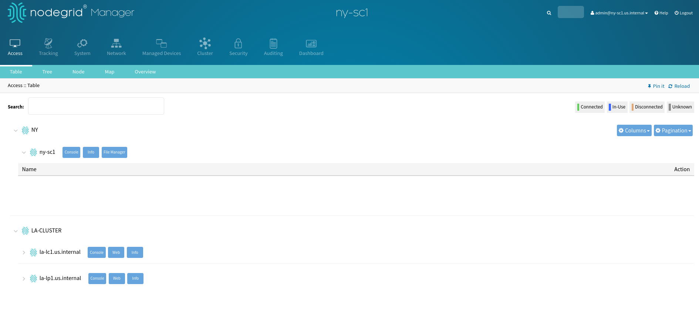

## Super-Coordinator `dub-sc1`


## Local-Coordinator `la-lc1`


## Local-Peer `la-lp1`
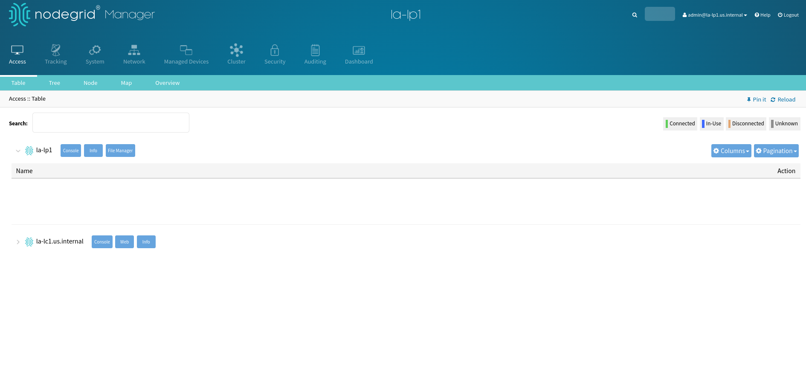

---

# Appendix
## `vim` editor tips

The playbook `001_setup_nodegrid_ansible.yaml` creates the file `/home/ansible/.vimrc` to configure `vim` with the following options:

```shell
set number
set tabstop=2 softtabstop=2 shiftwidth=2
set number ruler
set autoindent smartindent
syntax enable
filetype plugin indent on
```

### Display TAB characters in `vim`

> [!Warning]
> 
> YAML files only accept space characters, are very specific with the indentations, and do not allow tabulators. Should the command fail to display the host's inventory, double-check the hostname, `hosts.yaml` and the `ny-sc1.yaml` file for formatting errors.

To display in `vim` special characters like a tab, use in `vim` the command combination 
- Escape key
- then type `:set list`
- Tab characters are displayed as ^I

#### Example `:set list`
Before:

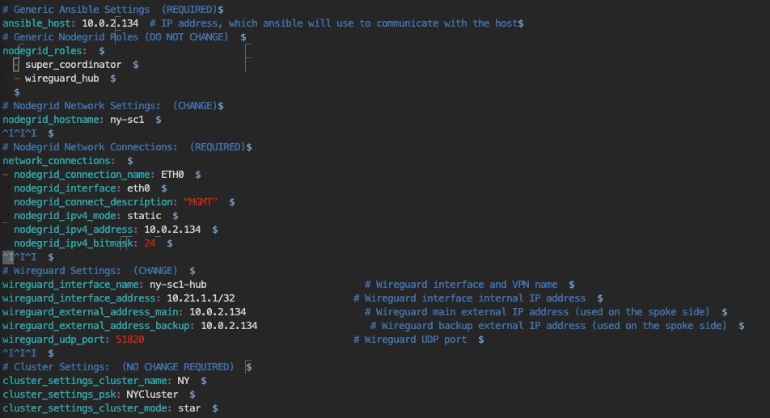

After

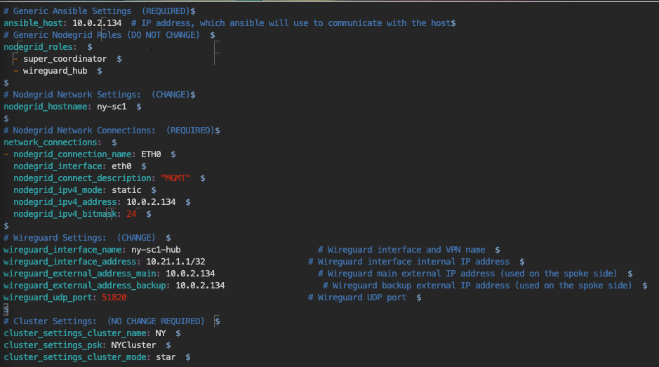


### Known Issues

- [ ] The following modules do not support Check Mode:
	- [ ] `zpe.nodegrid.facts`
	- [ ] `zpe.nodegrid.import_settings`
	- [ ] `zpe.nodegrid.cli_cmd`
- [ ] The following modules do not support Diff Mode:
	- [ ] `zpe.nodegrid.facts`
	- [ ] `zpe.nodegrid.import_settings`
	- [ ] `zpe.nodegrid.cli_cmd`
- [ ] The following modules always report task result as "changed":
	- [ ] `zpe.nodegrid.import_settings`
	- [ ] `zpe.nodegrid.cli_cmd`
- [ ] The following modules always report result as "changed", but this is not expected:
	- [ ] ``network_connections`` differentiation requires improvement
	- [ ] ``system_preferences`` differentiation requires improvement
	- [ ] `zpe.nodegrid.system_authentication`: Plain Passwords will always trigger a change. The recommendation is to only push hashed passwords
- [ ] Some service changes restart of the web server, when running ansible on this same system, this will cause the connection to the system to gets disconnected and the user must login again.
- [ ] Services: enable_search_engine_high_level_cipher_suite="yes" is currently not working
- [ ] Cluster Module reports back OK even when a change was performed
- [ ] **Nodegrid Nat Reversal Proxy**: if a Nodegrid is behind a NAT/Router with public IP, to have SSH access, a specific TCP port is required to be configured in port-forward mode pointing to the Nodegrid TCP/`22`. Furthermore, on the ansible host inventory, this port must be specified. For example, add the following to `dub-sc1.yaml` for configuring SSH access on port `2222`
   ```
   ansible_host: <dub-sc1 Public IP>
   ansible_ssh_port: 2222
   ```
- [ ] **Clustering Issue on KVM VMs deployment**: In the tests, both `la-lc1` and `la-lp1` were deployed on a KVM host with Nodegrid version v6.0.5, and in order to configure the *Cluster* options, first it is required that both Nodegrids are Restored to **Factory Default Settings**. Without this step, the `la-lc1`--`la-lp1` cluster failed.
