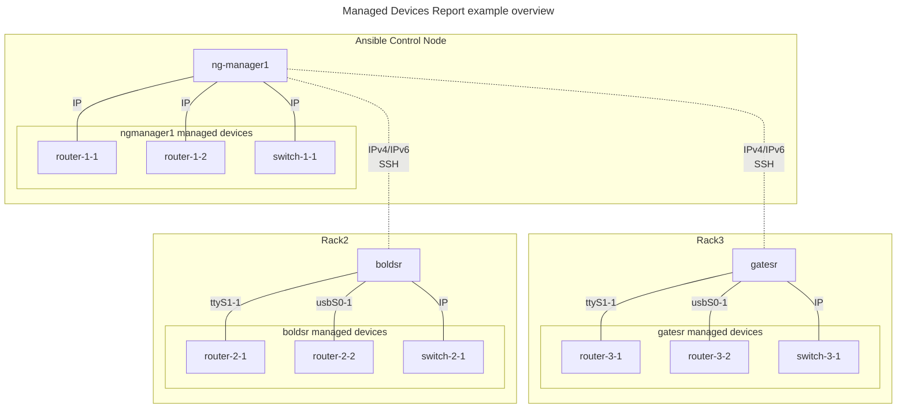
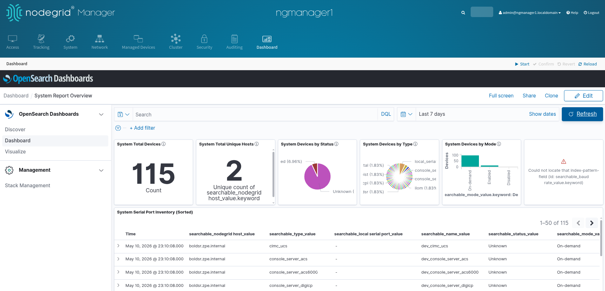

# Managed Devices Report: `nodegrid_elasticsearch_inventory`

This use case collects managed-devices inventory information from local Nodegrid OpenSearch indices, validates and flattens the source rows, and loads the result into a central report index on the designated Nodegrid device with `reports` role.

## Requirements

- Ansible with support for the built-in `uri`, `assert`, `set_fact`, and `include_vars` modules
- Access to the `zpe.nodegrid` collection modules used by this project, including `zpe.nodegrid.nodegrid_facts`
- OpenSearch reachable on the target Nodegrid reports host via `https://localhost:9200`
- Client certificate/key files present on the reports host for report-policy validation tasks

# Use Case Example: 3 Nodegrid devices 
This example considers three Nodegrid devices, each one manages multiple target managed-devices. Therein, the device `ngmanager1` is defined with the `reports` role in the Ansible inventory, and it is the one which will host the inventory information and provide access to the report dashboard. The following diagram depicts the example setup.



## Ansible Inventory

### `ngmanager1.yaml`
Create the file `/etc/ansible/inventories/host_vars/ngmanager1.yaml` with the following content (adapt it accordingly). **Important:** this is the device that will include the `reports` role. 

```yaml
ansible_host: localhost
ansible_port: '22'
ansible_user: ansible
ansible_ssh_private_key_file: ~/.ssh/managed@zpesystems.com
nodegrid_roles:
  - reports
```

### `boldsr.yaml`
Create the file `/etc/ansible/inventories/host_vars/boldsr.yaml` with the following content (adapt it accordingly). 

```yaml
ansible_host: 192.168.1.22
ansible_port: '22'
ansible_user: ansible
ansible_ssh_private_key_file: ~/.ssh/managed@zpesystems.com
```

### `gatesr.yaml`
Create the file `/etc/ansible/inventories/host_vars/gatesr.yaml` with the following content (adapt it accordingly).

```yaml
ansible_host: 192.168.1.23
ansible_port: '22'
ansible_user: ansible
ansible_ssh_private_key_file: ~/.ssh/managed@zpesystems.com
```

### `md_report.yaml` hosts group
Create the file `/etc/ansible/inventories/md_report.yaml` with the following content: 

```yaml
md_report:
  hosts:
    ngmanager1:
    boldsr:
    gatesr:
```

To verify that Ansible Inventory has been properly configured, execute the following:

```bash
ansible@ngmanager1:~$ ansible-inventory --graph md_report
@md_report:
  |--ngmanager1
  |--boldsr
  |--gatesr

```

To validate that Ansible is able to reach all the target devices, execute the following:
```bash
ansible@ngmanager1:~$ ansible -m ping md_report
ngmanager1 | SUCCESS => {
    "changed": false,
    "ping": "pong"
}
boldsr | SUCCESS => {
    "changed": false,
    "ping": "pong"
}
gatesr | SUCCESS => {
    "changed": false,
    "ping": "pong"
}

```

## Managed Devices Report Playbook
Create the file `/etc/ansible/playbooks/md_report.yaml` with the following content:

```yaml
- name: Build the central Nodegrid device report
  hosts: all
  gather_facts: false
  collections:
    - zpe.nodegrid
  tasks:
  - name: Create the Opensearch Inventory
    import_role: 
      name: nodegrid_elasticsearch_inventory
    vars:
      nodegrid_report_target_index: spconfig_system_report
      nodegrid_report_policy_id: system_report_keep_forever
      nodegrid_report_add_row_timestamps: true
      nodegrid_report_synced_timestamp_field: report_synced_at
```

To execute the playbook:

```bash
ansible-playbook md_report.yaml --limit md_report
```
<details>
    <summary> Playbook execution output example </summary>

```
ansible@ngmanager1:/etc/ansible/playbooks$ ansible-playbook md_report.yaml --limit md_report

PLAY [Build the central Nodegrid device report] *******************************************************************************

TASK [Nodegrid elastic search inventory] **************************************************************************************
included: nodegrid_elasticsearch_inventory for ngmanager1

TASK [zpe.nodegrid.nodegrid_elasticsearch_inventory : Include variable definitions] *******************************************
ok: [ngmanager1]

TASK [zpe.nodegrid.nodegrid_elasticsearch_inventory : Build list of central report host candidates] ***************************
skipping: [ngmanager1] => (item=dev_cimc_ucs)
skipping: [ngmanager1] => (item=dev_console_server_acs)
skipping: [ngmanager1] => (item=dev_console_server_acs6000)
ok: [ngmanager1 -> localhost(127.0.0.1)] => (item=ngmanager1)

TASK [zpe.nodegrid.nodegrid_elasticsearch_inventory : Ensure exactly one reports host is defined] *****************************
ok: [ngmanager1 -> localhost(127.0.0.1)] => {
    "changed": false,
    "msg": "Using central reports host: ngmanager1"
}

TASK [zpe.nodegrid.nodegrid_elasticsearch_inventory : Set central reports host fact for this execution host] ******************
ok: [ngmanager1]

TASK [zpe.nodegrid.nodegrid_elasticsearch_inventory : Collect Nodegrid facts] *************************************************
ok: [ngmanager1]

TASK [zpe.nodegrid.nodegrid_elasticsearch_inventory : Set Nodegrid version and model facts] ***********************************
ok: [ngmanager1]

TASK [zpe.nodegrid.nodegrid_elasticsearch_inventory : Audit - Inventory collection started] ***********************************
included: /etc/ansible/collections/ansible_collections/zpe/nodegrid/roles/nodegrid_elasticsearch_inventory/tasks/audit.yml for ngmanager1

TASK [zpe.nodegrid.nodegrid_elasticsearch_inventory : Set audit log directory] ************************************************
ok: [ngmanager1]

TASK [zpe.nodegrid.nodegrid_elasticsearch_inventory : Create primary audit log directory] *************************************
ok: [ngmanager1]

TASK [zpe.nodegrid.nodegrid_elasticsearch_inventory : Build audit timestamp] **************************************************
ok: [ngmanager1]

TASK [zpe.nodegrid.nodegrid_elasticsearch_inventory : Create audit entry] *****************************************************
ok: [ngmanager1]

TASK [zpe.nodegrid.nodegrid_elasticsearch_inventory : Write audit log] ********************************************************
changed: [ngmanager1]

TASK [zpe.nodegrid.nodegrid_elasticsearch_inventory : Collect inventory from Elasticsearch] ***********************************
ok: [ngmanager1]

TASK [zpe.nodegrid.nodegrid_elasticsearch_inventory : Audit - Inventory collection completed] *********************************
included: /etc/ansible/collections/ansible_collections/zpe/nodegrid/roles/nodegrid_elasticsearch_inventory/tasks/audit.yml for ngmanager1

TASK [zpe.nodegrid.nodegrid_elasticsearch_inventory : Set audit log directory] ************************************************
ok: [ngmanager1]

TASK [zpe.nodegrid.nodegrid_elasticsearch_inventory : Create primary audit log directory] *************************************
ok: [ngmanager1]

TASK [zpe.nodegrid.nodegrid_elasticsearch_inventory : Build audit timestamp] **************************************************
ok: [ngmanager1]

TASK [zpe.nodegrid.nodegrid_elasticsearch_inventory : Create audit entry] *****************************************************
ok: [ngmanager1]

TASK [zpe.nodegrid.nodegrid_elasticsearch_inventory : Write audit log] ********************************************************
changed: [ngmanager1]

TASK [zpe.nodegrid.nodegrid_elasticsearch_inventory : Audit - Report load started] ********************************************
included: /etc/ansible/collections/ansible_collections/zpe/nodegrid/roles/nodegrid_elasticsearch_inventory/tasks/audit.yml for ngmanager1

TASK [zpe.nodegrid.nodegrid_elasticsearch_inventory : Set audit log directory] ************************************************
ok: [ngmanager1]

TASK [zpe.nodegrid.nodegrid_elasticsearch_inventory : Create primary audit log directory] *************************************
ok: [ngmanager1]

TASK [zpe.nodegrid.nodegrid_elasticsearch_inventory : Build audit timestamp] **************************************************
ok: [ngmanager1]

TASK [zpe.nodegrid.nodegrid_elasticsearch_inventory : Create audit entry] *****************************************************
ok: [ngmanager1]

TASK [zpe.nodegrid.nodegrid_elasticsearch_inventory : Write audit log] ********************************************************
changed: [ngmanager1]

TASK [zpe.nodegrid.nodegrid_elasticsearch_inventory : Load inventory rows to central report index host] ***********************
changed: [ngmanager1]

TASK [zpe.nodegrid.nodegrid_elasticsearch_inventory : Audit - Report load completed] ******************************************
included: /etc/ansible/collections/ansible_collections/zpe/nodegrid/roles/nodegrid_elasticsearch_inventory/tasks/audit.yml for ngmanager1

TASK [zpe.nodegrid.nodegrid_elasticsearch_inventory : Set audit log directory] ************************************************
ok: [ngmanager1]

TASK [zpe.nodegrid.nodegrid_elasticsearch_inventory : Create primary audit log directory] *************************************
ok: [ngmanager1]

TASK [zpe.nodegrid.nodegrid_elasticsearch_inventory : Build audit timestamp] **************************************************
ok: [ngmanager1]

TASK [zpe.nodegrid.nodegrid_elasticsearch_inventory : Create audit entry] *****************************************************
ok: [ngmanager1]

TASK [zpe.nodegrid.nodegrid_elasticsearch_inventory : Write audit log] ********************************************************
changed: [ngmanager1]

TASK [zpe.nodegrid.nodegrid_elasticsearch_inventory : Validate report ISM policy exists on reports host] **********************
ok: [ngmanager1]

TASK [zpe.nodegrid.nodegrid_elasticsearch_inventory : Validate report index has expected ISM policy attached] *****************
ok: [ngmanager1]

TASK [zpe.nodegrid.nodegrid_elasticsearch_inventory : Assert report policy attachment state] **********************************
ok: [ngmanager1] => {
    "changed": false,
    "msg": "Report index spconfig_system_report is attached to policy system_report_keep_forever."
}

TASK [zpe.nodegrid.nodegrid_elasticsearch_inventory : Aggregate final facts] **************************************************
ok: [ngmanager1]

TASK [zpe.nodegrid.nodegrid_elasticsearch_inventory : Return results] *********************************************************
ok: [ngmanager1] => {
    "msg": "Inventory collection completed"
}

TASK [zpe.nodegrid.nodegrid_elasticsearch_inventory : Import Dashboard] *******************************************************
ok: [ngmanager1]

PLAY RECAP ********************************************************************************************************************
ngmanager1                 : ok=39   changed=5    unreachable=0    failed=0    skipped=0    rescued=0    ignored=0
```
</details>

## Access the Dashboard

Access the Web UI of the `ngmanager1` device and execute the following:

- Dashboard -> Dashboard -> System Report Overview




# Update/refresh the Managed Devices data

The following playbook execution will import the managed devices information, and not import the dashboard.

```bash
ansible-playbook md_report.yaml --limit md_report --skip-tags import_dashboard
```


---
# `nodegrid_elasticsearch_inventory` Role Variables

The role-level variables' defaults values are:

| Variable | Default | Purpose |
| --- | --- | --- |
| `nodegrid_report_target_index` | `spconfig_system_report` | Report index that receives the flattened inventory rows |
| `nodegrid_report_batch_size` | `1000` | Bulk API batch size used by the report-load module |
| `nodegrid_report_check_shard_capacity` | `true` | Pre-check shard capacity before index creation |
| `nodegrid_report_auto_increase_shard_limit` | `true` | Allow automatic `cluster.max_shards_per_node` increases when needed |
| `nodegrid_report_shard_limit_increment` | `100` | Minimum shard-limit increment when auto-increase is enabled |
| `nodegrid_report_shard_limit_hard_cap` | `1200` | Hard ceiling for automatic shard-limit updates |
| `nodegrid_report_purge_before_load` | `false` | Delete the existing report index before loading |
| `nodegrid_report_add_row_timestamps` | `true` | Stamp lifecycle timestamps on report rows |
| `nodegrid_report_created_timestamp_field` | `report_created_at` | First-seen timestamp field |
| `nodegrid_report_updated_timestamp_field` | `report_updated_at` | Field updated only when row content changes |
| `nodegrid_report_synced_timestamp_field` | `report_synced_at` | Field updated on every sync run |
| `nodegrid_report_protect_index` | `true` | Ensure the report index has a protective template and ISM policy |
| `nodegrid_report_validate_policy_attachment` | `true` | Validate that the expected report policy is attached |
| `nodegrid_report_policy_id` | `system_report_keep_forever` | ISM policy ID used for report-index protection |
| `nodegrid_report_client_cert` | `/etc/opensearch/config/admin.pem` | Client certificate for report-policy validation |
| `nodegrid_report_client_key` | `/etc/opensearch/config/admin-key.pem` | Client key for report-policy validation |
| `nodegrid_report_validate_certs` | `false` | TLS validation toggle used by validation tasks |

## Behavior notes

- The role discovers exactly one central reports host by looking for the `reports` role in `nodegrid_roles` or `nodegrid_role`.
- Inventory rows are loaded only when source OpenSearch is reachable.
- If `nodegrid_report_add_row_timestamps=true`, new rows get `report_created_at`, changed rows get `report_updated_at`, and every run updates `report_synced_at`.
- Timestamp field names and the report policy ID are fully configurable and are passed through to the load module.
- If a row contains a `coordinates` field in `lat,lon` form, the loader preserves it as text and also writes `coordinates_geo` as `geo_point`.

## Security Best Practices

- Keep the report index protected with `nodegrid_report_protect_index: true` and a dedicated policy such as `system_report_keep_forever`.
- Treat `nodegrid_report_auto_increase_shard_limit` as a privileged setting and enable it only when operationally necessary.
- The role includes structured audit events for critical operations (`inventory_start`, `inventory_complete`, `report_load_start`, `report_load_complete`) through `tasks/audit.yml`.
- Audit records are written to `/var/log/nodegrid/audit-*.log` and should be collected by your central logging pipeline.
- User-controlled field names and policy IDs are validated before OpenSearch API calls. Keep custom values within supported characters and lengths.
- Bulk writes include payload size safeguards (`MAX_PAYLOAD_BYTES`), request retries, and backoff to reduce overload risk.
- Error responses returned to playbooks are intentionally sanitized; use Ansible/controller logs for detailed troubleshooting.

## Dependencies

- No external Ansible role dependencies are declared in `meta/main.yml`
- This role depends on project-local custom modules in `library/`:
  - `nodegrid_elasticsearch_inventory`
  - `nodegrid_elasticsearch_report_load`

## Example Playbook

```yaml
- name: Build the central Nodegrid device report
  hosts: all
  gather_facts: false
  roles:
	- role: nodegrid_elasticsearch_inventory
	  vars:
		nodegrid_report_target_index: spconfig_system_report
		nodegrid_report_policy_id: system_report_keep_forever
		nodegrid_report_add_row_timestamps: true
		nodegrid_report_synced_timestamp_field: report_synced_at
```

## Tags

- `inventory_setup`: discover and validate the single central reports host
- `inventory_collect`: collect Nodegrid facts and source inventory from OpenSearch
- `inventory_load`: create/protect/load the report index
- `report_policy`: validate the report policy and policy attachment
- `policy_check`: run the report-policy existence and attachment assertions
- `inventory_summary`: publish the aggregated role fact and debug summary

## Exported Facts

The role exports a `nodegrid_elasticsearch_inventory` fact with:

- `nodegrid_version`
- `nodegrid_model`
- `elasticsearch_status`
- `device_data.valid`, `device_data.invalid`, `device_data.errors`, `device_data.devices`
- `report_load.target_host`, `report_load.target_index`
- row-write counts: `processed`, `created`, `updated`, `noop`, `failed`
- shard diagnostics: `shard_open`, `shard_available`, `max_shards_per_node`, `shard_limit_changed`, `shard_increase_error`, `shard_retry_create_error`
- protection state: `index_template_changed`, `policy_created`, `policy_attachment_changed`, `policy_expected`, `policy_attached`
- timestamp-field names used by the run

---
## Manual Dashboard Import
Access the Web UI of the `ngmanager1` device and execute the following:

1. Dashboard -> Stack Management -> Saved Objects -> Import
2. Select `files/nodegrid_device_report_kibana.ndjson`
3. Overwrite on conflicts if needed
4. Refresh the data view fields after the report index has been loaded so all report fields are available


## License

GPL-3.0-or-later

## Author Information

Maintained for Nodegrid/OpenSearch reporting workflows by ZPE Systems.

