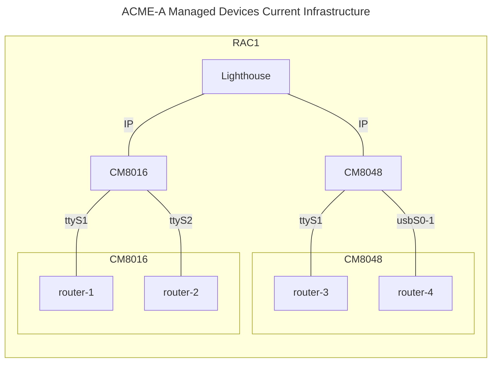
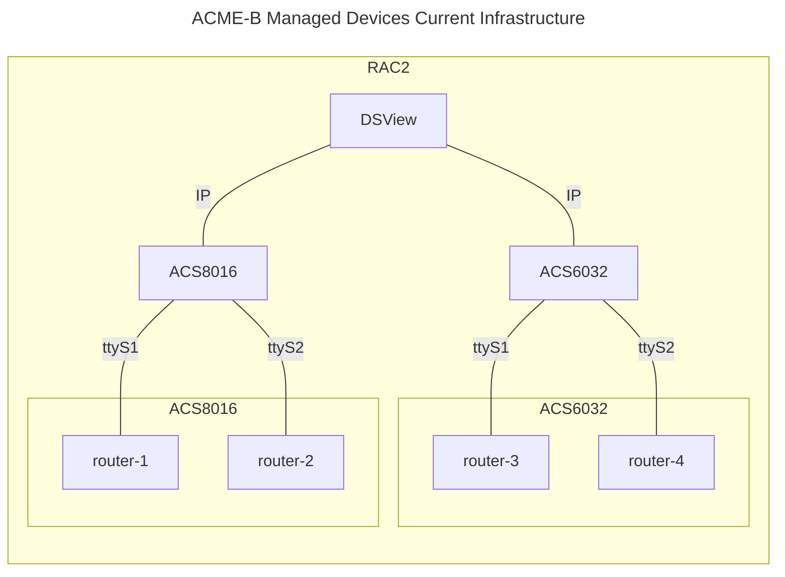
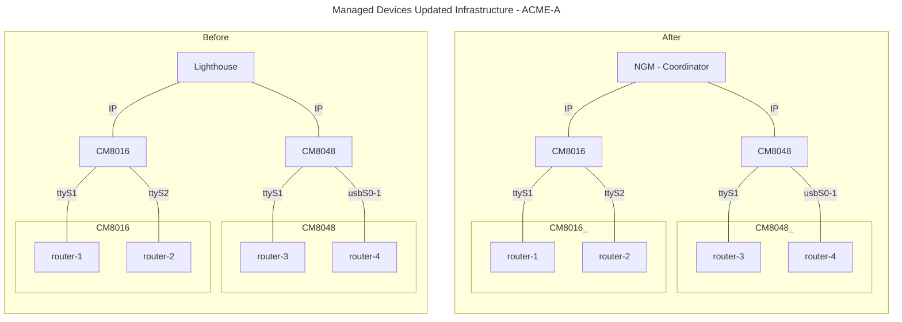
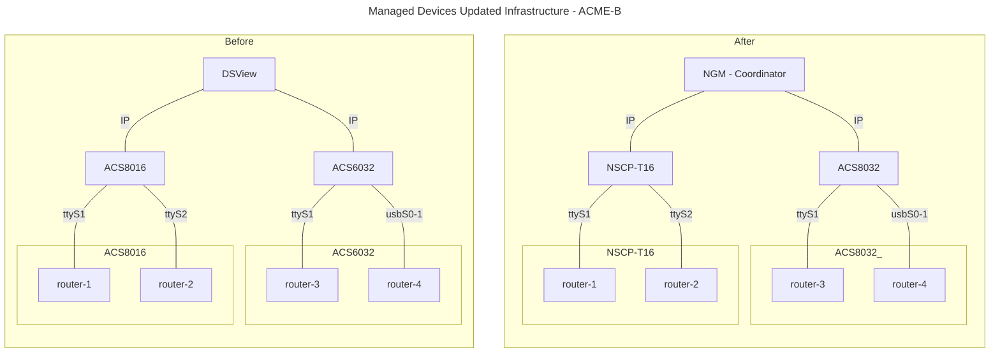
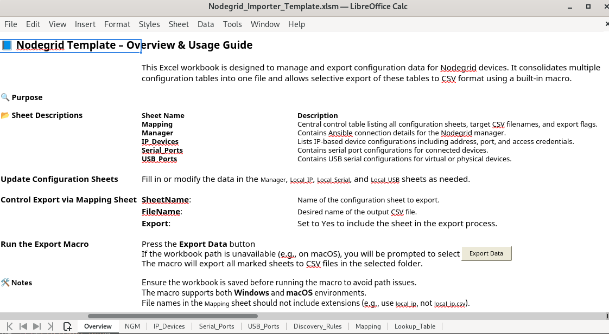
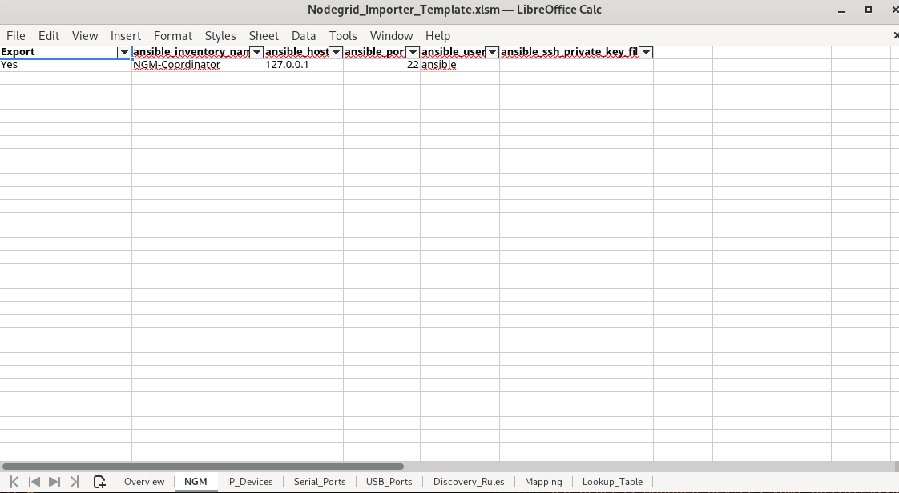
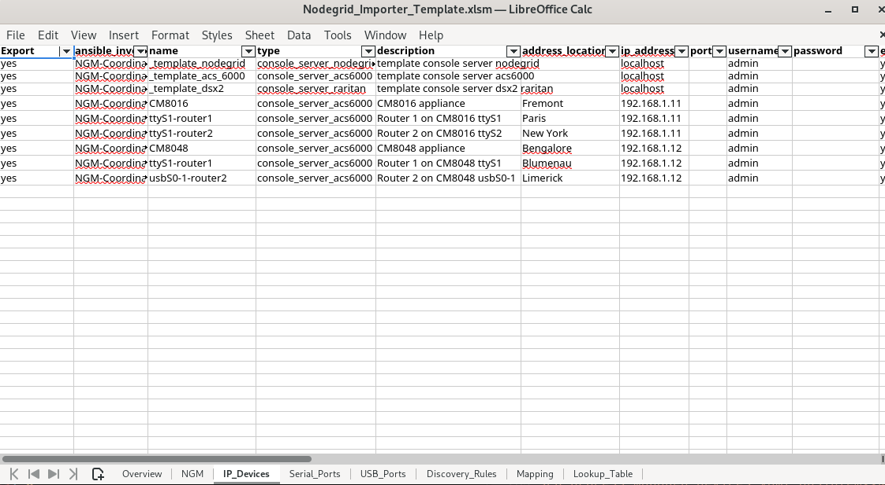
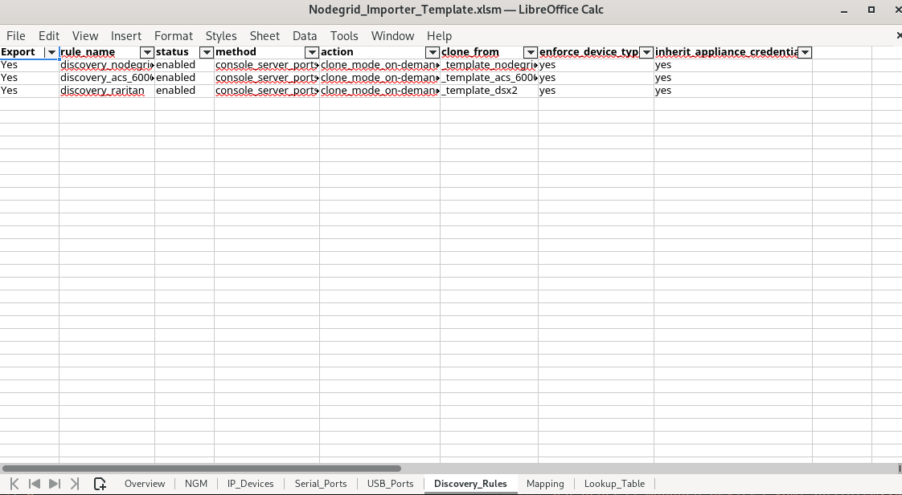
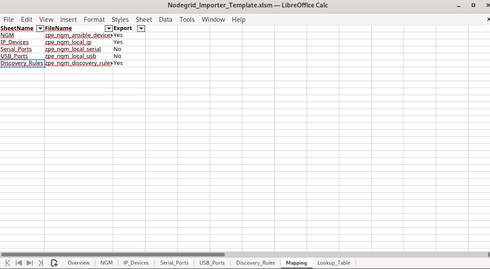

# ZPE Nodegrid Managed Devices Migration - Ansible Automation

## Executive Summary

This document describes the solution implemented to help customer to migrate to the OOB ZPE Nodegrid solution. The use case considers that a New Customer requires to migrate from their old OOB Management system into ZPE Nodegrid solution, thus it is required to configure all of its managed devices (e.g., serial console devices, USB console devices, or IP-based managed devices) in a seamless, and low-effort manner into the ZPE solution. The objective is to automate the configuration of the customers' managed devices into the ZPE Nodegrid solution.

This solution requires that the Customer **creates different CSV files by filling the required information in a provided Excel Template**. The required information includes their current infrastructure managed devices, and the new Nodegrid devices to be deployed. Then, the customer deploys the migration process via the execution of an Ansible playbook, which will configure the ZPE Nodegrid devices and their corresponding managed devices.

## Use Cases Examples

### Use Case 1: ACME-A company
This use case considers that the **ACME-A** company decides to migrate to the ZPE OOB solution, and their current infrastructure includes:

- One Lighthouse server
- Two OpenGear devices (CM8000 models) that provide remote management access
  - CM8016
    - Serial access to `router-1` and `router-2`
  - CM8048
    - Serial access to `router-3` and `router-4`

The following diagram depicts ACME-A Infrastructure example.


### Use Case 2: ACME-B company

An alternative scenario exist with company **ACME-B**. Their infrastructure includes:

- One DSView server
- Two ACS devices (ACS6000 and ACS8000 models) that provide remote management access
  - ACS6016
    - Serial access to `router-1` and `router-2`
  - ACS8032
    - Serial access to router-3 and router-4

The following diagram depicts ACME-B Infrastructure example.



## Desired Infrastructure migration

The desired migration tool, will facilitate two distinct and independent phases:

1. Replacement of existing management solution, without replacement of any available physical appliance.
2. Replacement of individual hardware appliances.

### Phase 1: Replacement of Management Solution

On this section, we consider the current infrastructure example of customer **ACME-A** and the replacement of their current Management Solution, i.e., *Lighthouse*. The following diagram depicts the before and after once the migration process is deployed:



### Phase 2: Replacement of Appliance

On this section, we consider the current infrastructure example of customer **ACME-B** and the replacement of an Appliance as well as their current Management Solution, i.e., *DSView. The following diagram depicts the before and after once the migration process is deployed:


---

## Migration process for the use case ACME-A.
### Phase 1: Replacement of Management Solution

In a nutshell to deploy the migration process, the following steps are required:

#### Step 1: Prepare the `NGM-Coordinator`
This step assumes that the new ZPE device `NGM - Coordinator` has been deployed and the customer have remote SSH access.

1. Install the ZPE Ansible library on the NGM following the instructions defined at [ZPESystems Ansible](https://github.com/ZPESystems/Ansible).
2. SSH access the NGM instance with the `ansible` user.
3. Execute the **Migration Process**.

#### Step 2: Migration Process
1. Fill in the current infrastructure information on the Excel file [Nodegrid_Importer_Template.xlsm](./Nodegrid_Importer_Template.xlsm). Then, on the `Overview` sheet, select __Export Data__. The following CSV files should be created:

|CSV File|Description|
|:--:|:---:|
|`zpe_ngm_ansible_devices.csv`|Ansible target devices|
|`zpe_ngm_local_ip.csv`|IP-based Managed Devices|
|`zpe_ngm_discovery_rules.csv`|Nodegrid Managed Devices Discovery Rules|

The following pictures depict the use case:







3. Copy the CSV files to the `NGM-Coordinator` (Replace the IP-address accordingly)
```shell
scp zpe_ngm_ansible_devices.csv zpe_ngm_local_ip.csv zpe_ngm_discovery_rules.csv ansible@<<NGM-Coordinator IP>>:~/
```
4. Copy the Ansible playbook [process_managed_devices.yaml](process_managed_devices.yaml) into the NGM-Coordinator
```shell
scp process_managed_devices.yaml ansible@<<NGM-Coordinator IP>>:~/
```
5. Execute the Ansible playbook
```shell
ansible-playbook process_managed_devices.yaml
```

**NOTE:** It is assumed that the Ansible playbook `process_managed_devices.yaml` and all the CSV files are located at the path `/home/ansible` on the NGM-Coordinator.

