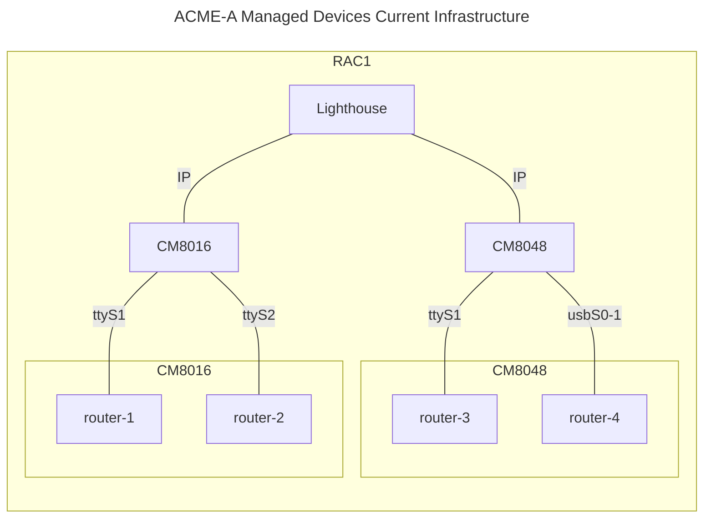
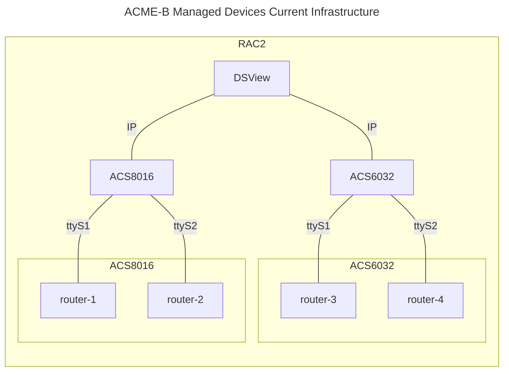
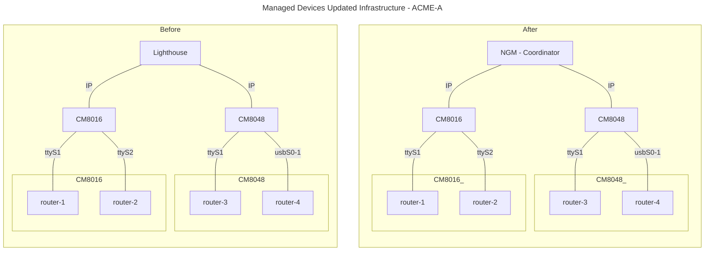
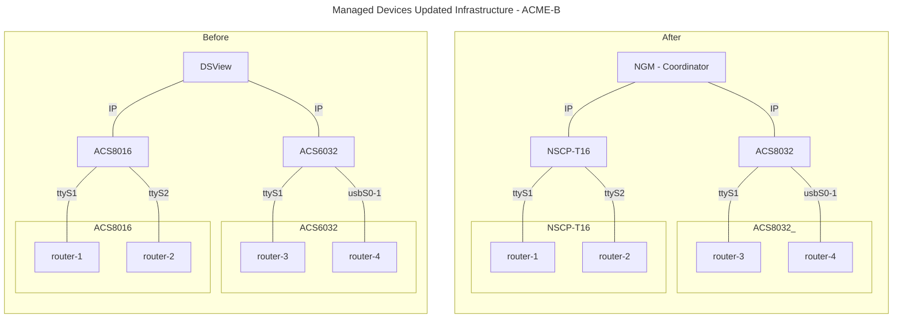
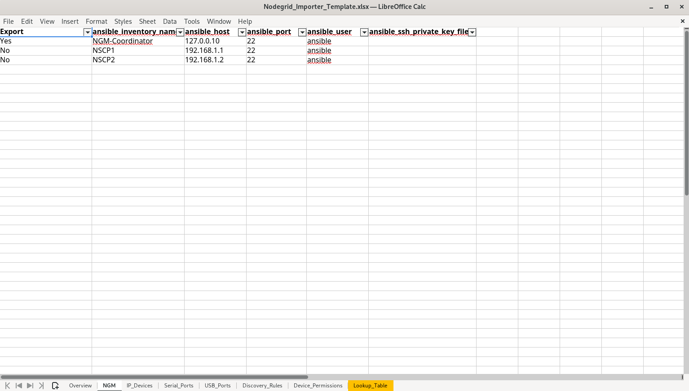
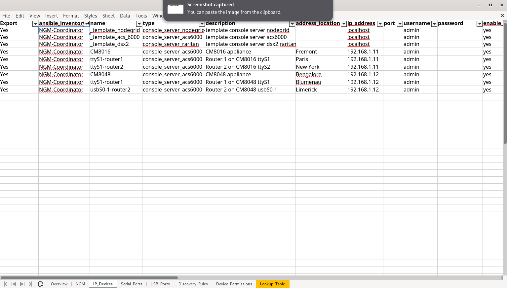
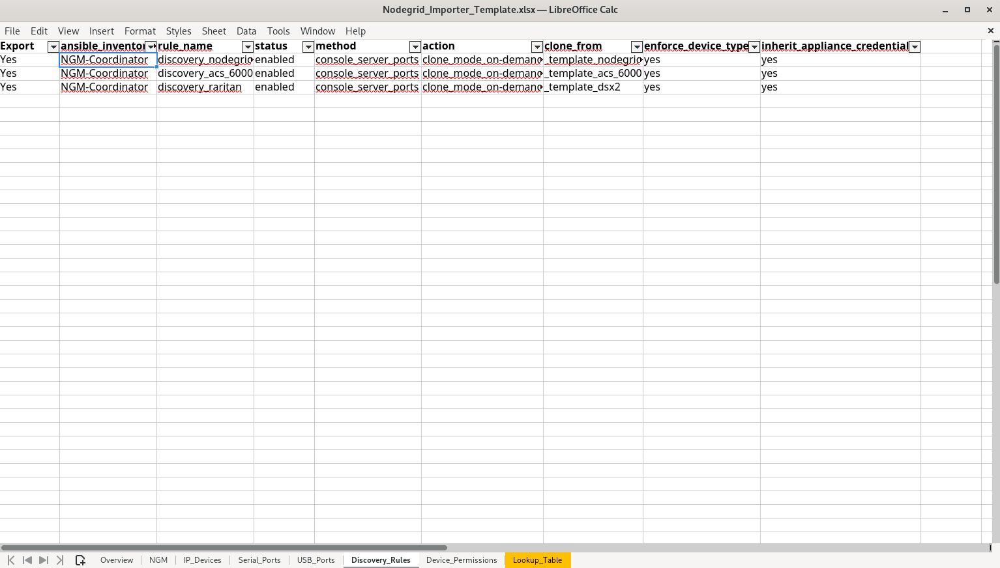
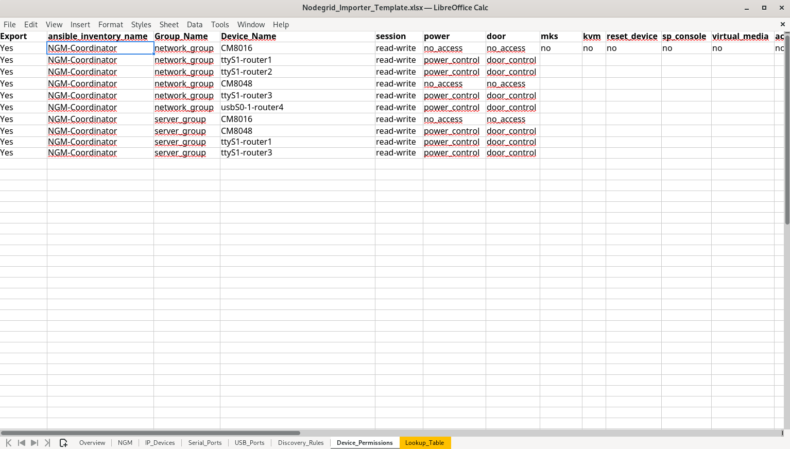
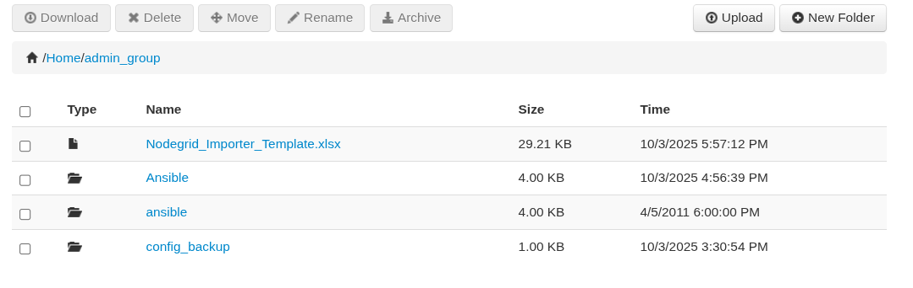

# ZPE Nodegrid Managed Devices Migration - Ansible Automation

## Executive Summary

This document describes the Ansible tool developed to help customers streamline the migration to the OOB ZPE Nodegrid solution. The use case considers that a New Customer seeks to migrate from their current OOB Management system into ZPE Nodegrid solution, thus it is required to properly setup the current infrastructure's managed devices (e.g., serial console devices, USB console devices, or IP-based managed devices) in a seamless manner into the ZPE solution. The objective is to automate the configuration of the customers' managed devices into the ZPE Nodegrid solution.

This solution requires that the Customer **fills-in an Excel template (`xlsx`) file with the relevant information about their infrastructure**. The required information includes their current managed devices, and the new Nodegrid devices to be deployed. Then, the customer deploys the migration process via the execution of Ansible playbooks, which will configure the ZPE Nodegrid devices with their corresponding managed devices.

## Use Cases Examples

### Use Case 1: ACME-A company
This use case considers that the **ACME-A** company decides to migrate to the ZPE OOB solution, and their current infrastructure includes:

- One Lighthouse server
- Two OpenGear devices (CM8000 models) that provide remote management access
  - CM8016
    - Serial access to `router-1` and `router-2`
  - CM8048
    - Serial access to `router-3` and `router-4`

The following diagram depicts ACME-A Infrastructure example.


```mermaid
---
title: ACME-A Managed Devices Current Infrastructure
---
flowchart
 id21["Lighthouse"]
 id210["CM8048"]
 id2101["router-3"]
 id2102["router-4"]
 id211["CM8016"]
 id2111["router-1"]
 id2112["router-2"]
 
subgraph RAC1
 direction TB
 id21 ---|IP| id210
  subgraph CM8048
   direction LR
   id2101
   id2102
 end
 id210 ---|ttyS1| id2101
 id210 ---|usbS0-1| id2102
 id21 ---|IP| id211
 subgraph CM8016
   direction LR
   id2111
   id2112
 end
 id211 ---|ttyS1| id2111
 id211 ---|ttyS2| id2112
end
```
### Use Case 2: ACME-B company

An alternative scenario exist with company **ACME-B**. Their infrastructure includes:

- One DSView server
- Two ACS devices (ACS6000 and ACS8000 models) that provide remote management access
  - ACS6016
    - Serial access to `router-1` and `router-2`
  - ACS8032
    - Serial access to router-3 and router-4

The following diagram depicts ACME-B Infrastructure example.


```mermaid
---
title: ACME-B Managed Devices Current Infrastructure
---
flowchart
 id22["DSView"]
 
 id220["ACS6032"]
 id2201["router-3"]
 id2202["router-4"]
 id223["ACS8016"]
 id2231["router-1"]
 id2232["router-2"]

subgraph RAC2
 direction TB
 id22 ---|IP| id220
  subgraph ACS6032
   direction LR
   id2201
   id2202
 end
 id220 ---|ttyS1| id2201
 id220 ---|ttyS2| id2202
 
 id22 ---|IP| id223
 subgraph ACS8016
   direction LR
   id2232
   id2231
   
 end
 id223 ---|ttyS1| id2231
 id223 ---|ttyS2| id2232
end
```

## Desired Infrastructure migration

The desired migration tool, will facilitate two distinct and independent phases:

1. Replacement of existing management solution, without replacement of any available physical appliances.
2. Replacement of individual hardware appliances.

### Phase 1: Replacement of the Management Solution

On this section, we consider the current infrastructure example of customer **ACME-A** and the replacement of their current Management Solution, i.e., *Lighthouse*. The following diagram depicts the before and after once the migration process is deployed:


```mermaid
---
title: Managed Devices Updated Infrastructure - ACME-A
---
flowchart
 id21["Lighthouse"]
 id22["NGM - Coordinator"]
 id210["CM8048"]
 id2101["router-3"]
 id2102["router-4"]
 id211["CM8016"]
 id2111["router-1"]
 id2112["router-2"]
 
 id220["CM8048"]
 id2201["router-3"]
 id2202["router-4"]
 id223["CM8016"]
 id2231["router-1"]
 id2232["router-2"]

subgraph After
 direction TB
 id22 ---|IP| id220
  subgraph CM8048_
   direction LR
   id2201
   id2202
 end
 id220 ---|ttyS1| id2201
 id220 ---|usbS0-1| id2202
 
 id22 ---|IP| id223
 subgraph CM8016_
   direction LR
   id2231
   id2232
 end
 id223 ---|ttyS1| id2231
 id223 ---|ttyS2| id2232
end

subgraph Before
 direction TB
 id21 ---|IP| id210
  subgraph CM8048
   direction LR
   id2101
   id2102
 end
 id210 ---|ttyS1| id2101
 id210 ---|usbS0-1| id2102
 id21 ---|IP| id211
 subgraph CM8016
   direction LR
   id2111
   id2112
 end
 id211 ---|ttyS1| id2111
 id211 ---|ttyS2| id2112
end
```

### Phase 2: Replacement of Appliance

On this section, we consider the current infrastructure example of customer **ACME-B** and the replacement of an Appliance as well as their current Management Solution, i.e., *DSView. The following diagram depicts the before and after once the migration process is deployed:


```mermaid
---
title: Managed Devices Updated Infrastructure - ACME-B
---
flowchart
 id21["DSView"]
 id22["NGM - Coordinator"]
 id210["ACS6032"]
 id2101["router-3"]
 id2102["router-4"]
 id211["ACS8016"]
 id2111["router-1"]
 id2112["router-2"]
 
 id220["ACS8032"]
 id2201["router-3"]
 id2202["router-4"]
 id223["NSCP-T16"]
 id2231["router-1"]
 id2232["router-2"]

subgraph After
 direction TB
 id22 ---|IP| id220
  subgraph ACS8032_
   direction LR
   id2201
   id2202
 end
 id220 ---|ttyS1| id2201
 id220 ---|usbS0-1| id2202
 
 id22 ---|IP| id223
 subgraph NSCP-T16
   direction LR
   id2231
   id2232
 end
 id223 ---|ttyS1| id2231
 id223 ---|ttyS2| id2232
end

subgraph Before
 direction TB
 id21 ---|IP| id210
  subgraph ACS6032
   direction LR
   id2101
   id2102
 end
 id210 ---|ttyS1| id2101
 id210 ---|usbS0-1| id2102
 id21 ---|IP| id211
 subgraph ACS8016
   direction LR
   id2111
   id2112
 end
 id211 ---|ttyS1| id2111
 id211 ---|ttyS2| id2112
end
```
---

## Migration process for the use case ACME-A.
### Phase 1: Replacement of the Management Solution

The following steps describe the migration process.

#### Step 1: Prepare the `NGM-Coordinator`
This step assumes that the new ZPE device `NGM - Coordinator` has been deployed and the customer have remote SSH access.

1. Install the ZPE Ansible library on the NGM following the instructions defined at [ZPESystems Ansible](https://github.com/ZPESystems/Ansible).
2. SSH access the NGM instance using the `ansible` user.
3. Execute the **Migration Process** step.

#### Step 2: Migration Process
1. Locally using Excel or Calc application, fill-in the current infrastructure information on the file [Nodegrid_Importer_Template.xlsx](./Nodegrid_Importer_Template.xlsx). 

The following pictures depict the above use case:






2. Copy the local file `Nodegrid_Importer_Template.xslx` into the `NGM-Coordinator` `admin_group` folder (**Note: do not change the file name**). This can be achieved either using the Nodegrid Web-UI (System->Toolkit->File Manager) or SSH, as described below:




```
scp Nodegrid_Importer_Template.xslx ansible@NGM-Coordinator:/var/local/file_manager/admin_group/Nodegrid_Importer_Template.xslx
```

3. Copy the Ansible playbooks [process_xlsx_managed_devices.yaml](process_xlsx_managed_devices.yaml) and [configure_managed_devices.yaml](configure_managed_devices.yaml). 

```shell
cp /etc/ansible/playbooks/examples/system-roles/Migration_Automation_Managed_Devices/process_xlsx_managed_devices.yaml /etc/ansible/playbooks/examples/system-roles/Migration_Automation_Managed_Devices/configure_managed_devices.yaml /etc/ansible/playbooks/
```


4. Create the Ansible Inventory. The following playbook processes the xlsx file and creates/configures the Ansible inventory. 
```shell
cd /etc/ansible/playbooks/
ansible-playbook process_xlsx_managed_devices.yaml
```

5. Configure the desired state. The following playbook configures all the target Nodegrid devices and their managed devices.

```shell
cd /etc/ansible/playbooks/
ansible-playbook configure_managed_devices.yaml
```
