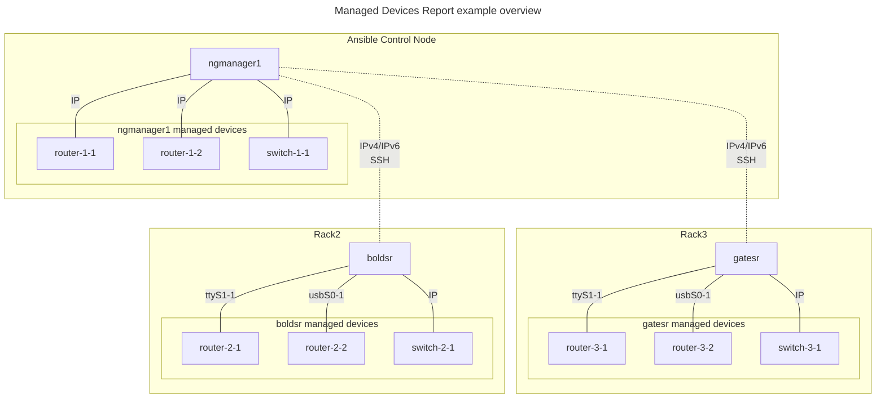
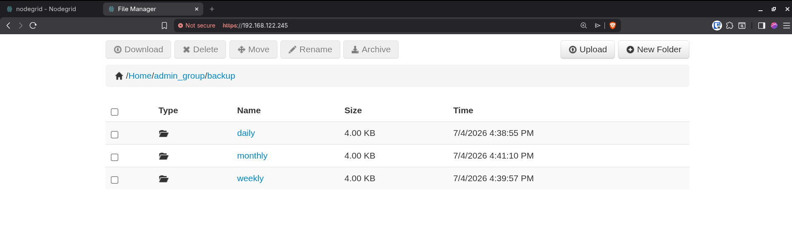
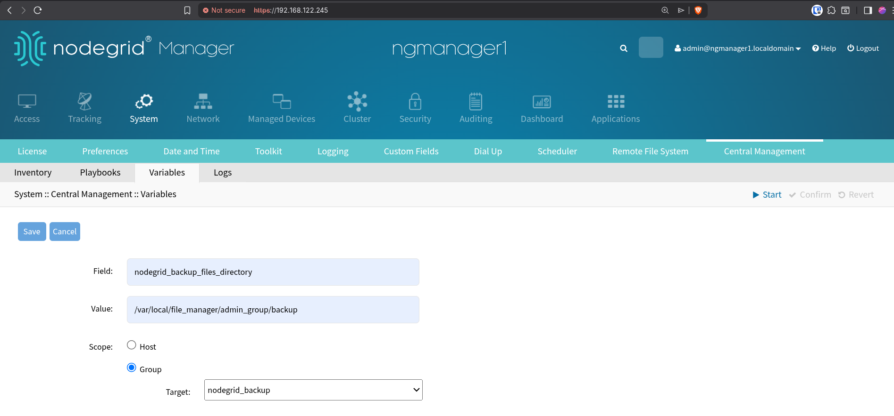
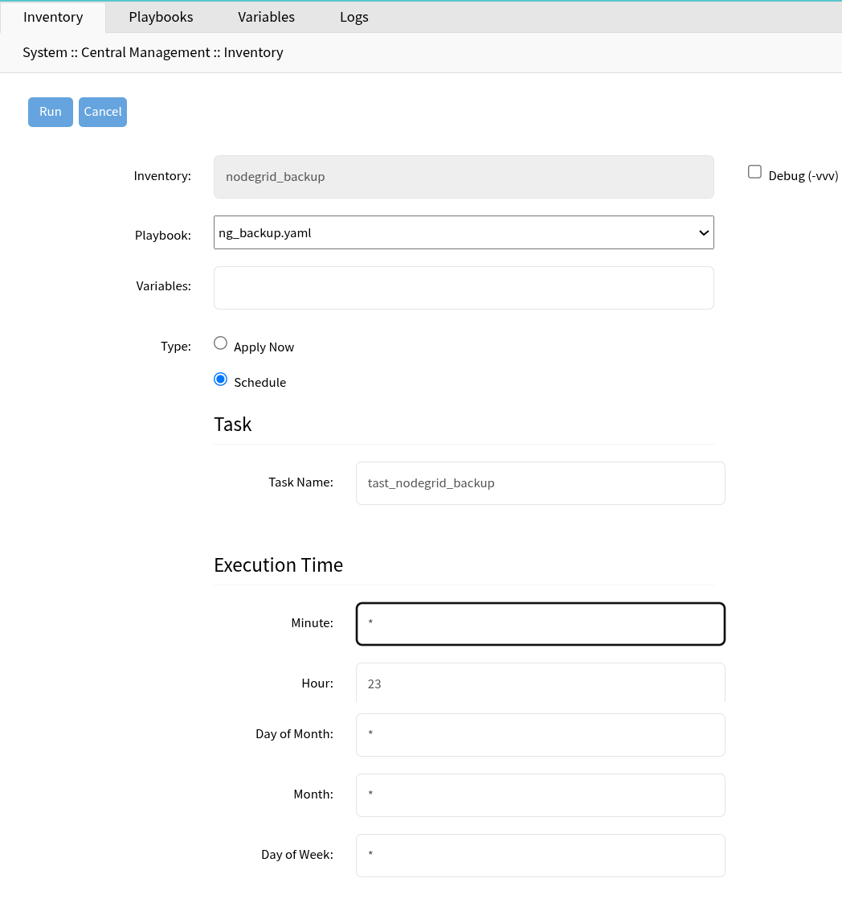
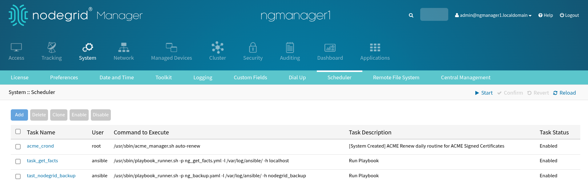
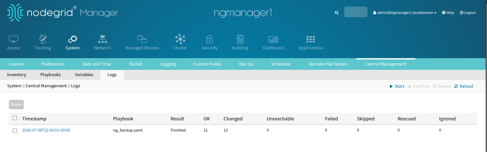
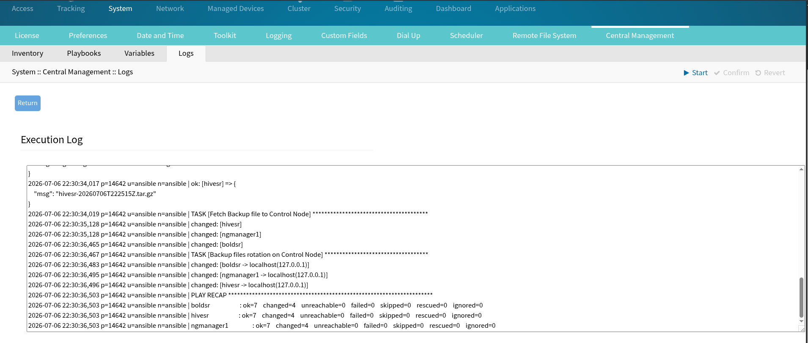

# Nodegrid Backups Rotations Use Case 

This use case describes the Nodegrid backup process with the following files rotation logic per each Nodegrid device:
- **Daily**: Keep a daily backup (latest) for the last 7 days.
- **Weekly**: Keep one backup per week (latest) for the last 4 weeks.
- **Montly**: Keep one backup per month (latest) for the last 12 months.

The above cases consider the time window starting from the Nodegrid localtime relative to when the process is executed. 

## Requirements

- Nodegrid Ansible Control Node with the `zpe.nodegrid` collection modules installed.

# Use Case Example: 3 Nodegrid devices 
This example considers three Nodegrid devices, each one manages multiple target managed-devices. Therein, the device `ngmanager1` is considered to be the Ansible Control node. The following diagram depicts the example setup.



## Ansible Inventory

### `ngmanager1.yaml`
Create the file `/etc/ansible/inventories/host_vars/ngmanager1.yaml` with the following content (adapt it accordingly). **Important:** this is the device that will include the `reports` role. 

```yaml
ansible_host: localhost
ansible_port: '22'
ansible_user: ansible
ansible_ssh_private_key_file: ~/.ssh/managed@zpesystems.com
```

### `boldsr.yaml`
Create the file `/etc/ansible/inventories/host_vars/boldsr.yaml` with the following content (adapt it accordingly). 

```yaml
ansible_host: 192.168.1.22
ansible_port: '22'
ansible_user: ansible
ansible_ssh_private_key_file: ~/.ssh/managed@zpesystems.com
```

### `gatesr.yaml`
Create the file `/etc/ansible/inventories/host_vars/gatesr.yaml` with the following content (adapt it accordingly).

```yaml
ansible_host: 192.168.1.23
ansible_port: '22'
ansible_user: ansible
ansible_ssh_private_key_file: ~/.ssh/managed@zpesystems.com
```

### `nodegrid_backup.yaml` hosts group
Create the file `/etc/ansible/inventories/nodegrid_backup.yaml` with the following content: 

```yaml
nodegrid_backup:
  hosts:
    ngmanager1:
    boldsr:
    gatesr:
```

To verify that Ansible Inventory has been properly configured, execute the following:

```bash
ansible@ngmanager1:~$ ansible-inventory --graph nodegrid_backup
@nodegrid_backup:
  |--ngmanager1
  |--boldsr
  |--gatesr

```

To validate that Ansible is able to reach all the target devices, execute the following:
```bash
ansible@ngmanager1:~$ ansible -m ping nodegrid_backup
ngmanager1 | SUCCESS => {
    "changed": false,
    "ping": "pong"
}
boldsr | SUCCESS => {
    "changed": false,
    "ping": "pong"
}
gatesr | SUCCESS => {
    "changed": false,
    "ping": "pong"
}

```

## Execute the Backup Process

The playbook [ng_backup.yaml](ng_backup.yaml) creates a backup for each of the Nodegrid devices and stores them in the Control Node. This playbook has a variable named `nodegrid_backup_files_directory` which defines the main path for the backup files (default value: `/var/local/file_manager/admin_group/backup`). Furthermore, the playbook executes the backup filtering logic on the Control Node according to the requirements defined at the beginning of this document. 

To execute the playbook:

```bash
ansible-playbook ng_backup.yaml --limit nodegrid_backup
```
<details>
    <summary> Playbook execution output example </summary>

```
ansible@ngmanager1:/etc/ansible/playbooks$ ansible-playbook ng_backup.yaml --limit nodegrid_backup
PLAY [all] ********************************************************************************************************************

TASK [Get list of backup files] ***********************************************************************************************
ok: [ngmanager1]
ok: [gatesr]
ok: [boldsr]

TASK [Show backup files to be removed] ****************************************************************************************
ok: [boldsr] => (item={'path': '/backup/boldsr-20260705T041809Z.tar.gz', 'mode': '0755', 'isdir': False, 'ischr': False, 'isblk': False, 'isreg': True, 'isfifo': False, 'islnk': False, 'issock': False, 'uid': 1, 'gid': 1, 'size': 12460456, 'inode': 13, 'dev': 2053, 'nlink': 1, 'atime': 1783225098.5666602, 'mtime': 1783225098.7476628, 'ctime': 1783225099.2616699, 'gr_name': 'daemon', 'pw_name': 'daemon', 'wusr': True, 'rusr': True, 'xusr': True, 'wgrp': False, 'rgrp': True, 'xgrp': True, 'woth': False, 'roth': True, 'xoth': True, 'isuid': False, 'isgid': False}) => {
    "msg": "/backup/boldsr-20260705T041809Z.tar.gz"
}
ok: [ngmanager1] => (item={'path': '/backup/ngmanager1-20260705T041806Z.tar.gz', 'mode': '0755', 'isdir': False, 'ischr': False, 'isblk': False, 'isreg': True, 'isfifo': False, 'islnk': False, 'issock': False, 'uid': 0, 'gid': 0, 'size': 85581824, 'inode': 13, 'dev': 65029, 'nlink': 1, 'atime': 1783225113.0384824, 'mtime': 1783225113.2744844, 'ctime': 1783225113.581487, 'gr_name': 'root', 'pw_name': 'root', 'wusr': True, 'rusr': True, 'xusr': True, 'wgrp': False, 'rgrp': True, 'xgrp': True, 'woth': False, 'roth': True, 'xoth': True, 'isuid': False, 'isgid': False}) => {
    "msg": "/backup/ngmanager1-20260705T041806Z.tar.gz"
}
ok: [gatesr] => (item={'path': '/backup/gatesr-20260705T041317Z.tar.gz', 'mode': '0755', 'isdir': False, 'ischr': False, 'isblk': False, 'isreg': True, 'isfifo': False, 'islnk': False, 'issock': False, 'uid': 1, 'gid': 1, 'size': 736513, 'inode': 13, 'dev': 45829, 'nlink': 1, 'atime': 1783224799.19832, 'mtime': 1783224799.20132, 'ctime': 1783224799.5023282, 'gr_name': 'daemon', 'pw_name': 'daemon', 'wusr': True, 'rusr': True, 'xusr': True, 'wgrp': False, 'rgrp': True, 'xgrp': True, 'woth': False, 'roth': True, 'xoth': True, 'isuid': False, 'isgid': False}) => {
    "msg": "/backup/gatesr-20260705T041317Z.tar.gz"
}

TASK [Remove old backups (keep only "0" newest)] ******************************************************************************
changed: [ngmanager1] => (item={'path': '/backup/ngmanager1-20260705T041806Z.tar.gz', 'mode': '0755', 'isdir': False, 'ischr': False, 'isblk': False, 'isreg': True, 'isfifo': False, 'islnk': False, 'issock': False, 'uid': 0, 'gid': 0, 'size': 85581824, 'inode': 13, 'dev': 65029, 'nlink': 1, 'atime': 1783225113.0384824, 'mtime': 1783225113.2744844, 'ctime': 1783225113.581487, 'gr_name': 'root', 'pw_name': 'root', 'wusr': True, 'rusr': True, 'xusr': True, 'wgrp': False, 'rgrp': True, 'xgrp': True, 'woth': False, 'roth': True, 'xoth': True, 'isuid': False, 'isgid': False})
changed: [gatesr] => (item={'path': '/backup/gatesr-20260705T041317Z.tar.gz', 'mode': '0755', 'isdir': False, 'ischr': False, 'isblk': False, 'isreg': True, 'isfifo': False, 'islnk': False, 'issock': False, 'uid': 1, 'gid': 1, 'size': 736513, 'inode': 13, 'dev': 45829, 'nlink': 1, 'atime': 1783224799.19832, 'mtime': 1783224799.20132, 'ctime': 1783224799.5023282, 'gr_name': 'daemon', 'pw_name': 'daemon', 'wusr': True, 'rusr': True, 'xusr': True, 'wgrp': False, 'rgrp': True, 'xgrp': True, 'woth': False, 'roth': True, 'xoth': True, 'isuid': False, 'isgid': False})
changed: [boldsr] => (item={'path': '/backup/boldsr-20260705T041809Z.tar.gz', 'mode': '0755', 'isdir': False, 'ischr': False, 'isblk': False, 'isreg': True, 'isfifo': False, 'islnk': False, 'issock': False, 'uid': 1, 'gid': 1, 'size': 12460456, 'inode': 13, 'dev': 2053, 'nlink': 1, 'atime': 1783225098.5666602, 'mtime': 1783225098.7476628, 'ctime': 1783225099.2616699, 'gr_name': 'daemon', 'pw_name': 'daemon', 'wusr': True, 'rusr': True, 'xusr': True, 'wgrp': False, 'rgrp': True, 'xgrp': True, 'woth': False, 'roth': True, 'xoth': True, 'isuid': False, 'isgid': False})

TASK [Create backup file] *****************************************************************************************************
changed: [gatesr]
changed: [boldsr]
changed: [ngmanager1]

TASK [Show backup filename] ***************************************************************************************************
ok: [boldsr] => {
    "msg": "boldsr-20260705T041935Z.tar.gz"
}
ok: [ngmanager1] => {
    "msg": "ngmanager1-20260705T041931Z.tar.gz"
}
ok: [gatesr] => {
    "msg": "gatesr-20260705T041442Z.tar.gz"
}

TASK [Fetch Backup file to Control Node] **************************************************************************************
changed: [ngmanager1]
changed: [gatesr]
changed: [boldsr]

TASK [Backup files rotation on Control Node] **********************************************************************************
changed: [boldsr -> localhost(127.0.0.1)]
changed: [gatesr -> localhost(127.0.0.1)]
changed: [ngmanager1 -> localhost(127.0.0.1)]

PLAY RECAP ********************************************************************************************************************
boldsr                     : ok=7    changed=4    unreachable=0    failed=0    skipped=0    rescued=0    ignored=0
gatesr                     : ok=7    changed=4    unreachable=0    failed=0    skipped=0    rescued=0    ignored=0
ngmanager1                 : ok=7    changed=4    unreachable=0    failed=0    skipped=0    rescued=0    ignored=0

```
</details>

# Access to the Backup Files.

Access the Web UI of the `ngmanager1` device:

- System -> Toolkit -> File Manager -> admin_group -> backup



# Automate the Backup Process execution.

This section describes how to automate the execution of the backup ansible playbook via the Nodegrid's Central Management feature.
1. Copy the playbook playbook [ng_backup.yaml](ng_backup.yaml) into the directory `/etc/ansible/playbooks`.
2. Access the Web UI of the `ngmanager1` device.
3. Select **System -> Central Management -> Variables -> Add**. Define the variable `backup_files_directory` with value `/var/local/file_manager/admin_group/backup` and group scope `nodegrid_backup`.

4. Select **System -> Central Management -> Inventory**. Look for the `nodegrid_backup` group, select it and click Run. 
  - Select the playbook: `ng_backup.yaml`
  - Select Type -> Schedule
  - Set a task name, e.g., *tast_nodegrid_backup*.
  - Set the periodicity. For this example, daily at 23:00.
  - Click **Run**

5. To verify the scheduled task go to **System -> Scheduler**


To verify the task execution and results:

1. Select **System -> Central Management -> Logs**

2. Select the task `ng_backup.yaml` timestamp


To access the backup files, follow the instructions detailed in the above section *'Access to the Backup Files'*.

