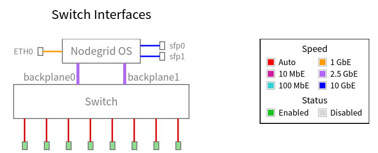
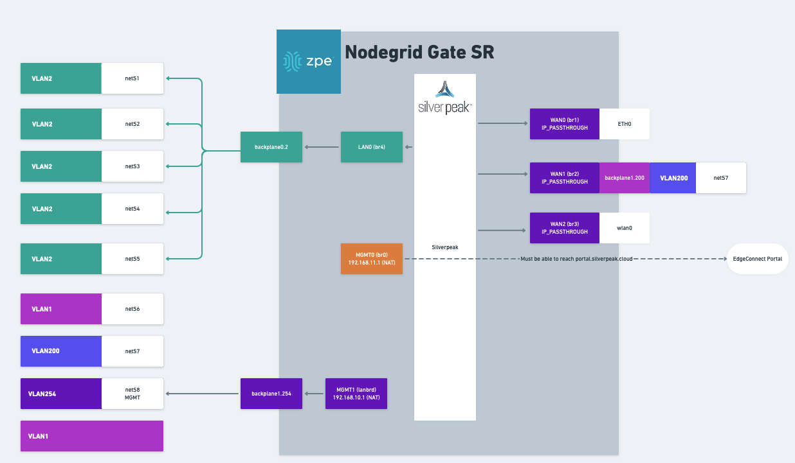
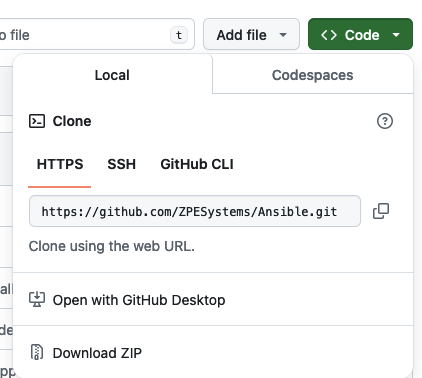
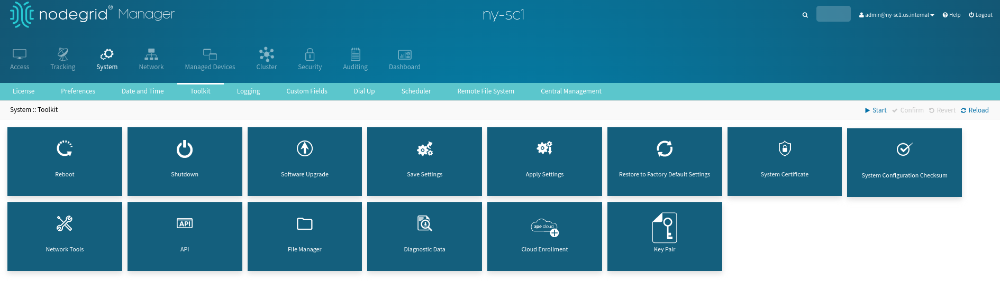
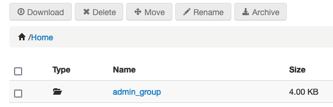
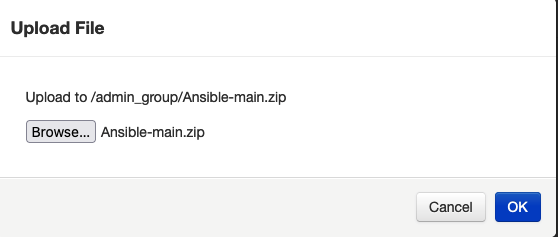
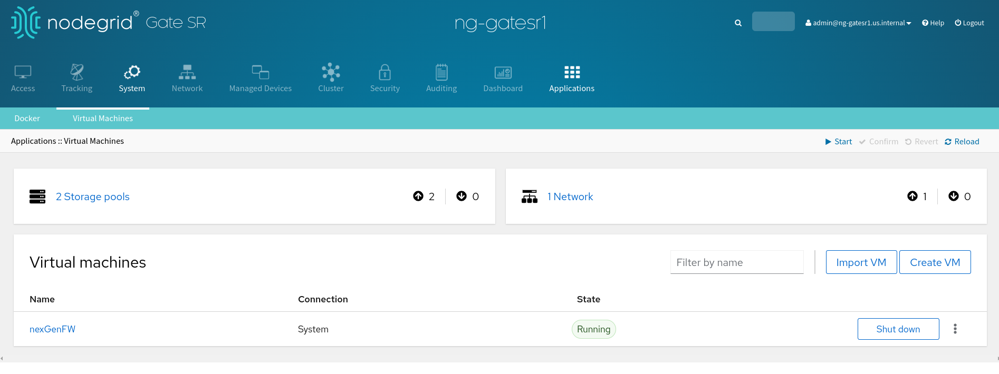
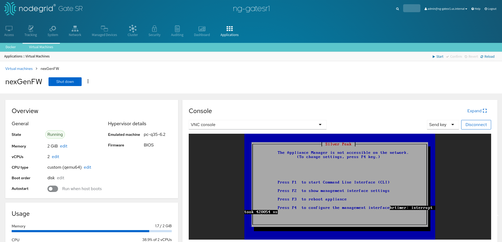

# ZPE Service Delivery Platform (SDP) Solution


## Executive Summary
ZPE Systems provides an Out-of-Band (OOB) **Service Delivery Platform (SDP)** which is a novel solution that enables the management and deployment of Virtualized services in the form of Virtual Machines or Containers. The SDP solution provides an isolated framework that allows the configuration and instantiation of specialized services to further enhance the OOB management and operations of your infrastructure. 

# Content

[TOC]

# Introduction
ZPE Systems focuses on Out-of-Band Network and Infrastructure Management solutions. It provides a variety of solutions that enables the management of your distributed infrastructure in a unified platform. Depending on your specific requirements, multiple hardware boxes have being designed in order to manage your infrastructure and network devices via, for example, serial console ports. All the ZPE boxes run the *ZPE Nodegrid Operating System*.

ZPE solutions have evolved from initially being focused on providing remote management access to Data Center infrastructure devices (e.g., servers and network devices' serial ports) to become a hybrid distributed solution that enables a platform for deploying services that can be specific and specialized for infrastructure management and operations. These services can be deployed in a virtualized environment via both virtual machines or containers.


# ZPE Service Delivery Platform SDP
The ZPE SDP solution focuses on providing DevOps teams an OOB platform to deploy specialized services for managing their infrastructure. This solution extends the OOB remote management access capabilities to enhanced management operations by user-defined services that are deployed close to the managed devices. These services can be deployed on different ZPE devices either as a Virtual Machine or a Container.

This document considers the case of deploying a service on a Nodegrid Device in the form of a Virtual Machine. The following requirements are taken into consideration:

- Configure a brand new Nodegrid device, it includes its network connections, firewall, and hypervisor.
- Deploy a Virtual Machine.
- All configurations are automated using Ansible.

## SDP Example Use Case

This section provides an overview of how a Virtualized Service can be deployed using ZPE Systems' Nodegrid solution. It utilizes the ZPE Systems Ansible Library to automate the setup and configuration process.

The example considers the following scenario for the *Acme* company:

- A ZPE GateSR device is used for OOB management, and it is required to deploy an specialized service on it.
- The specialized service can be packaged and executed in a virtualized environment. For this example, a virtual machine is used.
- The virtual machine requires specific network layout and configuration in the hypervisor.

The GateSR network interfaces and layout are as follows:
- Two SFP interfaces (i.e., `spf0` and `sfp1`)
- 1 ETH0 interface (i.e., `eth0`)
- 10-Ports configurable switch
  - 8 external ports (i.e., `netS1`, `netS2`, `netS3`, `netS4`, `netS5`, `netS6`, `netS7`, `netS8`)
  - 2 internal (backplane) ports (i.e., `backplane0`, and `backplane1`)

The following diagram shows the network layout:



Based on the GateSR capabilities, the following picture depicts the desired virtualized service configuration. It considers the deployment of a **SilverPeak virtual machine** with an specific network layout:



### Network Connections
- Three WAN connections configured with IP-Passthrough

| Connection Name | Type | Interface | IP-Passthrough to Connection | Comments |
|---|-----|-----|----|---|
|`ETH0` | ethernet | `eth0` | `WAN0` | |
|`VLAN200` | vlan | `backplane1` | `WAN1`| `vlan_id`=200 |
|`wlan0` | WiFi | `wlan0` | `WAN2` | |


- Six BRIDGE connections (*Note: the connection name is defined/understood from the VM perspective*)

| Connection Name | Type | Bridge Interfaces | IP address | Comments |
|---|-----|-----|----|--- | 
|`WAN0` | bridge | | | Provides direct WAN access to the VM |
|`WAN1` | bridge | | | Provides direct WAN access to the VM |
|`WAN2` | bridge | | | Provides direct WAN access to the VM |
|`LAN0` | bridge | `backplane.2` |  |Provides LAN access to the VM on VLAN `vlan_id=2` |
|`MGMT0` | bridge | | `192.168.11.1/24` |Provides Management and Internet access to the VM (NATed LAN) |
|`MGMT1` | bridge | `backplane1.254` | `192.168.10.1/24` | Nodegrid Management VLAN `vlan_id=254` |

### Switch Configuration

The following table defines the VLAN configuration on the switch:

| VLAN | Tagged Ports | Untagged Ports | Comments |
|---|---|---|---|
| 1 |  | `netS6`  |  |
| 2 | `backplane0` |  `netS1`, `netS2`, `netS3`, `netS4`, `netS5` |  |
| 200 | `backplane1` | `netS7`  |  |
| 254 | `backplane1`  | `netS8`  |  |


## Configuration Process to be followed

This guide assumes that the GateSR device is used as an Ansible host that will provision itself. It also assumes that only a minimal configuration was performed and that the device has multiple WAN connections. Furthermore, as an example, the device's switch is configured in an specific scenario considering LAN segmentation by using VLANs.

### Step 1: Download Ansible Library
- Download Ansible Library from https://github.com/ZPESystems/Ansible
	- Click on Code and select "Download ZIP"

	   

-  Login to the Nodegrid appliance via the WebUI as admin user
- Open  **System > Toolkit > File Manager** and navigate to **admin_group**

  

- Navigate to **admin_group**



- Upload the downloaded `.zip` file into the folder (default name: `Ansible-main.zip`)

  

- Close the File Manager window
- Open a **Console connection** to Nodegrid
- Access the shell as an **admin** user using the `shell` command
- Navigate to `/var/local/file_manager/admin_group/`
```shell
cd /var/local/file_manager/admin_group/
```
- Extract the `.zip` file with
```shell
unzip Ansible-main.zip
```
*Example Output*
```shell
[admin@nodegrid /]# shell

WARNING: Improper use of shell commands could lead to data loss,
the deletion of important system files or other unexpected result.
Please double-check your syntax when typing shell commands.

admin@nodegrid:~$ cd /var/local/file_manager/admin_group/
admin@nodegrid:/var/local/file_manager/admin_group$ unzip Ansible-main.zip
Archive:  Ansible-main.zip
   creating: Ansible-wireguard/
  inflating: Ansible-wireguard/.gitignore
  inflating: Ansible-wireguard/LibrarySupport.md
  inflating: Ansible-wireguard/README.md
  inflating: Ansible-wireguard/build.py
   creating: Ansible-wireguard/collections/
```
### Step 2: Install Ansible Library

- In an **admin shell**, navigate to the downloaded library directory 
```bash
cd Ansible-main
```
- Run the installation playbook.
```bash
ansible-playbook nodegrid_install.yml
```
- Example Output:
```bash
admin@nodegrid:/var/local/file_manager/admin_group$ ls 
ansible  Ansible-main.zip  Ansible-main
admin@nodegrid:/var/local/file_manager/admin_group$ cd Ansible-main
admin@nodegrid:/var/local/file_manager/admin_group/Ansible-main$ ansible-playbook nodegrid_install.yaml
[WARNING]: log file at /var/log/ansible/ansible.log is not writeable and we cannot create it, aborting


PLAY [localhost] *******************************************************************************************************************************************************************************************************************************************************************

....... 


......
TASK [ensure proper permissions to ansible.log] ************************************************************************************************************************************************************************************************************************************
changed: [localhost]

PLAY RECAP *************************************************************************************************************************************************************************************************************************************************************************
localhost                  : ok=27   changed=18   unreachable=0    failed=0    skipped=1    rescued=0    ignored=0   

admin@nodegrid:/var/local/file_manager/admin_group/Ansible-main$ 
```

- Become `ansible` user.
```bash
sudo su - ansible
```

- Navigate to the system ansible folder and display the example playbooks
```bash
cd /etc/ansible/playbooks/
ls -l examples
```

```bash
ansible@nodegrid:~$ cd /etc/ansible/playbooks/
ansible@nodegrid:/etc/ansible/playbooks$ ls -l examples
total 7
drwxrwxr-x 2 ansible admin 1024 May 13 10:30 managed_devices
drwxrwxr-x 2 ansible admin 1024 May 13 10:30 network
drwxrwxr-x 2 ansible admin 1024 May 13 10:30 nodegrid
drwxrwxr-x 2 ansible admin 1024 May 13 10:30 security
drwxrwxr-x 2 ansible admin 1024 May 13 10:30 setup
drwxrwxr-x 2 ansible admin 1024 May 13 10:30 system
drwxrwxr-x 3 ansible admin 1024 May 13 10:30 system-roles
```

> [!Note]
> 
> **Example Playbooks**
> 
> The examples are sorted into folders for reference. Users have the option to either directly run the playbooks from the examples folder or to copy the desired playbooks to `/etc/ansible/playbooks/`.
> 
> It is recommended that the examples be copied to the working directory. This allows users to change and adapt them as needed freely.

- To copy the required playbooks for this example to the playbook folder, use the following command.
```shell
cp /etc/ansible/playbooks/examples/system-roles/SDP/*.yaml /etc/ansible/playbooks/
```

- Run a test playbook. 
```shell
ansible-playbook 300_nodegrid_facts.yaml
```

Example Output
```shell
ansible@nodegrid:/etc/ansible/playbooks$ ansible-playbook 300_nodegrid_facts.yaml

PLAY [all] *************************************************************************************************************************************************************************************************************************************************************************

TASK [Get Facts from Nodegrid] *****************************************************************************************************************************************************************************************************************************************************
ok: [localhost]

TASK [output] **********************************************************************************************************************************************************************************************************************************************************************
ok: [localhost] => {
    "output": {
        "ansible_facts": {
            "nodegrid_about": {
                "bogomips": "6787.24",
                "boot_mode": "Legacy",
                "cpu": "QEMU Virtual CPU version 2.5+",
                "cpu_cores": "2",
                "licenses": "5",
                "revision_tag": "r1",
                "secure_boot": "Disabled",
                "serial_number": "821eef8d511b4e568e9c086223a89b97",
                "system": "Nodegrid Manager",
                "uptime_days": "0",
                "uptime_hours": "0",
                "uptime_minutes": "41",
                "version": "5.8.16",
                "version_date": "(Nov 8 2023 - 07:55:28)"
            },
....

....
        "changed": false,
        "failed": false
    }
}

PLAY RECAP *************************************************************************************************************************************************************************************************************************************************************************
localhost                  : ok=2    changed=0    unreachable=0    failed=0    skipped=0    rescued=0    ignored=0 
```
- The Ansible Nodegrid Library has been successfully installed. The next step is to define the `inventory.yaml` file, which is a **strict requirement for the SDP use case**.

### Step 3: Build the Ansible Inventory
#### Overview
This step is critical, as these settings will be used as a source of truth for all appliances and will determine which settings get applied to each system. The Inventory should match the designed layout. The following section outlines a few basic concepts. For more information about the Ansible Inventory option, see [How to Build Your Inventory](https://docs.ansible.com/ansible/latest/inventory_guide/intro_inventory.html)

Inventory Overview
1. The inventory is organized hierarchically and utilizes groups that can be nested.
2. Infrastructure devices like Nodegrid appliances are represented as `hosts` which can be part of one or multiple groups
3. Each group and host can have multiple variables assigned to it. These Variables are typically `key-value` pairs but can be in the form of `lists` and `dictionaries`
4. The Ansible inventory files utilize standard `YAML` or `JSON` notation. Both are valid, but ideally should not be mixed to avoid confusion. This document will only use `YAML` notation.
5. The default location for the Ansible inventory on a Nodegrid appliance is `/etc/ansible/inventories/`
6. The Inventory is stored in `YAML` files. The main file is the `hosts.yml` file, which must contain the inventory structure. 


> [!Note]
> 
> ZPE Systems Dynamic Inventory Plugins
> 
> ZPE Systems currently supports three dynamic inventory plugins:
> 1. **Cluster plugin**: This exposes all cluster hosts to a local installation of Ansible on a Nodegrid appliance. This is installed and active by default and only requires a working Cluster configuration
> 2. **Device plugin**: This Exposes all locally configured managed devices on Nodegrid appliance. This plugin is automatically installed with the Nodegrid Ansible library.
> 3. **ZPE Cloud plugin**: This plugin enables the execution of Ansible playbooks via ZPE Cloud as the connector, and the use of the ZPE Cloud inventory and custom fields as inventory on a local Ansible host. [Ansible ZPE Cloud](https://galaxy.ansible.com/ui/repo/published/zpe/zpecloud/) describes in detail this plugin.
---

#### Inventory Structure
Configure the Inventory

1. Navigate to the Inventory folder
```bash
cd /etc/ansible/inventories/
```
2. Edit the `hosts.yaml` file and create the inventory
```bash
vim hosts.yaml
```
3.  Example `hosts.yaml` file without variables, based on the provided Example
```hosts.yaml
all:
  children:
    company:
      children:
        USA:
          children:
            CA:
              hosts:
               ng-gatesr1:
```

> [!Tip]
> 
> It is recommended to utilize a group that identifies the organization/company. This serves to clearly differentiate manually configured hosts from hosts provided through an automated inventory plugin, like the Nodegrid Cluster inventory plugin, which exposes all Nodegrid Cluster nodes.


4. To test the current inventory changes, run the command the following command which will show and validate the inventory structure:
```bash
ansible-inventory --graph
```
Example Output:
```bash
``ansible@ng-gatesr1:/etc/ansible/inventories$ ansible-inventory --graph
@all:
  |--@cluster:
  |  |--@local:
  |  |  |--localhost
  |  |--@peers:
  |--@company:
  |  |--@USA:
  |  |  |--@CA:
  |  |  |  |--ng-gatesr1
  |--@managed_devices:
  |  |--@device_disabled:
  |  |  |--HumiditySensor
  |  |  |--ttyS2-switch1
  |  |  |--ttyS3
  |  |  |--ttyS4
  |  |  |--ttyS5
  |  |  |--ttyS6
  |  |  |--ttyS7
  |  |  |--ttyS8
  |  |  |--usbS0-3
  |  |  |--usbS0-4
  |  |--@device_enabled:
  |  |  |--NSC
  |  |  |--TemperatureSensor
  |  |  |--ttyS1-router1
  |  |--@device_ondemand:
  |  |--@ilo:
  |  |  |--NSC
  |  |--@local_serial:
  |  |  |--ttyS1-router1
  |  |  |--ttyS2-switch1
  |  |  |--ttyS3
  |  |  |--ttyS4
  |  |  |--ttyS5
  |  |  |--ttyS6
  |  |  |--ttyS7
  |  |  |--ttyS8
  |  |--@usb_serialB:
  |  |  |--HumiditySensor
  |  |  |--TemperatureSensor
  |  |  |--usbS0-3
  |  |  |--usbS0-4
  |  |--HumiditySensor
  |  |--NSC
  |  |--TemperatureSensor
  |  |--ttyS1-router1
  |  |--ttyS2-switch1
  |  |--ttyS3
  |  |--ttyS4
  |  |--ttyS5
  |  |--ttyS6
  |  |--ttyS7
  |  |--ttyS8
  |  |--usbS0-3
  |  |--usbS0-4
  |--@ungrouped:
```
To display host-specific settings use the following command
```bash
ansible-inventory --host ng-gatesr1
```

Example Output:
```bash
ansible@ng-gatesr1:/etc/ansible/inventories$ ansible-inventory --host ng-gatesr1
{}
```

> [!Warning]
> 
>  The inventory output for the specific host is currently still empty as no variables have been defined. This will be done during the following steps.

#### Group Variables
- Variables can be stored in the `hosts.yaml` file or in dedicated variable files, which are stored in the `group_vars` sub-folders. 

> [!Tip]
> 
> It is recommended to store group variables in dedicated files, for example, variables which apply to all hosts can be stored in the file `group_vars/company.yaml` 
-  Navigate to the Inventory folder  
```bash
cd /etc/ansible/inventories/group_vars  
```

- Create the file `company.yaml`, which will contain variables which apply to all hosts
```bash
vim company.yaml 
```

> [!Warning]
> 
> The file name must match the group name used in the inventory in this case 'company.yaml'

- Add the following content. This includes the minimum requirements for the intended example.
  
  The list should be adjusted as needed, each section is marked with:
  "**DO NOT CHANGE**" (Settings should not be changed), 
  "**NO CHANGE REQUIRED**" (Settings use common default values), 
  "**CHANGE**" (Section needs to be adjusted, the provided values only serve as an example), 
  "**REQUIRED**" (Details must be provided in these sections)

```yaml
# Section - REQUIRED - THIS SECTION CONTAINS VALUES THAT MUST BE ADJUSTED
# License Keys: (REQUIRED - ADD VALID CLUSTER LICENSE KEY)
nodegrid_license_keys:
     - XXXXX-XXXXX-XXXXX-XXXXX
     - XXXXX-XXXXX-XXXXX-XXXXX

# Local User Accounts: (REQUIRED - UPDATED PASSWORD)
local_user_accounts:
  - username: "<myusername>"
    hash_format_password: "no"
    password: "<mypassword>"
    user_group: "admin"

# SECTION - CHANGE - CHANGES ARE RECOMMENDED BUT NOT REQUIRED

# Firmware Settings: (CHANGE - TO DESIRED NODEGRID VERSION)
nodegrid_iso_location: "/var/local/file_manager/datastore/"
nodegrid_iso_file: "Nodegrid_Platform_v5.8.16_20231107.iso"
nodegrid_target_version: "5.8.16"

# Default System Settings: (CHANGE - TO DESIRED VALUES)
sys_show_hostname_on_webui_header: "yes"
sys_idle_timeout: 3600
sys_banner: "
WARNING: This private system is provided for authorized use only and it may be monitored for all lawful purposes to ensure its use. All information including personal information, placed on or sent over this system may be monitored and recorded. Use of this system, authorized or unauthorized, constitutes consent to monitoring your session. Unauthorized use may subject you to criminal prosecution. Evidence of any such unauthorized use may be used for administrative, criminal and/or legal actions.
"

# Default System Date and Time: (CHANGE - TO DESIRED VALUES)
sys_date_and_time_date_and_time: "network_time_protocol"
sys_date_and_time_zone: "utc"

# Authentication
# Local User Groups: (CHANGE - TO DESIRED VALUES)
nodegrid_local_user_groups:
  - name: 'admin'
    track_system_information: "yes"
    terminate_sessions: "yes"
    software_upgrade_and_reboot_system: "yes"
    configure_system: "yes"
    configure_user_accounts: "yes"
    apply_and_save_settings: "yes"
    shell_access: "yes"
    manage_devices_permissions: "no"
  - name: 'user'
    track_system_information: "no"
    terminate_sessions: "no"
    software_upgrade_and_reboot_system: "no"
    configure_system: "yes"
    configure_user_accounts: "no"
    apply_and_save_settings: "no"
    shell_access: "no"
    manage_devices_permissions: "no"

# Default Authentication Server: (CHANGE - TO DESIRED VALUES)
# TACACS server settings have changed from 5.8 to 6.0 Update settings as required
nodegrid_authentication_servers:
  - number: 1
    method: "tacacs+"
    status: "disabled"
    fallback_if_denied_access: "yes"
    remote_server: "10.1.1.5"
    tacacs_plus_accounting_server: "10.1.1.5"
    authorize_ssh_pkey_users: "yes"
    tacacs_plus_port: "49"
    tacacs_plus_service: "raccess"
    tacacs_plus_secret: "tacacs"
    tacacs_plus_timeout: "2"
    tacacs_plus_retries: "2"
    tacacs_plus_version: "v1"
    tacacs_plus_enable_user-level: "yes"
    tacacs_plus_user_level_12: "user"
    tacacs_plus_user_level_15: "admin"

# System SNMP Settings: (CHANGE - TO DESIRED VALUES)
syscontact: "noc@zpesystems.internal"
syslocation: "Nodegrid"
snmp_rules:
  - version: "version_v1|v2"
    community: "public"
    source: ""
    snmp_for_ipv6: "no"
    oid: ""
    access_type: "read_only"

# Network Settings (CHANGE - TO DESIRED VALUES)
nodegrid_domain_name: us.internal

# SECTION - NO CHANGE REQUIRED - NO CHANGES ARE REQUIRED

# Default Network Settings: (NO CHANGE REQUIRED)
nodegrid_enable_ipv4_ip_forward: "yes"
nodegrid_enable_ipv6_ip_forward: "no"
nodegrid_reverse_path_filtering: "disabled"
nodegrid_enable_multiple_routing_tables: "yes"
failover_enable_network_failover: "no"

# Default Audit Settings: (NO CHANGE REQUIRED)
auditing_settings:
  event_timestamp_format: local_time
  datalog_add_timestamp: "no"
  datalog_timestamp_format: local_time
  datalog_destination: file
  enable_persistent_logs: "no"

# System Session Logging: (NO CHANGE REQUIRED)
system_logging_enable_session_logging_alerts: "no"

# Nodegrid Authentication settings: (NO CHANGE REQUIRED)
authentication_admin_and_root_fallback_to_local_on_console: "yes"
authentication_default_group_for_remote_users: ""
authentication_enable_authentication_server_selection_based_on_realms: "yes"

# System Services: (NO CHANGE REQUIRED)
services_enable_snmp_service: "yes"
enable_qemu: "yes"
enable_docker: "yes"

# Firewall Settings
ipv4_firewall:
  policy:
    FORWARD: ACCEPT
    INPUT: ACCEPT
    OUTPUT: ACCEPT
  chains:
    INPUT:
        - target: ACCEPT
          action: insert
          rule_number: 0
          input_interface: lo
          output_interface: any
          description: DEFAULT_RULE_DO_NOT_REMOVE
        - target: ACCEPT
          action: insert
          rule_number: 1
          protocol: tcp
          destination_port: 22
          source_net4: ""
          destination_net4: ""
          description: 'NODEGRID_SSH'
        - target: ACCEPT
          action: insert
          rule_number: 2
          protocol: tcp
          source_net4: ""
          destination_net4: ""
          destination_port: 9300
          description: 'NODEGRID_SEARCH_9300'
        - target: ACCEPT
          action: insert
          rule_number: 3
          protocol: tcp
          destination_port: 9966
          description: 'NODEGRID_CLUSTER_9966'
          source_net4: ""
          destination_net4: ""
        - target: ACCEPT
          action: insert
          rule_number: 4
          protocol: tcp
          destination_port: 443
          description: 'NODEGRID_HTTPS'
          source_net4: ""
          destination_net4: ""
        - target: ACCEPT
          action: insert
          rule_number: 5
          protocol: udp
          destination_udp_port: 161
          description: 'NODEGRID_SNMP'
          source_net4: ""
          destination_net4: ""
        - target: ACCEPT
          action: insert
          rule_number: 6
          protocol: udp
          destination_udp_port: 51820
          description: 'NODEGRID_WIREGUARD'
          source_net4: ""
          destination_net4: ""
        - target: ACCEPT
          action: insert
          rule_number: 7
          protocol: numeric
          description: 'ACCEPT_RELATED_TRAFFIC'
          enable_state_match: "yes"
          new: "no"
          established: "yes"
          related: "yes"
          invalid: "no"
          reverse_state_match: "no"
          source_net4: ""
          destination_net4: ""

# NAT Settings
ipv4_nat:
  policy:
    PREROUTING: ACCEPT
    INPUT: ACCEPT
    OUTPUT: ACCEPT
    POSTROUTING: ACCEPT
  chains:
    POSTROUTING:
        - target: MASQUERADE
          action: append
          source_net4: '192.168.10.0/24' 
          description: NAT_DHCP_LAN_NETWORK
        - target: MASQUERADE
          action: append
          source_net4: '192.168.11.0/24' 
          description: NAT_DHCP_MGMT_NETWORK

network_dhcp_server:
  - protocol: 'dhcp4'
    subnet: '192.168.10.0'
    netmask: '255.255.255.0'
    domain: 'sdp-domain'
    domain_name_servers: '8.8.8.8'
    router_ip: '192.168.10.1'
    lease_time: '86400'
  - protocol: 'dhcp4'
    subnet: '192.168.11.0'
    netmask: '255.255.255.0'
    domain: 'sdp-domain'
    domain_name_servers: '8.8.8.8'
    router_ip: '192.168.11.1'
    lease_time: '86400'

network_dhcp_range:
  - subnet: '192.168.10.0'
    netmask: '255.255.255.0'
    ip_address_start: '192.168.10.10'
    ip_address_end: '192.168.10.100'
  - subnet: '192.168.11.0'
    netmask: '255.255.255.0'
    ip_address_start: '192.168.11.10'
    ip_address_end: '192.168.11.100'


# SECTION - DO NOT CHANGE - THIS SECTION CONTAINS SETTING WHICH SHOULD NOT BE CHANGED
# Generic Ansible Settings: (DO NOT CHANGE)
ansible_user: ansible
ansible_ssh_private_key_file: /home/ansible/.ssh/id_ed25519
ansible_python_interpreter: "/usr/bin/python3"

# System Libvirt Virtual Machines info: (NO CHANGE REQUIRED)
libvirt_resources_path: /run/media/sdb1/virtual_machines
# libvirt_resources_path directory structure
# |--- images_cache
# |--- images
# |--- cloudinit_iso
images_cache: "images_cache"
images: "images"
cloudinit: "cloudinit"
```

- To display and validate the defined group variables, display the host-specific settings of a group member, using the following command.

```bash
ansible-inventory --host ng-gatesr1
```
Example Output:
```bash
ansible@ng-gatesr1:/etc/ansible/inventories/group_vars$ ansible-inventory --host ng-gatesr1
{
    "ansible_host": "127.0.0.1",
    "ansible_python_interpreter": "/usr/bin/python3",
    "ansible_ssh_private_key_file": "/home/ansible/.ssh/id_ed25519",
    "ansible_user": "ansible",
    "auditing_settings": {
        "datalog_add_timestamp": "no",
        "datalog_destination": "file",
        "datalog_timestamp_format": "local_time",
        "enable_persistent_logs": "no",
        "event_timestamp_format": "local_time"
    },
    "authentication_admin_and_root_fallback_to_local_on_console": "yes",
    "authentication_default_group_for_remote_users": "",
    "authentication_enable_authentication_server_selection_based_on_realms": "yes",
    "enable_docker": "yes",
    "enable_qemu": "yes",
    ...
}
```
#### Host Specific Variables (`ng-gatesr1`)
- Host-specific variables can be stored either in the `hosts.yaml` file, or similar to group variables in individual files. 
  
> [!Tip]
> 
> It is recommended to store host-specific variables in host-specific files. These files are located in the folder `host_vars` and would typically have the name of the host, for example, `ng-gatesr1.yaml`

> [!Warning]
> 
> **OVERWRITING OF VARIABLES**
> 
>  Variables with the same name, that are defined on a host level will overwrite group-level variables; this allows us to have generic defaults defined on group levels, which then get overwritten with specific values on a lower level.

- For this example, we will store the variable inside the `host_vars` directory
- Edit the `ng-gatesr1.yaml` file
```
vim /etc/ansible/inventories/host_vars/ng-gatesr1.yaml
```
- Add the following content.

> [!Tip]
>
> It is recommended to configure some base settings. Other settings can be added later. The below example defines the required variables for the SDP example. Adjust the values are required.

```yaml
# Generic Ansible Settings  (REQUIRED)
ansible_host: 127.0.0.1  # IP address, which ansible will use to communicate with the host
ansible_port: 22

# Nodegrid Network Settings:  (CHANGE)
nodegrid_hostname: ng-gatesr1

# Nodegrid Network Connections:  (REQUIRED)
network_connections:
# BRIDGE CONNECTIONS
- name: MGMT0
  type: bridge
  description: 'MGMT0 bridge' 
  bridge_interfaces: lo1
  enable_lldp: 'no'
  bridge_mac_configuration: bridge_custom_mac
  enable_spanning_tree_protocol: "no"
  ipv4_mode: static
  ipv4_address: 192.168.11.1
  ipv4_bitmask: 24
  ipv4_default_route_metric: 425
  ipv4_ignore_obtained_default_gateway: 'no'
  ipv4_ignore_obtained_dns_server: 'no'
  ipv6_mode: no_ipv6_address
  ipv6_ignore_obtained_default_gateway: 'no'
  ipv6_ignore_obtained_dns_server: 'no'
- name: MGMT1
  type: bridge
  description: 'MGMT1 lanbrd' 
  bridge_interfaces: backplane0.2
  enable_lldp: 'no'
  bridge_mac_configuration: bridge_custom_mac
  enable_spanning_tree_protocol: "no"
  ipv4_mode: static # dhcp no_ipv4_address static
  ipv4_address: 192.168.10.1
  ipv4_bitmask: 24
  ipv4_ignore_obtained_default_gateway: 'no'
  ipv4_ignore_obtained_dns_server: 'no'
  ipv6_mode: no_ipv6_address
  ipv6_ignore_obtained_default_gateway: 'no'
  ipv6_ignore_obtained_dns_server: 'no'
- name: LAN0
  type: bridge
  description: "LAN0 bridge"
  bridge_interfaces: backplane1.254
  enable_lldp: "no"
  enable_spanning_tree_protocol: "no"
  ipv4_mode: no_ipv4_address
- name: WAN0
  type: bridge
  ipv4_mode: no_ipv4_address
  description: "WAN0 bridge" 
  bridge_interfaces: "wlan0"
  enable_lldp: "no"
  enable_spanning_tree_protocol: "no"
- name: WAN1
  type: bridge
  ipv4_mode: no_ipv4_address
  description: "WAN1 bridge"
  bridge_interfaces: lo1
  enable_lldp: "no"
  enable_spanning_tree_protocol: "no"
# Nodegrid WAN interfaces: IP-Passthrough configuration
- name: ETH0
  type: ethernet
  description: "ETH0 connection"
  connect_automatically: "yes"
  ethernet_interface: eth0
  set_as_primary_connection: "yes"
  enable_lldp: "no"
  block_unsolicited_incoming_packets: "no"
  configure_hostname_through_dhcp: "no"
  ethernet_link_mode: auto
  ipv4_mode: dhcp
  ipv4_default_route_metric: 100
  ipv6_mode: no_ipv6_address
  enable_ip_passthrough: "yes"
  ethernet_connection: WAN0  # IP-Passthrough to WAN0 bridge connection
- name: VLAN200
  type: vlan
  ethernet_interface: backplane1
  vlan_id: 200
  description: "vlan200"
  set_as_primary_connection: 'no'
  block_unsolicited_incoming_packets: 'no'
  ipv4_mode: dhcp
  ipv4_default_route_metric: 200
  enable_ip_passthrough: 'yes'
  ethernet_connection: WAN1 # IP-Passthrough to WAN1 bridge connection
- name: wlan0
  type: wifi
  description: "wlan0 connection"
  connect_automatically: "yes"
  ethernet_interface: wlan0
  set_as_primary_connection: "yes"
  enable_lldp: "no"
  block_unsolicited_incoming_packets: "no"
  ipv4_mode: dhcp
  ipv4_default_route_metric: 300
  enable_ip_passthrough: "yes"
  ethernet_connection: WAN2 # IP-Passthrough to WAN2 bridge connection

# Switch configuration
switch:
  vlans:
    - vlan: '1'
      tagged_ports: "" # comma separated list
      untagged_ports: "netS6" # comma separated list
    - vlan: '2'
      tagged_ports: "backplane0"
      untagged_ports: "netS1,netS2,netS3,netS4,netS5"
    - vlan: '200'
      tagged_ports: "backplane1"
      untagged_ports: "netS7"
    - vlan: '254'
      tagged_ports: "backplane1"
      untagged_ports: "netS8"

  interfaces:
    - interface: 'netS1'
      speed: 'auto'
      port_vlan_id: '1'
      description: ''

  backplane:
    backplane0_port_vlan_id: '1'
    backplane1_port_vlan_id: '200'

virtual_machines:
  - name: nextGenFW
    ram:  
      size: 2048 # size in MB
    cpu:
      count: 2
    disks:
        # VM disk file name on the target device (used in the KVM domain)
      - file_name: nextGenFWdisk1.qcow2 
        # VM disk file source (e.g., URL or file path in the target node or control node)
        file_source: /var/local/file_manager/remote_file_system/extended_storage/Shared/files/nextGenFWdisk.qcow2 
        # VM file disk name on the cache directory
        file_cache_name: nextGenFWdisk.qcow2
        # VM file disk copy method: defines how to get the disk
        type: copy_local_file
        #  - local_file: it does not copy any disk file. It assumes that the 'file' path exists.
        #  - url: URL to download the qcow2 file and saves it to the 'file' path
        #  - copy_local_file: copies the file 'file_source' to the 'file' path (both paths are in the target node)
        #  - copy_file_to_remote: copies the local file 'file_source' to the target node path 'file'

    # Nodegrid Bridge Connections (ordered list)
    network_bridges:
      - MGMT0
      - WAN0
      - WAN1
      - WAN2
      - LAN0

    # Cloud Init config (limited support, only ssh_public_key definition)
    cloud_init:
      # SSH public key
      ssh_public_key: "ssh-ed25519 AAAAC3NzaC1lZLODlo19fgQg9IL ansible@zpesystems.com"
      # ISO file name 
      iso_file: nextGenFWinit.iso
```

- Now that all required variables for the GateSR are defined, we can validate that the inventory is working before continuing:
```bash
ansible-inventory --host ng-gatesr1
```
- The output will now contain the host-specific variables
- To test the Ansible connection with the host use the following command
```shell
ansible -m ping ng-gatesr1
```

> [!Warning]
> 
>  This command will only be successful if the target host is the local system. 
>  In the case of a remote target, the user `ssh_keys` must be installed first on the remote system. This is covered in the section [[#Configure a new host]]

Example Output:
```shell
ansible@ng-gatesr1:/etc/ansible/inventories/host_vars$ ansible -m ping ng-gatesr1
ng-gatesr1 | SUCCESS => {
    "changed": false,
    "ping": "pong"
}
```

### Step 4: Configure Nodegrid
At this point, everything is ready to configure the GateSR SDP use case. If we want to change any configurations in future, we only have to adjust the inventory variables, and the changes will be on the next run applied to all of the specific systems.

To push the configuration, use the following commands.

#### Setup the Network
- Navigate to the playbooks folder.
```shell
cd /etc/ansible/playbooks/
```
- Execute the playbook `100_configure_network.yaml`. In this example, we limit the target node execution to the currently configured system `ng-gatesr1`
```
ansible-playbook 100_configure_network.yaml --limit ng-gatesr1
```

Example Output:
```
ansible@ng-gatesr1:/etc/ansible/playbooks$ ansible-playbook 100_configure_network.yaml --limit ng-gatesr1

PLAY [all] *********************************************************************

TASK [Setup Audit Settings] ****************************************************

TASK [zpe.nodegrid.auditing : Apply Auditing Settings] *************************

...

PLAY RECAP *******************************************************************************************************************************************************************************************************************************************************************
ng-gatesr1                     : ok=26   changed=18   unreachable=0    failed=0    skipped=4    rescued=0    ignored=0
```

- The network configuration is now in place.

#### Setup the VM
- Install Ansible community libvirt

```bash
ansible-galaxy collection install community.libvirt
```

- Navigate to the playbooks folder.
```shell
cd /etc/ansible/playbooks/
```
- Execute the playbook `200_create_virtual_machines.yaml`. In this example, we limit the target node execution to the currently configured system `ng-gatesr1`
```
ansible-playbook 200_create_virtual_machines.yaml --limit ng-gatesr1
```
- The VM resources (disks, cloudinit isos) shall be stored at:
```
ansible@ng-gatesr1:~$ ls -lh /run/media/sdb1/virtual_machines/*
/run/media/sdb1/virtual_machines/cloudinit:
total 728K
-rw-r--r-- 1 qemu qemu 364K Nov 11 01:04 seed1.iso
-rw-r--r-- 1 qemu qemu 364K Nov 11 01:26 seed2.iso

/run/media/sdb1/virtual_machines/images:
total 1.3G
-rw-r--r-- 1 qemu qemu 429M Nov 11 01:41 debian.qcow2
-rw-r--r-- 1 qemu qemu 859M Nov 11 01:41 vmansible.qcow2

/run/media/sdb1/virtual_machines/images_cache:
total 1.1G
-rw-r--r-- 1 root root 412M Nov 11 01:25 debian-sid-generic-amd64-daily.qcow2
-rw-r--r-- 1 root root 706M Oct 10 01:08 nextGenFWdisk.qcow2
```
- The VM is now deployed and running on the GateSR.

## Final Result

The following pictures show the VM instantiated on the GateSR:






