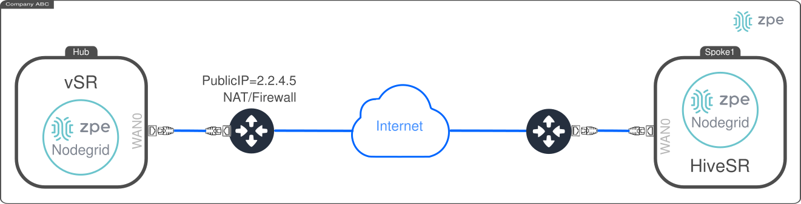
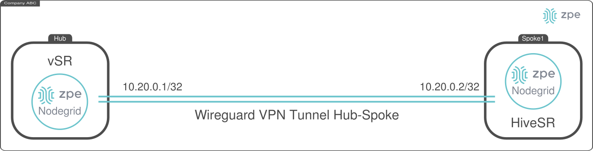
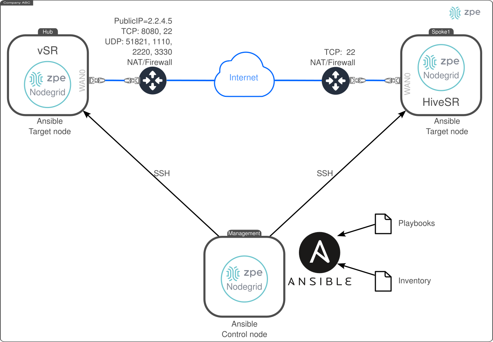

# ZPE Wireguard Hub-Spoke automated peering service

This document describes the deployment of the *ZPE Wireguard Hub-Spoke automated peering service*. This service consists of having a centralized node, i.e., the **Hub**, and multiple **Spokes** in remote locations which require to configure a Point-to-Point VPN, i.e., a Wireguard tunnel. To this end, each **Spoke** shall request the **Hub** the required information to create a Wireguard peering VPN. Once the peering VPN is established, both the **Spoke** and the **Hub** must have IP connectivity over it. 



The setup process includes:

- Deploying and Configuring the **Hub** (executed once)
- Deploying the **Spokes** (executed once on each one)

The following diagram depicts this document's objective:




## Requirements

For all the devices (i.e., the Hub and all the Spokes), the following requirements must be met:
- Clone the repo [Nodegrid Ansible Library](https://github.com/ZPESystems/Ansible) and execute:

```bash
git clone https://github.com/ZPESystems/Ansible 
cd Ansible
ansible-playbook nodegrid_install.yml
```

- The above playbook will configure a user named `ansible`, create public/private keys for it at `/home/ansible/.ssh/`
  - `id_ed25519`: private key
  - `id_ed25519.pub`: public key.

### Hub specific requirements

- Public IP address: `{{ PUBLIC_IP }}`
- Capability to open TCP port, e.g., 8080, 22
- Capability to open multiple UDP ports, e.g., 51821, 1110, 2220, 3330


## Deploying and Configuring the **Hub**

### Deploying from the Nodegrid Hub device

The deployment and configuration consist on the execution of an ansible playbook as follows:

- Connect to the Hub using the **ansible** user

- Go to the path `Ansible/examples/playbooks/wireguard-hub-spoke-peering`:

- Modify the file `setup-wireguard-hub.yaml`, specifying:
  - `WIREGUARD_IFACE_PUBLIC_IP`:  `{{ PUBLIC_IP }}`
  - `PORT_KNOCKING: true` to enable port knocking feature

```yaml
- hosts: localhost
  gather_facts: false
  connection: local
  become: true
  vars_promt:

  tasks:
    - name: setting up wg hub role
      include_role:
        name: setup-wg-hub
      vars:
        # Nodegrid Variables
        NODEGRID_URI: "https://localhost"
        NODEGRID_API_PREFIX: "/api/v1"
        NODEGRID_CREATE_API_USER: true 
        NODEGRID_USER: "zpeapi" # Nodegrid API User
        NODEGRID_KEY: "" # Nodegrid API User key must be defined if NODEGRID_CREATE_API_USER is fale

        # Wireguard Peering Service Variables
        WIREGUARD_IFACE_PUBLIC_IP: "{{ PUBLIC_IP }}" # Hub public IP
        WIREGUARD_SERVICE_PORT: 8080 # Hub TCP port for incoming peering requests
        WIREGUARD_IFACE_PUBLIC_PORT: 51821 # Hub UDP port for wireguard encrypted trafic
        WIREGUARD_IFACE_NAME: 'wg-hub' # Hub's Network :: Wireguard interface name 
        WIREGUARD_LAN: '10.20.0.0/16' # Hub-Spokes LAN. Each node will have an /32 IP address
        WIREGUARD_IFACE_IP: '10.20.0.1/32' # Hub's Network :: Wireguard interface LAN IP Address /32

        # Port Knocking Variables
        PORT_KNOCKING: false # true for enabling port knocking. If true, the following vars are taken in consideration
        PORT1: 1110 # first port to knock
        PORT2: 2220 # second port to knock
        PORT3: 3330 # third port to knock
        TCP_PORTS: # TCP ports to open on the firewall
          - 80
          - 443
          - 22
        UDP_PORTS: # UDP ports to open on the firewall
          - 51821
```

- Execute the playbook:

```bash
ansible-playbook setup-wireguard-hub.yaml
```

The playbook configures a new service on the Nodegrid. To validate it manually, you can interact with the service as follows:

- Check status: `/etc/init.d/wgpeer status`
- Start the service: `/etc/init.d/wgpeer start`
- Restart the service: `/etc/init.d/wgpeer restart`
- Stop the service: `/etc/init.d/wgpeer stop`

The service's logs are at: `/var/log/wgpeerservice.log`


## Deploying the **Spoke**
### Deploying from the Nodegrid Spoke device

The deploying and configuration consist on the execution of an ansible playbook as follows:

- Connect to the Spoke using the **ansible** user

- Go to the path `Ansible/examples/playbooks/wireguard-hub-spoke-peering`:

- Modify the file `setup-wireguard-spoke.yaml`, specifying:
  - `HUB_URI: "http://{{ PUBLIC_IP }}:8080"`
  - `PORT_KNOCKING: true` to enable port knocking feature
  - `PORT_KNOCKING_IP: "{{ PUBLIC_IP }}"`


```yaml
- hosts: localhost
  gather_facts: false
  connection: local
  become: true

  tasks:
    - name: setting up wg spoke role
      include_role:
        name: setup-wg-spoke
      vars:
        HUB_URI: 'http://{{ PUBLIC_IP }}:8080' # Hus URI for peering requests
        # Nodegrid Variables
        NODEGRID_URI: "https://localhost"
        NODEGRID_API_PREFIX: "/api/v1"
        NODEGRID_CREATE_API_USER: true # Ansible playbook create the NODEGRID_USER and retrieves the NODEGRID_KEY
        NODEGRID_DELETE_API_USER: true # Ansible playbook deletes the NODEGRID_USER
        NODEGRID_USER: "zpeapi" # Nodegrid API User
        NODEGRID_KEY: "" # Nodegrid API User key must be defined if NODEGRID_CREATE_API_USER is fale

        # Wireguard Peering Variables
        WIREGUARD_IFACE_NAME: 'wg-spoke1' # Spokes's UNIQUE Network :: Wireguard interface name
        WIREGUARD_PEER_ID: 'spoke1' # Hub's UNIQUE PEER ID. It mus be unique per each Spoke

        # Port Knocking Variables
        PORT_KNOCKING: false # true for enabling port knocking. If true, the following vars are taken in consideration
        PORT_KNOCKING_IP: "{{ PUBLIC_IP }}" # remote IP for port knocking
        PORT1: 1110 # first port to knock
        PORT2: 2220 # second port to knock
        PORT3: 3330 # third port to knock

```

- Execute the playbook:

```bash
ansible-playbook setup-wireguard-spoke.yaml
```

- To manually verify, execute the following:

```bash
ping 10.20.0.1
```

## (Optional) Remote deployment from a Control Node 

This option considers that there is a Control Node which has remote SSH access to both target nodes, i.e., the Hub and the Spoke as depicted in the following diagram:




- Configure the Control node SSH public key for remote access to all nodes. Execute the `setup_install_ssh_key.yml` playbook on the Control node to configure access to each node:

```bash
cd examples/playbooks/setup
ansible-playbook setup_install_ssh_key.yml --inventory {{hub_ip}},

ansible-playbook setup_install_ssh_key.yml --inventory {{spoke_ip}},
```

### Deploying and Configuring the Hub from the Control Node

- Access the control node with user `ansible`
- Move to the path:

```bash
cd Ansible/examples/playbooks/wireguard-hub-spoke-peering

├── figs
├── inventory.yaml
├── README.md
├── setup-wireguard-hub.yaml
└── setup-wireguard-spoke.yaml
```

- Create an `inventory.yaml` file with the following content:

```yaml
all:
  hosts:
    hub:
      ansible_port: 22
      ansible_host: "{{hub_ip}}"
      ansible_user: "ansible"
      ansible_ssh_private_key_file: "{{control_node_private_key}}"
```

#### Deploying the Hub Remotely

- Edit the `setup-wireguard-hub.yaml` playbooks as follows. Replace:
  - `"{{ HUB PUBLIC IP }}"`: Public IP of the Hub 
  - `PORT_KNOCKING: true` to enable port knocking feature

```yaml
- hosts: all
  gather_facts: false
  become: true
  vars_promt:

  tasks:
    - name: setting up wg hub role
      include_role:
        name: setup-wg-hub
      vars:
        # Nodegrid Variables
        NODEGRID_URI: "https://localhost"
        NODEGRID_API_PREFIX: "/api/v1"
        NODEGRID_CREATE_API_USER: true 
        NODEGRID_USER: "zpeapi" # Nodegrid API User
        NODEGRID_KEY: "" # Nodegrid API User key must be defined if NODEGRID_CREATE_API_USER is fale

        # Wireguard Peering Service Variables
        WIREGUARD_IFACE_PUBLIC_IP: "{{ HUB PUBLIC IP }}" # Hub public IP
        WIREGUARD_SERVICE_PORT: 8080 # Hub TCP port for incoming peering requests
        WIREGUARD_IFACE_PUBLIC_PORT: 51821 # Hub UDP port for wireguard encrypted trafic
        WIREGUARD_IFACE_NAME: 'wg-hub' # Hub's Network :: Wireguard interface name 
        WIREGUARD_LAN: '10.20.0.0/16' # Hub-Spokes LAN. Each node will have an /32 IP address
        WIREGUARD_IFACE_IP: '10.20.0.1/32' # Hub's Network :: Wireguard interface LAN IP Address /32

        # Port Knocking Variables
        PORT_KNOCKING: true # true for enabling port knocking. If true, the following vars are taken in consideration
        PORT1: 1110 # first port to knock
        PORT2: 2220 # second port to knock
        PORT3: 3330 # third port to knock
        TCP_PORTS: # TCP ports to open on the firewall
          - 80
          - 443
          - 22
        UDP_PORTS: # UDP ports to open on the firewall
          - 51821
```

- Execute the playbook as follows:

```bash
ansible-playbook setup-wireguard-hub.yaml --inventory inventory.yaml --limit hub
```

- The result should look like:

```bash
PLAY [all] ***********************************************************************************

TASK [setting up wg spoke role] **************************************************************
[WARNING]: Skipping plugin (/usr/lib/python3.10/site-packages/ansible/plugins/filter/core.py)
as it seems to be invalid: cannot import name 'environmentfilter' from 'jinja2.filters'
(/usr/lib/python3.10/site-packages/jinja2/filters.py)
[WARNING]: Skipping plugin (/usr/lib/python3.10/site-
packages/ansible/plugins/filter/mathstuff.py) as it seems to be invalid: cannot import name
'environmentfilter' from 'jinja2.filters' (/usr/lib/python3.10/site-
packages/jinja2/filters.py)

TASK [setup-wg-spoke : Delete user zpeapi if exists] *****************************************
fatal: [localhost]: FAILED! => {"changed": true, "cmd": "unset SID DLITF_SID; cli -C -y delete /settings/local_accounts/ zpeapi", "delta": "0:00:00.183131", "end": "2024-03-03 20:23:47.206668", "msg": "non-zero return code", "rc": 1, "start": "2024-03-03 20:23:47.023537", "stderr": "", "stderr_lines": [], "stdout": "\r\nError: Invalid Target name: zpeapi. Please, use tab-tab to obtain available targets.", "stdout_lines": ["", "Error: Invalid Target name: zpeapi. Please, use tab-tab to obtain available targets."]}
...ignoring

TASK [setup-wg-spoke : create user] **********************************************************
ok: [localhost]

TASK [setup-wg-spoke : Show user API results] ************************************************
ok: [localhost] => {
    "output.cmds_output[5]['stdout']": "show api_key\r\napi_key: BnFqc+IwbQK9lZzeaeUdtDdw5XdK6ShMYg==\r\n[ansible@vsrEC-2 {local_accounts}"
}

TASK [setup-wg-spoke : Save user API key to file] ********************************************
changed: [localhost]

TASK [setup-wg-spoke : Export user API key to variables] *************************************
ok: [localhost]

TASK [setup-wg-spoke : Export user API key to variables] *************************************
skipping: [localhost]

TASK [setup-wg-spoke : Validate Nodegrid credentials and access] *****************************
ok: [localhost]

TASK [setup-wg-spoke : Logout from Nodegrid] *************************************************
ok: [localhost]

TASK [setup-wg-spoke : Copy project code to Spoke] *******************************************
changed: [localhost]

TASK [setup-wg-spoke : Install reqs into the specified virtualenv using Python3] *************
changed: [localhost]

TASK [setup-wg-spoke : spoke-config.yaml config file] ****************************************
changed: [localhost]

TASK [setup-wg-spoke : Changing perm of "/tmp/spoke/wgpeer.py", adding "+x"] *****************
changed: [localhost]

TASK [setup-wg-spoke : Execute Port Knocking] ************************************************
failed: [localhost] (item=1110) => {"ansible_loop_var": "item", "changed": true, "cmd": "nc -t -w 1 35.212.186.167 1110", "delta": "0:00:01.005093", "end": "2024-03-03 20:24:22.304878", "item": 1110, "msg": "non-zero return code", "rc": 1, "start": "2024-03-03 20:24:21.299785", "stderr": "", "stderr_lines": [], "stdout": "", "stdout_lines": []}
failed: [localhost] (item=2220) => {"ansible_loop_var": "item", "changed": true, "cmd": "nc -t -w 1 35.212.186.167 2220", "delta": "0:00:01.006332", "end": "2024-03-03 20:24:23.743259", "item": 2220, "msg": "non-zero return code", "rc": 1, "start": "2024-03-03 20:24:22.736927", "stderr": "", "stderr_lines": [], "stdout": "", "stdout_lines": []}
failed: [localhost] (item=3330) => {"ansible_loop_var": "item", "changed": true, "cmd": "nc -t -w 1 35.212.186.167 3330", "delta": "0:00:01.004874", "end": "2024-03-03 20:24:25.120791", "item": 3330, "msg": "non-zero return code", "rc": 1, "start": "2024-03-03 20:24:24.115917", "stderr": "", "stderr_lines": [], "stdout": "", "stdout_lines": []}
...ignoring

TASK [setup-wg-spoke : Execute the Spoke Configuration] **************************************
changed: [localhost]

TASK [setup-wg-spoke : Show Peering Results] *************************************************
ok: [localhost] => {
    "results.stdout_lines": [
        "[2024-03-03 20:24:25,778] INFO in nodegrid: Log-in: Logged-in to nodegrid https://localhost//api/v1/Session successfully!",
        "[2024-03-03 20:24:27,092] INFO in nodegrid: Info provided by Hub: http://35.212.186.167:8080/peers | {'allowed_ips': '10.20.0.1/32', 'public_key': 'mMm2EHai29AcvVMcBexTbksuJd4to6pgbRnGvAykqAs=', 'external_address': '35.212.186.167', 'listening_port': '51821', 'peer_ip': '10.20.0.2/32'}",
        "[2024-03-03 20:24:27,862] INFO in nodegrid: Wireguard VPN tunnel configured successfully!",
        "[2024-03-03 20:24:28,519] INFO in wgpeer: Peering info: {'allowed_ips': '10.20.0.1/32', 'public_key': 'mMm2EHai29AcvVMcBexTbksuJd4to6pgbRnGvAykqAs=', 'external_address': '35.212.186.167', 'listening_port': '51821', 'peer_ip': '10.20.0.2/32'}"
    ]
}

TASK [setup-wg-spoke : Delete files] *********************************************************
changed: [localhost]

TASK [setup-wg-spoke : Delete user zpeapi if exists] *****************************************
changed: [localhost]

TASK [setup-wg-spoke : Execute Ping] *********************************************************
changed: [localhost]

TASK [setup-wg-spoke : Show ping results] ****************************************************
ok: [localhost] => {
    "vpn_results.stdout_lines": [
        "PING 10.20.0.1 (10.20.0.1) 56(84) bytes of data.",
        "64 bytes from 10.20.0.1: icmp_seq=1 ttl=64 time=151 ms",
        "64 bytes from 10.20.0.1: icmp_seq=2 ttl=64 time=151 ms",
        "64 bytes from 10.20.0.1: icmp_seq=3 ttl=64 time=154 ms",
        "64 bytes from 10.20.0.1: icmp_seq=4 ttl=64 time=151 ms",
        "64 bytes from 10.20.0.1: icmp_seq=5 ttl=64 time=159 ms",
        "",
        "--- 10.20.0.1 ping statistics ---",
        "5 packets transmitted, 5 received, 0% packet loss, time 4005ms",
        "rtt min/avg/max/mdev = 150.989/153.343/159.375/3.199 ms"
    ]
}

PLAY RECAP ***********************************************************************************
localhost                  : ok=18   changed=11   unreachable=0    failed=0    skipped=1    rescued=0    ignored=2
```


#### Deploying the Spoke Remotely

- Access the control node with user `ansible`
- Move to the path:

```bash
cd Ansible/examples/playbooks/wireguard-hub-spoke-peering

├── figs
├── inventory.yaml
├── README.md
├── setup-wireguard-hub.yaml
└── setup-wireguard-spoke.yaml
```

- Add to the `inventory.yaml` file:

```yaml
all:
  hosts:
    spoke:
      ansible_port: 22
      ansible_host: "{{spoke_ip}}"
      ansible_user: "ansible"
      ansible_ssh_private_key_file: "{{control_node_private_key}}"
```

- Edit the `setup-wireguard-spoke.yaml` playbooks as follows. Replace:
  - `"{{ SPOKE IP }}"`: Spoke's IP that is reachable from the Control Node
  - `"{{ HUB PUBLIC IP }}"`: Public IP of the Hub 
  - `PORT_KNOCKING: true` to enable port knocking feature

```yaml
- hosts: all
  gather_facts: false
  become: true

  tasks:
    - name: setting up wg spoke role
      include_role:
        name: setup-wg-spoke
      vars:
        HUB_URI: 'http://{{ HUB PUBLIC IP }}:8080' # Hus URI for peering requests
        # Nodegrid Variables
        NODEGRID_URI: "https://localhost"
        NODEGRID_API_PREFIX: "/api/v1"
        NODEGRID_CREATE_API_USER: true # Ansible playbook create the NODEGRID_USER and retrieves the NODEGRID_KEY
        NODEGRID_DELETE_API_USER: true # Ansible playbook deletes the NODEGRID_USER
        NODEGRID_USER: "zpeapi" # Nodegrid API User
        NODEGRID_KEY: "" # Nodegrid API User key must be defined if NODEGRID_CREATE_API_USER is fale

        # Wireguard Peering Variables
        WIREGUARD_IFACE_NAME: 'wg-spoke1' # Spokes's UNIQUE Network :: Wireguard interface name
        WIREGUARD_PEER_ID: 'spoke1' # Hub's UNIQUE PEER ID. It mus be unique per each Spoke

        # Port Knocking Variables
        PORT_KNOCKING: true # true for enabling port knocking. If true, the following vars are taken in consideration
        PORT_KNOCKING_IP: "1.1.2.2" # remote IP for port knocking
        PORT1: 1110 # first port to knock
        PORT2: 2220 # second port to knock
        PORT3: 3330 # third port to knock
```

- Execute the playbook as follows:

```bash
ansible-playbook setup-wireguard-spoke.yaml --inventory inventory.yaml --limit spoke
```

- The result should look like:

```bash
PLAY [all] ***********************************************************************************

TASK [setting up wg spoke role] **************************************************************
[WARNING]: Skipping plugin (/usr/lib/python3.10/site-packages/ansible/plugins/filter/core.py)
as it seems to be invalid: cannot import name 'environmentfilter' from 'jinja2.filters'
(/usr/lib/python3.10/site-packages/jinja2/filters.py)
[WARNING]: Skipping plugin (/usr/lib/python3.10/site-
packages/ansible/plugins/filter/mathstuff.py) as it seems to be invalid: cannot import name
'environmentfilter' from 'jinja2.filters' (/usr/lib/python3.10/site-
packages/jinja2/filters.py)
[WARNING]: Skipping plugin (/usr/lib/python3.10/site-packages/ansible/plugins/filter/core.py)
as it seems to be invalid: cannot import name 'environmentfilter' from 'jinja2.filters'
(/usr/lib/python3.10/site-packages/jinja2/filters.py)
[WARNING]: Skipping plugin (/usr/lib/python3.10/site-
packages/ansible/plugins/filter/mathstuff.py) as it seems to be invalid: cannot import name
'environmentfilter' from 'jinja2.filters' (/usr/lib/python3.10/site-
packages/jinja2/filters.py)

TASK [setup-wg-spoke : Delete user zpeapi if exists] *****************************************
fatal: [nodegrid]: FAILED! => {"changed": true, "cmd": "unset SID DLITF_SID; cli -C -y delete /settings/local_accounts/ zpeapi", "delta": "0:00:00.171422", "end": "2024-03-03 20:26:45.590820", "msg": "non-zero return code", "rc": 1, "start": "2024-03-03 20:26:45.419398", "stderr": "", "stderr_lines": [], "stdout": "\r\nError: Invalid Target name: zpeapi. Please, use tab-tab to obtain available targets.", "stdout_lines": ["", "Error: Invalid Target name: zpeapi. Please, use tab-tab to obtain available targets."]}
...ignoring

TASK [setup-wg-spoke : create user] **********************************************************
ok: [nodegrid]

TASK [setup-wg-spoke : Show user API results] ************************************************
ok: [nodegrid] => {
    "output.cmds_output[5]['stdout']": "show api_key\r\napi_key: XkTDMPyrxPMPvT9US09JfAux9JdgSeG0+Q==\r\n[ansible@vsrEC-1 {local_accounts}"
}

TASK [setup-wg-spoke : Save user API key to file] ********************************************
changed: [nodegrid]

TASK [setup-wg-spoke : Export user API key to variables] *************************************
ok: [nodegrid]

TASK [setup-wg-spoke : Export user API key to variables] *************************************
skipping: [nodegrid]

TASK [setup-wg-spoke : Validate Nodegrid credentials and access] *****************************
ok: [nodegrid]

TASK [setup-wg-spoke : Logout from Nodegrid] *************************************************
ok: [nodegrid]

TASK [setup-wg-spoke : Copy project code to Spoke] *******************************************
changed: [nodegrid]

TASK [setup-wg-spoke : Install reqs into the specified virtualenv using Python3] *************
changed: [nodegrid]

TASK [setup-wg-spoke : spoke-config.yaml config file] ****************************************
changed: [nodegrid]

TASK [setup-wg-spoke : Changing perm of "/tmp/spoke/wgpeer.py", adding "+x"] *****************
changed: [nodegrid]

TASK [setup-wg-spoke : Execute Port Knocking] ************************************************
failed: [nodegrid] (item=1110) => {"ansible_loop_var": "item", "changed": true, "cmd": "nc -t -w 1 35.212.186.167 1110", "delta": "0:00:01.005892", "end": "2024-03-03 20:27:20.880114", "item": 1110, "msg": "non-zero return code", "rc": 1, "start": "2024-03-03 20:27:19.874222", "stderr": "", "stderr_lines": [], "stdout": "", "stdout_lines": []}
failed: [nodegrid] (item=2220) => {"ansible_loop_var": "item", "changed": true, "cmd": "nc -t -w 1 35.212.186.167 2220", "delta": "0:00:01.004695", "end": "2024-03-03 20:27:22.379460", "item": 2220, "msg": "non-zero return code", "rc": 1, "start": "2024-03-03 20:27:21.374765", "stderr": "", "stderr_lines": [], "stdout": "", "stdout_lines": []}
failed: [nodegrid] (item=3330) => {"ansible_loop_var": "item", "changed": true, "cmd": "nc -t -w 1 35.212.186.167 3330", "delta": "0:00:01.004645", "end": "2024-03-03 20:27:23.852809", "item": 3330, "msg": "non-zero return code", "rc": 1, "start": "2024-03-03 20:27:22.848164", "stderr": "", "stderr_lines": [], "stdout": "", "stdout_lines": []}
...ignoring

TASK [setup-wg-spoke : Execute the Spoke Configuration] **************************************
changed: [nodegrid]

TASK [setup-wg-spoke : Show Peering Results] *************************************************
ok: [nodegrid] => {
    "results.stdout_lines": [
        "[2024-03-03 20:27:24,635] INFO in nodegrid: Log-in: Logged-in to nodegrid https://localhost//api/v1/Session successfully!",
        "[2024-03-03 20:27:25,988] INFO in nodegrid: Info provided by Hub: http://35.212.186.167:8080/peers | {'allowed_ips': '10.20.0.1/32', 'public_key': 'mMm2EHai29AcvVMcBexTbksuJd4to6pgbRnGvAykqAs=', 'external_address': '35.212.186.167', 'listening_port': '51821', 'peer_ip': '10.20.0.3/32'}",
        "[2024-03-03 20:27:26,787] INFO in nodegrid: Wireguard VPN tunnel configured successfully!",
        "[2024-03-03 20:27:27,434] INFO in wgpeer: Peering info: {'allowed_ips': '10.20.0.1/32', 'public_key': 'mMm2EHai29AcvVMcBexTbksuJd4to6pgbRnGvAykqAs=', 'external_address': '35.212.186.167', 'listening_port': '51821', 'peer_ip': '10.20.0.3/32'}"
    ]
}

TASK [setup-wg-spoke : Delete files] *********************************************************
changed: [nodegrid]

TASK [setup-wg-spoke : Delete user zpeapi if exists] *****************************************
changed: [nodegrid]

TASK [setup-wg-spoke : Execute Ping] *********************************************************
changed: [nodegrid]

TASK [setup-wg-spoke : Show ping results] ****************************************************
ok: [nodegrid] => {
    "vpn_results.stdout_lines": [
        "PING 10.20.0.1 (10.20.0.1) 56(84) bytes of data.",
        "64 bytes from 10.20.0.1: icmp_seq=1 ttl=64 time=151 ms",
        "64 bytes from 10.20.0.1: icmp_seq=2 ttl=64 time=152 ms",
        "64 bytes from 10.20.0.1: icmp_seq=3 ttl=64 time=150 ms",
        "64 bytes from 10.20.0.1: icmp_seq=4 ttl=64 time=150 ms",
        "64 bytes from 10.20.0.1: icmp_seq=5 ttl=64 time=164 ms",
        "",
        "--- 10.20.0.1 ping statistics ---",
        "5 packets transmitted, 5 received, 0% packet loss, time 4005ms",
        "rtt min/avg/max/mdev = 149.842/153.368/163.615/5.172 ms"
    ]
}

PLAY RECAP ***********************************************************************************
nodegrid                   : ok=18   changed=11   unreachable=0    failed=0    skipped=1    rescued=0    ignored=2
```
