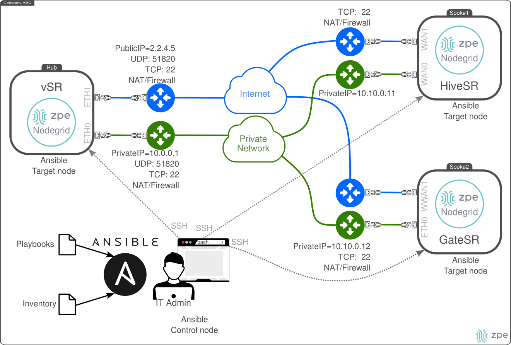
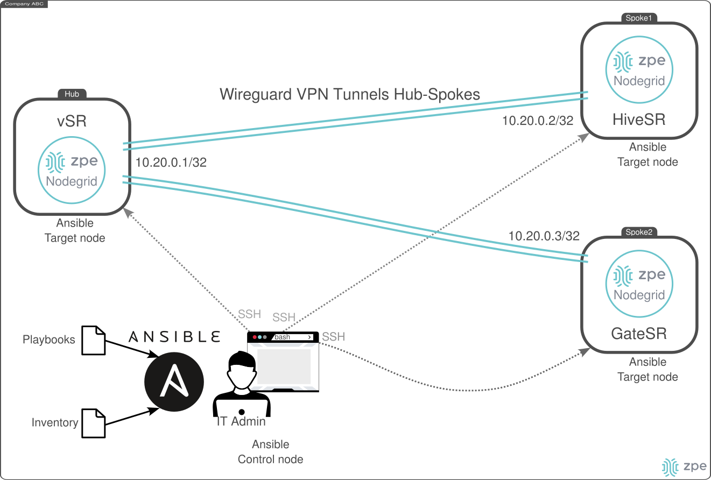

# ZPE Wireguard Hub-Spoke Peering - Ansible Automation

This document describes the deployment of multiple Wireguard VPNs between a **Hub** node and multiple **Spoke** nodes in remote locations. The VPNs are Point-to-Point configured which enable hub-to-spoke IP communication and vice versa. 

The Ansible playbook considers that the Hub and Spokes have a Private Network connection as well as an Internet connection. The private connection acts as the main network, while the Internet connection as backup. Therein, an IT Admin from its laptop is able to SSH access all the nodes, either using the privater network or the Internet. The Ansible Playbook configures one Hub node and the multiple Spoke nodes defined in the the `inventory.yaml` file. The following graphic depicts the Network connectivity.



The setup process includes:

- Defining the `inventory.yaml` file with all the nodes' information.
- Execute the Ansible Playbook to configure both the **Hub** and the **Spokes** from an Ansible Control node with SSH access to all the target nodes.


The following diagram depicts the deployment objective:




## Requirements

On the *Ansible Control node*, the following requirement must be met:
- Clone the repo [Nodegrid Ansible Library](https://github.com/ZPESystems/Ansible) and execute:

```bash
git clone https://github.com/ZPESystems/Ansible 
cd Ansible
ansible-playbook nodegrid_install.yml
```

The *Ansible Control node* must be able to SSH access each target node with an *user* and *password*. Then, the following playbook configures on each target node an SSH key for Ansible remote configuration. Thus, the IT Admin is required to use an specific SSH private/public keys to access the target nodes.

- Execute the Playbook `setup_install_ssh_key.yml`, one time for each node:

```bash
cd Ansible/examples/playbooks/setup
# inventory: comma separated IP list
# For example:
# - hub: 10.0.0.1
ansible-playbook setup_install_ssh_key.yml --inventory 10.0.0.1,
# - spoke1: 10.10.0.11
ansible-playbook setup_install_ssh_key.yml --inventory 10.10.0.11,
# - spoke2: 10.10.0.12
ansible-playbook setup_install_ssh_key.yml --inventory 10.10.0.12,
```

### Example

For example, consider the case that the IT Admin creates a new SSH public/private key as follows (key type **ed25519**):

```bash
ssh-keygen -t ed25519 -f ~/.ssh/admin@zpesystems.com -C admin@zpesystems.com
Generating public/private ed25519 key pair.
Enter passphrase (empty for no passphrase): 
Enter same passphrase again: 
Your identification has been saved in /home/diego/.ssh/admin@zpesystems.com
Your public key has been saved in /home/diego/.ssh/admin@zpesystems.com.pub
The key fingerprint is:
SHA256:b8ss1GQV8xYLRkS4hCRYn6b/DIsau9PwG3+FtqWijBA admin@zpesystems.com
The key's randomart image is:
+--[ED25519 256]--+
|     oo... =O..  |
|    .  o..o..+ o |
|        +. o  +  |
|       o  +  .   |
|  E   . S+ .     |
|   ..  ...+ o    |
|  . .+..o.o=     |
|   ..=o+oO+.     |
|    =+=oo+*      |
+----[SHA256]-----+
```

Copy the public key:

```bash
cat ~/.ssh/admin@zpesystems.com.pub 
ssh-ed25519 AAAAC3NzaC1lZDI1NTE5AAAAICVwb7p/Z+gytpJbIKOdLQ6+o61x+fzqnp76jNU7eHsg admin@zpesystems.com
```

Execute the playbook to configure this SSH key on the hub. This example considers that the IT Admin know in advance the following:
- user / password credentials to access the Hub (e.g., `admin`)
- the ansible user (`ansible` by default, recommended)
- the SSH key type (e.g., ed25519)
- the SSH public key
- Hub SSH TCP port (e.g., 22 by default)
- Add user to sudoers: select `True` (i.e., it adds the user `ansible` to sudoers)

```ansible
ansible-playbook setup_install_ssh_key.yml --inventory 10.0.0.1,
Enter Username for the connection [admin]: admin
Provide a current password for the user: 
Provide username to which the ssh_key should be installed [ansible]: ansible
Provide ssh key type that is used (dsa | ecdsa | ecdsa-sk | ed25519 | ed25519-sk | rsa)? [rsa]: ed25519
Enter a user's ssh public key to access ansible user via ssh: ssh-ed25519 AAAAC3NzaC1lZDI1NTE5AAAAICVwb7p/Z+gytpJbIKOdLQ6+o61x+fzqnp76jNU7eHsg admin@zpesystems.com
Enter ssh port [22]: 22
Add user to sudoers (True | False)? [False]: True

PLAY [Configure ZPE Out Of Box - Factory Default] ********************************************

TASK [Install a ssh_key for a user] **********************************************************
changed: [192.168.122.15]

PLAY RECAP ***********************************************************************************
192.168.122.15             : ok=1    changed=1    unreachable=0    failed=0    skipped=0    rescued=0    ignored=0   
```


## `inventory.yaml`

The `inventory.yaml` file defines all the devices SSH configurations as well as their Ansible variables. There must exists only **ONE** **hub** target node, and **Multiple** **spokes** target nodes (one or more). Two groups named *hub* and *spokes* are defined as follows:

```yaml
hub:                                        # only 1 host must be configured in this group
  hosts:
    hub: 
      ansible_port: 22
      ansible_host: "10.0.0.1"
      ansible_user: "ansible"
      ansible_ssh_private_key_file: "~/.ssh/admin@zpesystems.com"
      WG_INTERFACE_NAME: 'wg1-hub'          # Wireguard interface and VPN name
      WG_INTERFACE_ADDRESS: '10.20.0.1/32'  # Wireguard interface internal IP address
      WG_EXTERNAL_IP: 10.0.0.1              # Wireguard External IP address (used on the spoke side)
      WG_LISTENING_PORT: 51820              # Wireguard UDP port
      WIREGUARD_ENDPOINT_MAIN: 10.0.0.1     # Main Wireguard IP
      WIREGUARD_ENDPOINT_BACKUP: 2.2.4.5    # Backup Wireguard IP

spokes:
  hosts:
    spoke1:
      ansible_port: 22
      ansible_host: "10.10.0.11"
      ansible_user: "ansible"
      ansible_ssh_private_key_file: "~/.ssh/admin@zpesystems.com"
      WG_INTERFACE_NAME: 'wg1-spoke1'        # Wireguard interface and VPN name
      WG_INTERFACE_ADDRESS: '10.20.0.2/32'   # Wireguard interface internal IP address
    spoke2:
      ansible_port: 22
      ansible_host: "10.10.0.12"
      ansible_user: "ansible"
      ansible_ssh_private_key_file: "~/.ssh/admin@zpesystems.com"
      WG_INTERFACE_NAME: 'wg1-spoke2'        # Wireguard interface and VPN name
      WG_INTERFACE_ADDRESS: '10.20.0.3/32'   # Wireguard interface internal IP address
```

## Playbook `setup-wireguard-hub-spokes.yaml`

### Playbook Definition

[`setup-wireguard-hub-spokes.yaml`](setup-wireguard-hub-spokes.yaml)
 
### Playbook Execution

Execute the playbook using the `inventory.yaml` file defined above as follows:

```bash
ansible-playbook setup-wireguard-hub-spokes.yaml --inventory inventory.yaml
```

#### Example

Below you can find an example of the playbook execution:

```bash
ansible-playbook setup-wireguard-hub-spokes.yaml -i inventory.yaml
[WARNING]: Found both group and host with same name: hub

PLAY [Hub - Create Wireguard VPN and get its Public Key] *************************************

TASK [Delete Wireguard VPN wg1-hub if exists] ************************************************
ok: [hub]

TASK [Add Hub Wireguard VPN] *****************************************************************
ok: [hub]

TASK [Get Hub Wireguard Public Key] **********************************************************
ok: [hub]

TASK [Export Hub Wireguard Public Key] *******************************************************
ok: [hub]

PLAY [Spoke - Create Wireguard VPN and get its Public Key] ***********************************

TASK [Delete Wireguard VPN wg1-spoke1 if exists] *********************************************
ok: [spoke1]
ok: [spoke2]

TASK [Add Spoke Wireguard VPN] ***************************************************************
ok: [spoke1]
ok: [spoke2]

TASK [Get Spoke Wireguard Public Key] ********************************************************
ok: [spoke2]
ok: [spoke1]

TASK [Export Spoke Wireguard Public Key] *****************************************************
ok: [spoke1]
ok: [spoke2]

TASK [Spoke add spoke-hub peering] ***********************************************************
ok: [spoke2]
ok: [spoke1]

TASK [Spoke - Setup Wireguard fail-over] *****************************************************

TASK [zpe.nodegrid.site_coordinator : Setup Wireguard fail-over script] **********************
ok: [spoke2]
ok: [spoke1]

TASK [zpe.nodegrid.site_coordinator : Update Event Triggers] *********************************
changed: [spoke2]
changed: [spoke1]

PLAY [Hub - Add hub-spoke peering] ***********************************************************

TASK [Hub add hub-spoke peering] *************************************************************
ok: [hub] => (item=spoke1)
ok: [hub] => (item=spoke2)

PLAY [spokes] ********************************************************************************

TASK [Execute Ping from Spoke to the Hub] ****************************************************
changed: [spoke2]
FAILED - RETRYING: [spoke1]: Execute Ping from Spoke to the Hub (5 retries left).
changed: [spoke1]

TASK [Show ping results] *********************************************************************
ok: [spoke1] => {
    "vpn_results.stdout_lines": [
        "PING 10.21.0.1 (10.21.0.1) 56(84) bytes of data.",
        "64 bytes from 10.21.0.1: icmp_seq=1 ttl=64 time=167 ms",
        "64 bytes from 10.21.0.1: icmp_seq=2 ttl=64 time=164 ms",
        "64 bytes from 10.21.0.1: icmp_seq=4 ttl=64 time=166 ms",
        "64 bytes from 10.21.0.1: icmp_seq=5 ttl=64 time=183 ms",
        "",
        "--- 10.21.0.1 ping statistics ---",
        "5 packets transmitted, 4 received, 20% packet loss, time 4030ms",
        "rtt min/avg/max/mdev = 163.861/169.897/182.972/7.641 ms"
    ]
}
ok: [spoke2] => {
    "vpn_results.stdout_lines": [
        "PING 10.21.0.1 (10.21.0.1) 56(84) bytes of data.",
        "64 bytes from 10.21.0.1: icmp_seq=1 ttl=64 time=163 ms",
        "64 bytes from 10.21.0.1: icmp_seq=2 ttl=64 time=161 ms",
        "64 bytes from 10.21.0.1: icmp_seq=3 ttl=64 time=163 ms",
        "64 bytes from 10.21.0.1: icmp_seq=4 ttl=64 time=160 ms",
        "64 bytes from 10.21.0.1: icmp_seq=5 ttl=64 time=164 ms",
        "",
        "--- 10.21.0.1 ping statistics ---",
        "5 packets transmitted, 5 received, 0% packet loss, time 4002ms",
        "rtt min/avg/max/mdev = 160.498/162.300/164.112/1.312 ms"
    ]
}

PLAY RECAP ***********************************************************************************
hub                        : ok=5    changed=0    unreachable=0    failed=0    skipped=0    rescued=0    ignored=0   
spoke1                     : ok=9    changed=2    unreachable=0    failed=0    skipped=0    rescued=0    ignored=0   
spoke2                     : ok=9    changed=2    unreachable=0    failed=0    skipped=0    rescued=0    ignored=0   
```

### Playbook results

The playbook configures the following:
- `hub`
  - New Wireguard VPN named `wg1-hub`
  - New Peer configuration named `wg1-hub-peer-wg1-spoke1`
  - New Peer configuration named `	wg1-hub-peer-wg1-spoke2`
- `spoke1`
  - New Wireguard VPN named `wg1-spoke1`
  - New Peer configuration named `wg1-spoke1-peer-wg1-hub`
- `spoke2`
  - New Wireguard VPN named `wg1-spoke2`
  - New Peer configuration named `wg1-spoke2-peer-wg1-hub`

**As a result, both spokes are able to reach the hub via the Wireguard VPN.**
