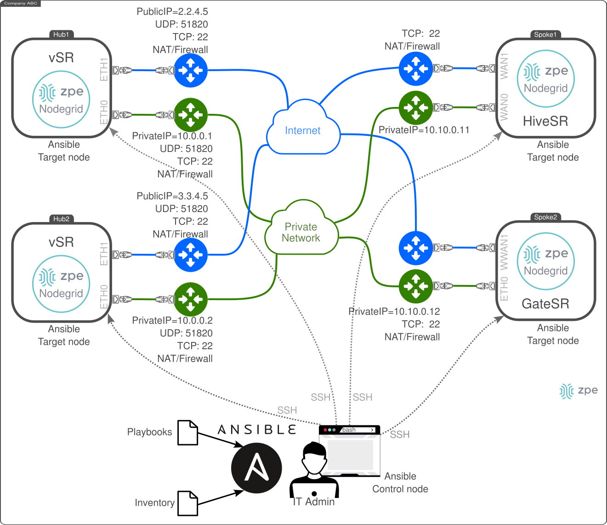
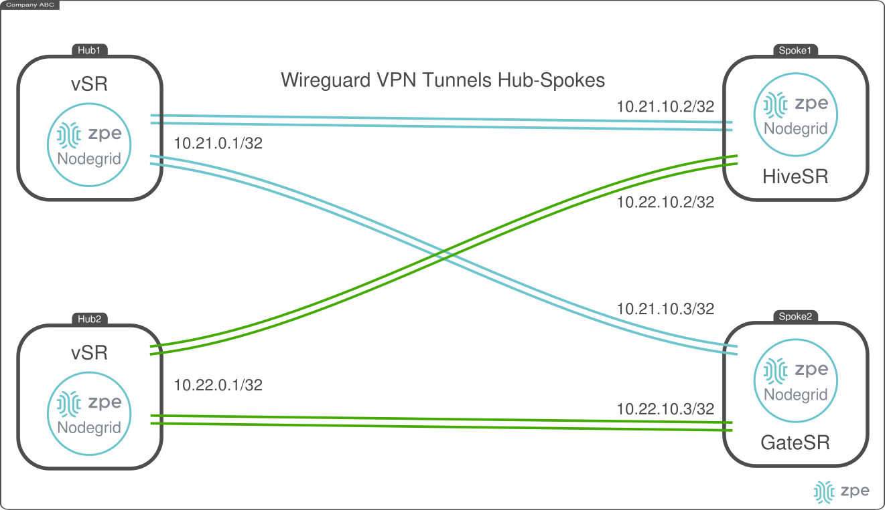

# ZPE Wireguard Hubs-Spoke Peering - Ansible Automation

This document describes the deployment of multiple Wireguard VPNs between **Hubs** nodes and **Spoke** nodes in remote locations. The VPNs are Point-to-Point configured which enable hub-to-spoke IP communication and vice versa. 

The Ansible playbook considers that the Hubs and Spokes have a Private Network connection as well as an Internet connection. The private connection acts as the main network, while the Internet connection as backup. Therein, an IT Admin from its laptop is able to SSH access all the nodes, either using the privater network or the Internet. This is a requirement for the initial Ansible configuration. The Ansible Playbook configures multiple Hubs nodes and their correspondig Spoke nodes, which are defined in the the `inventory.yaml` file. The following graphic depicts the Network connectivity.



The setup process includes:

- Defining the `inventory.yaml` file with all the nodes' information.
- Execute the Ansible Playbook to configure both the **Hub** and the **Spokes** from an Ansible Control node with SSH access to all the target nodes.


The following diagram depicts the deployment objective:




## Requirements

On the *Ansible Control node*, the following requirement must be met:
- Clone the repo [Nodegrid Ansible Library](https://github.com/ZPESystems/Ansible) and execute:

```bash
git clone https://github.com/ZPESystems/Ansible 
cd Ansible
ansible-playbook nodegrid_install.yml
```

The *Ansible Control node* must be able to SSH access each target node with an *user* and *password*. Then, the following playbook configures on each target node an SSH key for Ansible remote configuration. Thus, the IT Admin is required to use an specific SSH private/public keys to access the target nodes.

- Execute the Playbook `setup_install_ssh_key.yml`, one time for each node:

```bash
cd Ansible/examples/playbooks/setup
# inventory: comma separated IP list
# For example:
# - hub1: 10.0.0.1
ansible-playbook setup_install_ssh_key.yml --inventory 10.0.0.1,
# - hub2: 10.0.0.2
ansible-playbook setup_install_ssh_key.yml --inventory 10.0.0.2,
# - spoke1: 10.10.0.11
ansible-playbook setup_install_ssh_key.yml --inventory 10.10.0.11,
# - spoke2: 10.10.0.12
ansible-playbook setup_install_ssh_key.yml --inventory 10.10.0.12,
```

### Example

For example, consider the case that the IT Admin creates a new SSH public/private key as follows (key type **ed25519**):

```bash
ssh-keygen -t ed25519 -f ~/.ssh/admin@zpesystems.com -C admin@zpesystems.com
Generating public/private ed25519 key pair.
Enter passphrase (empty for no passphrase): 
Enter same passphrase again: 
Your identification has been saved in /home/diego/.ssh/admin@zpesystems.com
Your public key has been saved in /home/diego/.ssh/admin@zpesystems.com.pub
The key fingerprint is:
SHA256:b8ss1GQV8xYLRkS4hCRYn6b/DIsau9PwG3+FtqWijBA admin@zpesystems.com
The key's randomart image is:
+--[ED25519 256]--+
|     oo... =O..  |
|    .  o..o..+ o |
|        +. o  +  |
|       o  +  .   |
|  E   . S+ .     |
|   ..  ...+ o    |
|  . .+..o.o=     |
|   ..=o+oO+.     |
|    =+=oo+*      |
+----[SHA256]-----+
```

Copy the public key:

```bash
cat ~/.ssh/admin@zpesystems.com.pub 
ssh-ed25519 AAAAC3NzaC1lZDI1NTE5AAAAICVwb7p/Z+gytpJbIKOdLQ6+o61x+fzqnp76jNU7eHsg admin@zpesystems.com
```

Execute the playbook to configure this SSH key on the hub. This example considers that the IT Admin know in advance the following:
- user / password credentials to access the Hub (e.g., `admin`)
- the ansible user (`ansible` by default, recommended)
- the SSH key type (e.g., ed25519)
- the SSH public key
- Hub SSH TCP port (e.g., 22 by default)
- Add user to sudoers: select `True` (i.e., it adds the user `ansible` to sudoers)

```ansible
ansible-playbook setup_install_ssh_key.yml --inventory 10.0.0.1,
Enter Username for the connection [admin]: admin
Provide a current password for the user: 
Provide username to which the ssh_key should be installed [ansible]: ansible
Provide ssh key type that is used (dsa | ecdsa | ecdsa-sk | ed25519 | ed25519-sk | rsa)? [rsa]: ed25519
Enter a user's ssh public key to access ansible user via ssh: ssh-ed25519 AAAAC3NzaC1lZDI1NTE5AAAAICVwb7p/Z+gytpJbIKOdLQ6+o61x+fzqnp76jNU7eHsg admin@zpesystems.com
Enter ssh port [22]: 22
Add user to sudoers (True | False)? [False]: True

PLAY [Configure ZPE Out Of Box - Factory Default] ********************************************

TASK [Install a ssh_key for a user] **********************************************************
changed: [192.168.122.15]

PLAY RECAP ***********************************************************************************
192.168.122.15             : ok=1    changed=1    unreachable=0    failed=0    skipped=0    rescued=0    ignored=0   
```


## `inventory.yaml`

The `inventory.yaml` file defines all the devices SSH configurations as well as their Ansible variables. There must exists only **ONE** **hub** target node, and **Multiple** **spokes** target nodes (one or more). Two groups named *hub* and *spokes* are defined as follows:

```yaml
AME:
  hosts:
    hub1:
      ansible_port: 22
      ansible_host: 10.0.0.1
      ansible_user: ansible
      ansible_ssh_private_key_file: "~/.ssh/admin@zpesystems.com"
      wireguard_interface_name: wg-hub1                             # Wireguard interface and VPN name
      wireguard_interface_address: 10.21.0.1/32                     # Wireguard interface internal IP address
      wireguard_external_address_main: 10.0.0.1                     # Wireguard main external IP address (used on the spoke side)
      wireguard_external_address_backup: 1.1.4.5                    # Wireguard backup external IP address (used on the spoke side)
      wireguard_udp_port: 51820                                     # Wireguard UDP port
      nodegrid_roles:                                               # Nodegrid Roles List
        - wireguard_hub                                             # - Role for Nodegrid as a Wireguard Hub
    hub2:
      ansible_port: 22
      ansible_host: 10.0.1.1
      ansible_user: ansible
      ansible_ssh_private_key_file: "~/.ssh/admin@zpesystems.com"
      wireguard_interface_name: wg-hub2
      wireguard_interface_address: 10.22.0.1/32
      wireguard_external_address_main: 10.0.0.2
      wireguard_external_address_backup: 2.2.4.5
      wireguard_udp_port: 51820
      nodegrid_roles: 
        - wireguard_hub
    spoke1:
      ansible_port: 22
      ansible_host: 10.10.0.11
      ansible_user: ansible
      ansible_ssh_private_key_file: "~/.ssh/admin@zpesystems.com"
      nodegrid_roles:                                   # Nodegrid Roles List
        - wireguard_spoke                               # - Role for Nodegrid as a Wireguard Spoke
      wireguard_interfaces:
        - wireguard_hub: hub1                           # it must match an ansiblehost defined as wireguard_hub
          wireguard_interface_name: hub1                # Wireguard interface and VPN name
          wireguard_interface_address: 10.21.10.2/32    # Wireguard interface internal IP address
        - wireguard_hub: hub2
          wireguard_interface_name: hub2
          wireguard_interface_address: 10.22.10.2/32 
    spoke2:
      ansible_port: 22
      ansible_host: 10.10.0.12
      ansible_user: ansible
      ansible_ssh_private_key_file: "~/.ssh/admin@zpesystems.com"
      nodegrid_roles: 
        - wireguard_spoke
      wireguard_interfaces:
        - wireguard_hub: hub1
          wireguard_interface_name: hub1
          wireguard_interface_address: 10.21.10.3/32
        - wireguard_hub: hub2
          wireguard_interface_name: hub2
          wireguard_interface_address: 10.22.10.3/32
```

## Playbook `setup-wireguard-hubs-spokes.yaml`

### Playbook Definition

[`setup-wireguard-hubs-spokes.yaml`](setup-wireguard-hubs-spokes.yaml)
 
### Playbook Execution

Execute the playbook using the `inventory.yaml` file defined above as follows:

```bash
ansible-playbook setup-wireguard-hub-spokes.yaml --inventory inventory.yaml
```

#### Example

Below you can find an example of the playbook execution:

```bash
ansible-playbook setup-wireguard-hub-spokes.yaml -i inventory.yaml
```

### Playbook results

The playbook configures the following:
- `hub1`
  - New Wireguard VPN named `wg-hub1`
    - New Peer configuration named `wg-hub1-peer-spoke1`
    - New Peer configuration named `wg-hub1-peer-spoke2`
- `hub2`
  - New Wireguard VPN named `wg-hub2`
    - New Peer configuration named `wg-hub2-peer-spoke1`
    - New Peer configuration named `wg-hub2-peer-spoke2`
- `spoke1`
  - New Wireguard VPN named `hub1`
    - New Peer configuration named `hub1-peer-hub1`
  - New Wireguard VPN named `hub2`
    - New Peer configuration named `hub2-peer-hub2`
- `spoke2`
  - New Wireguard VPN named `hub1`
    - New Peer configuration named `hub1-peer-hub1`
  - New Wireguard VPN named `hub2`
    - New Peer configuration named `hub2-peer-hub2`

**As a result, both spokes are able to reach the hubs via the Wireguard VPNs.**
